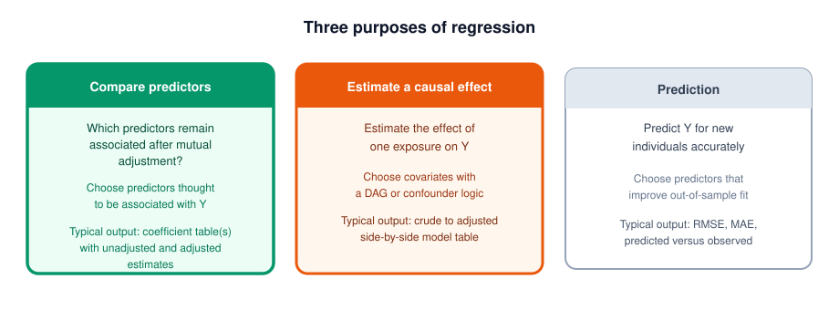

# Introduction


Dear students, congrats on making it through all 12 weeks of this challenging course. You now understand the basics of descriptive and inferential statistics and how to apply these to a range of health data questions. For your final assessment, you will bring all this knowledge together into a short research report. 

The document below outlines the instructions. It is admittedly a bit long, but reading it carefully will set you up for success. 

# Summary

-   **Overall report objective:** To write a short research report using either multiple linear regression or multivariable logistic regression as the main statistical method.
-   **Due date:** Sunday August 23 at 23:59 GMT
-   **Grade weight:** 40% of your final course grade
-   **Data:** Pick a dataset from the collection provided below, or find an external dataset and get approval from an instructor.
-   **Main analysis sequence:** Sample characteristics, univariable regression, multivariable regression
-   **Use R throughout:** All data cleaning, analyses, figures, and tables should be created with R code
-   **Report structure:** At least the following sections: Introduction, Methods, Results & Interpretation, Discussion & Limitations, and References.
-   **Minimum word count:** At least 750 words of text in the report (excluding code, code comments, and references). 
  -   **AI usage**: Your submission should score as having less than **50%** AI-generated text on [Pangram.com](https://www.pangram.com) to pass the assessment.
-   **Submission:** You will submit your `.Rmd` source file as well as a knitted `.html`, `.docx`, or `.pdf` report.

## Timeline

+----------------------+----------------------------------------------------------------------------------+
| August 6/9           | Prework: Read the full instructions document and browse the datasets provided. \ |
|                      | \                                                                                |
|                      | During workshop, you will do a checkpoint presentation (see below)               |
+----------------------+----------------------------------------------------------------------------------+
| August 23, 23:59 GMT | Final submission due date.                                                       |
+----------------------+----------------------------------------------------------------------------------+
| September 26         | Certificates awarded                                                             |
+----------------------+----------------------------------------------------------------------------------+

## Checkpoint session

In the checkpoint session, you will present **two slides** with the following:

-   **Data overview**: dataset description, outcome variable, and predictors
-   **Purpose**: the main question/hypothesis/aim of your study
-   **Method**: linear regression or logistic regression
-   **Optional**: One or two descriptive figures of your key variable(s) using `inspect_cat()`, `inspect_num()`, `glimpse()`, or `ggplot`.

Keep it short (**2-3 minutes**). This may be factored into your performance assessment.

::: callout-note
## If you cannot attend the checkpoint session

Record a short video presenting the two slides and leave the link to the video as a comment on the **Week 12 workshop page**. Use a platform like [loom.com](loom.com) to create a shareable video.
:::

Now let's get to the four main sections to think about while building your project.

# 1. Plan your study

## 1a. Selecting a dataset

Choose one dataset from the provided list.

We have compiled a range of datasets suitable for regression which were used in published papers.

<a class="link-button" href="https://the-graph-courses.github.io/rsr_resources/final_project_datasets/" target="_blank" rel="noopener">Open the dataset collection</a>

Preview of the dataset collection:

<iframe src="https://the-graph-courses.github.io/rsr_resources/final_project_datasets/" width="100%" height="500px" style="border:1px solid #ccc;" title="Website Preview"></iframe>

Choose:

-   A topic that interests you and sparks curiosity.
-   A dataset with a clear **outcome variable** and **several plausible predictors** (at least three for the multivariable model).
-   Large enough sample size and minimal missing data in your variables of interest (see [Sample size and missing data](#sample-size)).

::: callout-tip
You may propose an external dataset, but you must receive instructor approval **before** beginning the full analysis. Email [trainingteam\@thegraphnetwork.org](mailto:trainingteam@thegraphnetwork.org) **by Aug 10** with:

1. The dataset as a **CSV file** attachment.
2. Confirmation that you are permitted to share the data.
3. A one-paragraph description of the data and how it was collected.
4. The outcome variable and the predictors you plan to use.
5. The sample size and any missing data issues.

Many of you are already familiar with DHS (Demographic and Health Survey) datasets from our previous R course. You are most welcome to use most DHS datasets, though you should still email us with your proposed research questions, outcome variable and predictors.

:::


## 1b. Choosing your outcome variable and regression method

Now that you have a dataset in mind, you'll need to choose your outcome variable. The type of outcome then determines your regression method, either linear or logistic regression:

| Outcome type | Regression method | Main model results to focus on |
|:---|:---|:---|
| Continuous outcome (e.g. birthweight, PHQ-9 scores) | **Linear regression** | beta coefficient, 95% confidence interval, p-value, adjusted R-squared |
| Binary outcome (e.g. died/survived, anaemic/not anaemic) | **Logistic regression** | odds ratio, 95% confidence interval, p-value, AIC (only if comparing multiple models) |


## 1c. Choosing a report style and research purpose

In our workshops, we introduced the following classification for the main purposes of multivariable regression analysis in much of health research: 

{width="100%"}

Your report should be structured either as a comparison of predictors or as an estimation of a causal effect. As you may recall, in our workshops, we worked mostly on comparing predictors, so that will likely be the natural choice for most students. If you want a challenge, you can attempt to estimate a causal effect of one main predictor.

### Compare predictors

For this purpose, no single predictor is the star of the show. Your goal is to see which of several plausible predictors are independently associated with your outcome, once they are all in the model together and each one is adjusted for the others.

**Example question:** "Which maternal and pregnancy characteristics are independently associated with birthweight among newborns in Bogotá, Colombia?"

**Analysis:**
Here you would want to make sure you have

- a clear outcome variable (here, birthweight)
- at least three predictors, all chosen because subject-matter knowledge suggests they may be associated with the outcome. No single one of them is the "exposure", and no DAG is needed.
- then you will fit a univariable model for each predictor separately,
- then fit one multivariable model containing all of them at once.

**Common way to present the main results:** a single table with the univariable estimate for each predictor beside the multivariable estimate for that same predictor, so readers can see what changed after mutual adjustment.

**Workshop example:** Week 9 (side-by-side simple and multiple regression tables).

### Estimate a causal effect

For this purpose, your goal is to try to isolate the effect of one main predictor on an outcome, after controlling for its potential confounders. Note that although the goal is to isolate a "causal" effect, we rarely fully succeed at this aim with observational data. 

So while your research question can be framed in terms of an effect, in your results and discussion you may still want to describe your findings as an "independent association", or "adjusted relationship". You can then discuss how likely it is that this association reflects a true causal effect, given the strength and limitations of your analysis. 

**Example question:** "What is the effect of maternal smoking on birthweight among newborns in Bogotá, Colombia, after accounting for confounders?"

**Analysis:**
Here you would want to make sure you have 

- a clear outcome variable (here, birthweight)
- one main exposure whose effect you want to estimate (here, maternal smoking)
- a small set of covariates chosen because they are plausible confounders of the smoking-birthweight relationship (e.g. maternal age, income, education), not just because they may be predictors of the outcome. A DAG would be helpful here.
- then you will fit a crude (univariable) model with just the exposure,
- then fit one or more adjusted models that add the confounders, ending in your final model.

**Common way to present the main results:** a crude (univariable) estimate for your exposure, then increasingly adjusted models ending in your final estimate. 

**Workshop example:** Week 8 (effect of smoking on FEV, adjusting for age, height, and sex).

## 1d. Selecting your predictors (covariates)

Next, decide which predictors, also called covariates, will go into your models:

-   **If comparing predictors:** select at least three plausible predictors of your outcome.
-   **If estimating a causal effect:** select one main exposure, plus covariates that are plausible confounders of the exposure-outcome relationship.

In either case, choose your variables based on subject-matter knowledge *before* fitting any models, not by fishing for statistically significant variables. This helps you avoid "p-hacking".

::: {#sample-size .callout-note}
## Sample size and missing data

Before deciding on a model, make sure you have enough observations to fit it with the predictors you plan to include. Remember the minimum guidelines we learned:

- **Linear regression:** at least **10 observations per parameter** in your model.
- **Logistic regression:** at least **10 events per parameter**, where an "event" is the rarer outcome class.

It is also important to take missing data into account. We have not taught you, and do not expect you to use more advanced approaches like imputing missing values. 

Therefore, in this project, most of you will be using **complete case analysis**. This means that your final sample size, called your **analytic sample** may be considerably smaller than your original sample size. So take this into account when you select your predictors. 
:::

## 1e. Formulating your research question and hypotheses

Once you have your dataset and chosen your regression method, it is time to write down your research question and hypotheses. This will guide you as you properly begin your analysis, and you will be asked to present this during the checkpoint session.

For example:

**For the predictor comparison-style analysis:**

- **Research question:** Which socio-demographic and clinical factors are independently associated with depression among teenagers in Lagos, Nigeria?
- **Hypothesis:** Age, sex, household income, BMI, and smoking status will remain associated with depression score after mutual adjustment.

**For the causal effect estimation-style analysis:**

- **Research question:** What is the effect of maternal smoking on birthweight among newborns in Bogotá, Colombia, after accounting for confounders?
- **Hypothesis:** After adjusting for maternal age, income, and education, maternal smoking will be associated with lower birthweight.

# 2. Understanding the structure of the report

Now you're almost ready to begin your analysis! It will be helpful to have a sense of the target report structure you will be aiming for. Below is a general guideline we suggest you follow. You can of course add more subsections to your report.

## 2a. Introduction

The introduction answers the following questions:

-   What is the health or scientific problem?
-   Why is the topic important?
-   What is your specific research question and hypothesis?

## 2b. Methods

This section answers the following questions:

-   What is the data source, study design, population, and unit of observation?
-   What are the outcome, exposures/predictors?
-   Why did you include the variables you did in your multivariable model?
-   How did you code these variables (for example, if you recoded a continuous variable into a categorical variable)? What are the reference groups you used?
-   What other relevant data cleaning and preparation steps did you take (e.g. missing data handling)?
-   What tables and/or figures will you be using to describe your data?
-   What is the description of your univariable models? What is the description of your multivariable model?
-   What diagnostics will you run (e.g. model diagnostics should be run on at least your final multivariable model)?

You should write these up in enough detail for another analyst to be able to reproduce your results using the same data. Below, in the "Implement your analysis" section, we outline the recommended steps in more detail.

## 2c. Results & Interpretation

This section should include:

-   A restatement of your analytic sample
-   A table of sample characteristics (i.e. Table 1)
-   Univariable regression results, with a table, and some textual interpretation of main findings for some of your predictors
-   Multivariable regression results, with a table, and some textual interpretation of main findings
-   A comparison between the univariable and multivariable results
-   The findings from your model diagnostics

## 2d. Discussion & Limitations

This section should include:

-   A direct answer to your research question and hypotheses;
-   Any important changes from the univariable to multivariable analysis;
-   The scientific or practical meaning of the findings;
-   Whether the findings support your hypothesis;
-   At least two relevant limitations, including any model-diagnostic concern; and
-   What can and cannot be concluded from the study design and analysis.

## 2e. References

You do not need a detailed literature review, but you should at least cite the data source. You can fill in the references manually, or use RStudio's reference manager if you prefer. Here is a short [video on how to use it](https://www.youtube.com/watch?v=zuuOYjE8m98).

::: {.callout-note}
Note that this is a bit different from a standard research report.

For example, no literature citations are required or expected, either in the introduction or discussion sections (though, if you feel so inclined, you are welcome to include them).

In addition, here we ask you to be explicit about some explanations (such as why multivariable modeling is needed), which would be assumed knowledge in a standard research report.
:::

# 3. Implement your analysis

Now that you have your research question and hypotheses, and you have a sense of the report structure you will be aiming for, you are ready to begin your analysis.

Below we describe some key steps in your analysis pipeline that will probably be helpful to guide you through your analysis.

## 3a. Import and clean the data

Use R code to:

- import the data
- clean and recode the variables you will use in your analysis
- set appropriate reference categories for your categorical predictor
- create a complete-case dataset that keeps only the rows with no missing values in the outcome or any of your planned predictors
- identify the number of observations that will be used in your analysis

## 3b. Conduct your descriptive analysis

Before you fit any models, you should describe your analytic sample and explore your key variables. This includes:

-   **Table 1:** a nicely formatted table showing the characteristics of your analytic sample for the outcome and predictors. For continuous variables, this will include mean and SD. For categorical variables, this will include the number of observations in each category, and the percentage of the sample in each category. The `gtsummary::tbl_summary()` function is a nice way to create such a table.
-   **At least one informative data figure:** This should show the distribution of your outcome or its relationship with one of the important predictors. For example:
    -   a histogram of a continuous outcome
    -   a boxplot of a continuous outcome by an important categorical predictor (e.g. birthweight per smoker status);
    -   a bar chart of a binary outcome by a key categorical predictor (e.g. survival status per age group); or
    -   a scatterplot of a continuous outcome against a continuous predictor (e.g. birthweight by maternal age)

## 3c. Fit and interpret the univariable models

- Fit your univariable models for each predictor. 

- Write some sentences in your results & interpretation section to describe the main findings for some of your predictors (e.g. "For each additional 1 year of age, predicted FEV is higher by about 0.222 litres, on average (95% CI 0.207 to 0.237)." or "Each additional year of age was associated with 6% higher odds of mortality (OR 1.06, 95% CI 1.04 to 1.09).").

- Comment on whether the significant associations are clinically or practically important.

## 3d. Fit and interpret the multivariable model

-   Fit **one** multivariable model with all chosen predictors (your final multivariable model should have at least three predictors).
-   Interpret key coefficients, remembering to use conditional language appropriately: *"holding the other predictors constant"* or *"after adjusting for age, sex, and ..."*.
-   Report model fit using **R-squared and adjusted R-squared** (for linear regression) or **AIC** (for logistic regression).

::: callout-tip
You may include an interaction term if it is motivated by your research question (see Week 8). Keep the main model simple, and present the interaction as a secondary analysis.
:::


## 3e. Compare your univariable and multivariable models

Create **Table 2**, showing univariable and multivariable estimates side by side. You may use tools learned in the workshops, such as `{broom}`, `{gtsummary}`, `{gt}`, or `{modelsummary}`.

Your comparison must discuss:

-   how the main coefficient or odds ratio changed after adjustment;
-   which predictors remained associated after mutual adjustment;
-   what confounding, shared information, or other relationships between predictors might explain the changes.


## 3f. Check your model diagnostics

Run `check_model()` on your final multivariable model and present and describe the results. This works for both linear and logistic models.

For logistic models, the diagnostic panels differ slightly from linear regression (as in the Week 11 workshop). Homogeneity of variance and normality of residuals are not assumptions of logistic regression. Focus on **binned residuals** (model shape / fit), **collinearity**, and **influential observations**.

You are unlikely to have a model that perfectly satisfies all assumptions. This is okay. What matters is that you report any deviations from the assumptions. You are not required to implement advanced corrections or transformations that were not covered in the course.

# 4. Final checks and submission

## 4a. AI usage policy

As mentioned at the start of our course, responsible AI use is allowed and even encouraged in this course. 

For code, we encourage you to use LLMs to help you debug, cross-check, and extend your own abilities, for example with formatting tables and figures. Of course, remember to **verify** every number in your tables and figures against your own `lm()`, `glm()`, `summary()`, and `tidy()` outputs. 

However, for the textual parts of your report, we think it is important that the majority of this is written out by you, in your own words, as this is important for you to properly imbibe the material. Therefore, we will use an AI checker on your report text (that is, the Introduction, Methods narrative, Results interpretation, Discussion) using [Pangram](https://www.pangram.com). Your submission should score **under 50%** AI-generated text to pass the assessment. 

## 4b. Submission instructions

Before submitting, make sure to go through the rubric below to check your work and make sure you're in good shape for a strong grade.

Then:

1.  To submit, you should name your source file `firstname_lastname_rsr_final.Rmd` (or `.qmd`).
2.  Knit to **HTML**, **DOCX**, or **PDF**, with the same base filename.
3.  Upload the source file and the knitted report by **Aug 23, 23:59 GMT**.


# Grading rubric (100 points)

### Research aim, data selection, and introduction (15 points)

-   Is the dataset an individual-level dataset for which the regression approaches taught in the course are appropriate?
-   Does the paper use an appropriate outcome and set of predictors?
-   Does the report state or clearly imply a well defined research question and, ideally, a hypothesis?
-   Does the report's introduction or conclusion give meaningful context about why this research question is important?
-   Do the report's goals align with at least one of the following purposes: a) to compare predictors of an outcome, before and after mutual adjustment b) to try to estimate a causal effect, controlling for other factors?
-   Does the paper's main regression type (linear vs logistic regression) make sense for the chosen outcome?

### Methods (10 points)

-   Is the data source, including collection method and study design, decently well described? (Of course, if the report reuses data from a published paper, this description can only be as detailed as the original paper.)
-   Does the report clearly define the outcomes and predictor variables, including how variables were coded, and the reference groups?
-   Is the set of predictors chosen justified using subject-matter knowledge or other valid principles?
-   Where relevant, are important data cleaning steps, including missing data handling, or exclusion of certain individuals clearly described?
-   Are the descriptive analysis, univariable and multivariable models and the model diagnostics described in sufficient detail for someone else to fairly easily reproduce the analysis?

### Descriptive analysis (10 points)

-   Is there at least one table that describes the final analytic sample, using for example mean and standard deviation for the continuous variables and percentage compositions for the categorical variables?
-   Does the report have at least one nicely-formatted figure that shows the distribution of the outcome or the relationship between the outcome and an important predictor?
-   Are the tables and figures created in R?
-   Are the tables well presented, without mistakes, with clear labels, and referred to appropriately in the text?
-   Are the descriptive findings, including some of what was presented in the table, interpreted accurately in the text?

### Univariable regression (15 points)

-   Is there a separate univariable model for each predictor that was mentioned in the methods?
-   Is there at least one table presenting univariable estimates?
-   In the table or the text, are the odds ratios (for logistic regression) or the beta coefficients (for linear regression) reported appropriately, including their 95% confidence intervals?
-   Are some of the findings for the univariable regressions reported and interpreted accurately in the report text, including, where relevant, the size of the association, the units, the confidence intervals?

### Multivariable regression and comparison (25 points)

-   In the results section, is there at least one main multivariable model appropriately fitted with at least three of the predictors planned?
-   When multivariable associations are presented, is appropriate conditional language used?
-   Is the model fit characterised and reported using R-squared and related measures for linear regression, and AIC for logistic regression when comparisons between models are relevant?
-   Is there a table (or multiple tables) with the multivariable estimates?
-   For predictor-comparison papers, does the report identify which predictors remain associated after adjustment?
-   If there are noticeable changes between the univariable and multivariable results, does the paper discuss these, including plausible reasons for such changes?
-   If relevant, is there some mention of the clinical/practical significance of associations, in contrast to statistical significance (either for univariable or multivariable models)?

### Diagnostics, discussion, and limitations (15 points)

-   Is the `performance::check_model()` function or similar diagnostics run on the final multivariable model, and are diagnostic findings well presented?
-   Where they exist, are any diagnostic concerns reported in the text, either fixed/addressed directly or reported as limitations?
-   Does the discussion/conclusion satisfactorily answer the research question(s) identified in the beginning (either directly or indirectly)?
-   Are at least two relevant limitations identified?
-   Are the conclusions appropriate for the study design and analysis and does the report avoid making unwarranted claims?

### Reproducible R and professional communication (10 points)

-   Are all required sections present, including but not limited to an introduction, a methods, a results and a discussion section?
-   Where data was obtained from another published paper, is the source of the data cited in the report?
-   Excluding code, does the narrative text have at least 750 words?
-   Is the code reproducible: that is, written so that rerunning it would likely produce the reported results, including the use of relative file paths such as `here::here()`?
-   Are the code chunks hidden with `echo = FALSE` or similar, and are warnings and messages also suppressed?
-   Are the tables and figures readable, clearly labelled, and include units where relevant?
-   Is the source file appropriately named, including the student's name?
-   Was a knitted html, docx, or pdf report submitted?
-   Is the writing overall clear and professional, without severe comprehension issues or typos?
-   Does the report score under 50% AI-generated text on [Pangram](https://www.pangram.com)?

# Appendices

## Appendix 1: Where to look in the course materials

+-----------------------------------------------------------------------------------+-----------------------------------------------------------------------------------------------------------------------+
| If you need to...                                                                 | Revisit                                                                                                               |
+:==================================================================================+:======================================================================================================================+
| Build a publication-style descriptive table                                       | Week 5 workshop                                                                                                       |
+-----------------------------------------------------------------------------------+-----------------------------------------------------------------------------------------------------------------------+
| Fit and interpret a simple linear regression                                      | Weeks 6 and 7 workshops                                                                                               |
+-----------------------------------------------------------------------------------+-----------------------------------------------------------------------------------------------------------------------+
| Handle categorical predictors and reference levels                                | Week 7 workshop                                                                                                       |
+-----------------------------------------------------------------------------------+-----------------------------------------------------------------------------------------------------------------------+
| Estimate a causal effect with a confounder DAG                                    | Week 8 workshop                                                                                                       |
+-----------------------------------------------------------------------------------+-----------------------------------------------------------------------------------------------------------------------+
| Build a side-by-side simple/multiple table and run diagnostics                    | Week 9 workshop                                                                                                       |
+-----------------------------------------------------------------------------------+-----------------------------------------------------------------------------------------------------------------------+
| Fit and interpret univariable logistic regression and odds ratios                 | Week 10 workshop                                                                                                      |
+-----------------------------------------------------------------------------------+-----------------------------------------------------------------------------------------------------------------------+
| Fit a multivariable logistic model, merge tables, use AIC, run `check_model()`    | Week 11 workshop                                                                                                      |
+-----------------------------------------------------------------------------------+-----------------------------------------------------------------------------------------------------------------------+
| Refresh on any diagnostic panel                                                   | [Regression Diagnostics Explorer](https://the-graph-courses.github.io/rsr_resources/explorers/regression-diagnostics) |
+-----------------------------------------------------------------------------------+-----------------------------------------------------------------------------------------------------------------------+

## Appendix 2: Worked example code, with output

Below are some code snippets using a sample dataset that may help remind you of some of the code we learned in class. 

Outcomes used: `weight` (birth weight in pounds) for the linear examples, and `low_bw` (born under 5.5 lb, yes/no) for the logistic examples.

### Setup

```{r}
#| message: false
#| warning: false
if (!require(pacman)) install.packages("pacman")
pacman::p_load(tidyverse, here, janitor, readxl, broom, gt, gtsummary,
               modelsummary, performance, see, sandwich, lmtest, openintro)
```

In your setup chunk, hide code from the knitted report:

``` r
knitr::opts_chunk$set(echo = FALSE, message = FALSE, warning = FALSE)
```

`inspectdf` is not on CRAN, so if you want `inspect_cat()` or `inspect_num()` for your checkpoint slides, install it from GitHub:

``` r
pacman::p_load_gh("the-graph-courses/inspectdf")
```

### Import, set factor levels, and build the analytic sample

```{r}
data(births14, package = "openintro")

births <- births14 %>%
  mutate(
    habit  = factor(habit, levels = c("nonsmoker", "smoker")),
    sex    = factor(sex,   levels = c("female", "male")),
    low_bw = factor(lowbirthweight, levels = c("not low", "low"))
  ) %>%
  select(weight, low_bw, weeks, mage, gained, habit, sex) %>%
  drop_na()   # complete-case analysis

nrow(births)   # analytic sample size
```

```{r}
glimpse(births)
```

### Table 1 (sample characteristics table)

```{r}
births %>%
  select(weight, low_bw, weeks, mage, gained, sex, habit) %>%
  tbl_summary(
    statistic = list(all_continuous() ~ "{mean} ({sd})"),
    label = list(weight = "Birth weight (lb)",
                 low_bw = "Low birth weight (< 5.5 lb)",
                 weeks  = "Gestation (weeks)",
                 mage   = "Mother's age (years)",
                 gained = "Weight gained in pregnancy (lb)",
                 sex    = "Infant sex",
                 habit  = "Maternal smoking")
  )
```

### A descriptive figure

```{r}
#| fig-width: 7
#| fig-height: 4.5
ggplot(births, aes(x = weeks, y = weight, colour = habit)) +
  geom_point(alpha = 0.4) +
  geom_smooth(method = "lm", se = FALSE) +
  labs(x = "Gestation (weeks)", y = "Birth weight (lb)", colour = NULL) +
  theme_minimal()
```

### Compare predictors: side-by-side unadjusted and adjusted table (linear)

```{r}
multivar_lm <- lm(weight ~ weeks + mage + habit + sex, data = births)

crude_table <- births %>%
  select(weight, weeks, mage, habit, sex) %>%
  tbl_uvregression(y = weight, method = lm)

adjusted_table <- tbl_regression(multivar_lm)

tbl_merge(list(crude_table, adjusted_table),
          tab_spanner = c("**Unadjusted beta (95% CI)**", "**Adjusted beta (95% CI)**"))
```

```{r}
glance(multivar_lm) %>% select(nobs, r.squared, adj.r.squared)
```

### Estimate a causal effect: a sequence of adjusted models (linear)

```{r}
m1_crude <- lm(weight ~ habit, data = births)
m2 <- lm(weight ~ habit + mage, data = births)
m3 <- lm(weight ~ habit + mage + sex, data = births)
m4_full <- lm(weight ~ habit + mage + sex + gained, data = births)

modelsummary(
  list("1. Crude" = m1_crude, "2. + age" = m2, "3. + sex" = m3, "4. + gain" = m4_full),
  estimate = "{estimate}",
  statistic = "[{conf.low}, {conf.high}]",
  fmt = 3,
  gof_map = list(list(raw = "nobs", clean = "N", fmt = 0),
                 list(raw = "r.squared", clean = "R-squared", fmt = 3),
                 list(raw = "adj.r.squared", clean = "Adjusted R-squared", fmt = 3)),
  output = "gt"
)
```

### Diagnostics for the linear model

```{r}
#| fig-width: 9
#| fig-height: 10
check_model(multivar_lm)
```

```{r}
check_heteroscedasticity(multivar_lm)
```

Heteroscedasticity is flagged here, so we can also report robust standard errors.

```{r}
coeftest(multivar_lm, vcov. = vcovHC(multivar_lm, type = "HC3"))
```

### Compare predictors: side-by-side unadjusted and adjusted table (logistic)

Same predictors, but now with the binary outcome `low_bw`, so the estimates are odds ratios.

```{r}
multivar_glm <- glm(low_bw ~ weeks + mage + habit + sex,
                    family = binomial, data = births)

crude_or_table <- births %>%
  select(low_bw, weeks, mage, habit, sex) %>%
  tbl_uvregression(y = low_bw, method = glm,
                   method.args = list(family = binomial),
                   exponentiate = TRUE)

adjusted_or_table <- tbl_regression(multivar_glm, exponentiate = TRUE)

tbl_merge(list(crude_or_table, adjusted_or_table),
          tab_spanner = c("**Unadjusted OR (95% CI)**", "**Adjusted OR (95% CI)**"))
```

```{r}
AIC(multivar_glm)
```

### Diagnostics for the logistic model

```{r}
#| fig-width: 9
#| fig-height: 10
check_model(multivar_glm)
```

Collinearity is low and no observations appear unduly influential. The binned-residual panel is the main check of whether the model shape fits the data. Here, many binned average residuals fall outside their error bounds, which suggests systematic lack of fit in parts of the prediction range. This should be reported as a limitation in the Discussion & Limitations section.