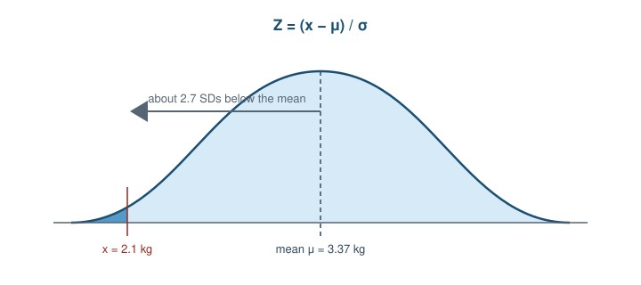
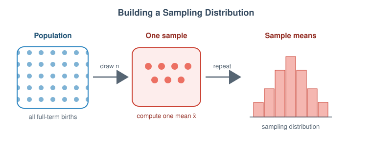

# Introduction

Welcome to Workshop 3! In this workshop you will practice applying the concepts of the Normal Distribution, Z-scores, and Sampling Distributions using a real dataset of births in the US in 2014.

This week's pre-work lessons covered:

- The Normal Distribution and Z-scores
- Sampling Distributions and the Central Limit Theorem

# Dataset: US Births in 2014

Today we will use a dataset containing records of births in the United States in 2014. We will focus specifically on **birth weight** of full-term babies.

The data come from the CDC National Center for Health Statistics and cover nearly **4 million births** registered across the United States in 2014. Because this is essentially *every* birth that year rather than a small sample, we can treat the whole dataset as our **population** of interest. You can [read more about the source data here](https://www.cdc.gov/nchs/data_access/VitalStatsOnline.htm).

## Load packages and data

For this workshop you will need the packages below. Run the chunk to load them:

```{r setup, message=FALSE, warning=FALSE}
if (!require(pacman)) install.packages("pacman")
pacman::p_load(tidyverse, here, janitor)
```

Load the `births_2014.csv.gz` file and assign it to an object called `births_raw`. 

```{r}
births_raw <- read_csv("births_2014.csv.gz")
```

## Data Preparation

The original `weight` variable is in pounds. We also have a `premie` column where `0` means full-term and `1` means premature. 
Let's filter for only full-term babies (premie == 0) and convert the weight to kilograms.

```{r}
births <- births_raw %>%
  filter(premie == 0) %>% 
  mutate(weight_kg = weight * 0.453592) %>% 
  drop_na(weight_kg)

head(births)
```

# Part 1: The Normal Distribution of Birth Weights

## Exploring the distribution

Before diving into individual probabilities, let's look at the overall distribution of birth weights for full-term babies. We can plot a histogram to check for normality.

```{r}
ggplot(births, aes(x = weight_kg)) +
  geom_histogram(bins = 40, fill = "lightblue", color = "white") +
  theme_minimal() +
  labs(title = "Distribution of Full-Term Birth Weights (2014)",
       x = "Weight (kg)",
       y = "Count")
```


Since we have data for nearly all US births in 2014, we can treat this dataset as our **population**. Let's calculate the population mean (`pop_mean`) and population standard deviation (`pop_sd`).

```{r}
pop_mean <- mean(births$weight_kg)
pop_sd <- sd(births$weight_kg)

pop_mean
pop_sd
```

**Note:** The mean should be about 3.37 kg, and the SD about 0.47 kg.

### Q1a
Does the distribution look approximately normal (bell-shaped)?

**Ans:**


## Demo: How unusual is a low birth weight baby?

Late in a pregnancy, a doctor does an ultrasound on a mother expecting a baby boy. She's already picked the name **Tito**. The scan estimates Tito will weigh about **2.1 kg** at birth, and the doctor wonders whether to flag this as a concern. Is **2.1 kg** unusually low for a full-term baby?

### Z-score for Tito

A **z-score** answers this by measuring how many standard deviations a value sits from the mean.

First, calculate the **z-score** for Tito. Remember the formula: `Z = (x - mean) / sd`

```{r}
z_tito <- (2.1 - pop_mean) / pop_sd
z_tito
```

### Q1b

What does this z-score tell you about how far Tito's weight is from the mean?

**Ans:**




*A z-score measures how many standard deviations a value lies from the mean. Here 2.1 kg sits about 2.7 SDs into the left tail.*

### From z-score to probability

Next, use the `pnorm()` function to calculate the exact percentage of babies weighing *less* than Tito's 2.1 kg in a normal distribution with our population mean and SD.

```{r}
prop_less_tito <- pnorm(q = 2.1, mean = pop_mean, sd = pop_sd)
pct_less_tito <- prop_less_tito * 100
pct_less_tito
```

### Q1c

Express the percentage above as a "1 in N" frequency (e.g. "about 1 in 200 babies"). Based on this number, would you describe a full-term baby weighing less than Tito's 2.1 kg as rare, uncommon, or routine?

**Ans:**

### Checking against the actual population

Because we actually have the full population data, we don't just have to rely on `pnorm()`. We can directly count what percentage of babies in our dataset weighed less than 2.1 kg.

We do this by filtering the data to keep only babies below 2.1 kg, then dividing the number of rows in that subset by the total number of rows.

```{r}
below_tito <- births %>% filter(weight_kg < 2.1)

pct_below_tito_actual <- nrow(below_tito) / nrow(births) * 100
pct_below_tito_actual
```

### Q1d

How does the theoretical percentage from `pnorm()` compare to the actual percentage we calculated from the data?

**Ans:**

## Practice: How unusual is a heavy baby?

Another expectant mother's scan suggests her baby, to be named **Bruno**, is tracking large, around **4.4 kg**. Is that unusually heavy for a full-term baby, heavy enough that the doctor might want to prepare for a more complicated delivery? Let's do the same calculations for Bruno.

### Z-score and probability

Calculate Bruno's z-score:

```{r}
"WRITE_YOUR_CODE_HERE"
```

### Q1e

What does the **sign** of Bruno's z-score tell you, and how does its **magnitude** compare to Tito's z-score? Which baby is further from the mean in standard-deviation units?

**Ans:**


Calculate the **percentage** of babies weighing **MORE** than Bruno's 4.4 kg using `pnorm()`. *Hint: `pnorm()` gives you the area to the left (less than). Use `lower.tail = FALSE` (or do `1 - pnorm(...)`) to get the area to the right. Multiply by 100 to convert to a percentage.*

```{r}
"WRITE_YOUR_CODE_HERE"
```

### Q1f

Based on your percentage, roughly how many full-term babies out of every 1,000 would you expect to weigh more than Bruno's 4.4 kg? If a doctor saw such a baby on an ultrasound, would you describe it as "rare" or "routine"?

**Ans:**

# Part 2: Sampling Distributions

## Demo: Sampling distributions (small sample)

In Part 1, we asked if a *single baby* was unusual. But what if we want to know if a *group of babies* is unusual?

The key shift is that we no longer look at one baby. Instead we take a whole **sample** of babies from the **population** and summarise it with a single number: the sample mean. The distribution of this sample mean is called a **sampling distribution**.




*Repeatedly draw a sample, record its mean, and collect those means into their own distribution.*

### Illustrative hospital data (Flint-inspired scenario)

In 2014, Flint, Michigan switched its public water source, which led to a well-documented public health crisis. Researchers later linked the crisis to worse birth outcomes using **CDC natality records** and city-level statistical methods (for example, [Wang et al., 2021](https://link.springer.com/article/10.1007/s00148-021-00876-9)).

Below, we use a small synthetic sample of weights inspired by that real-world context to illustrate the concepts of sampling distributions.

Imagine a doctor at a hospital in Flint noticed what seemed like lighter-than-usual full-term babies and pulled the weights from their last 8 full-term deliveries:

```{r}
flint_babies_n8 <- tibble(weight_kg = c(3.0, 3.3, 2.8, 3.7, 3.2, 3.2, 3.3, 2.7))
mean_flint_babies_n8 <- mean(flint_babies_n8$weight_kg)
mean_flint_babies_n8
```

The mean of these 8 babies is 3.15 kg. This is lower than the national average of 3.37 kg.

But is that mean *unusually* low? To answer this, we need to know what kind of sample means we would get just by random chance if the hospital were really no different from the nation. 

Our **null hypothesis** (H0) is that the Flint water crisis had no effect on birth weights, meaning the babies born at this hospital are effectively just a random sample from the national population. By repeatedly drawing 8 babies from the national CDC data, we are simulating what the hospital's averages would look like in a world where H0 is perfectly true.

We can build a **sampling distribution of the null** by drawing random samples of size `n = 8` from the national `births` population over and over again and recording each mean.

```{r}
set.seed(123)

sim_data_8 <- tibble(
  mean = replicate(1000, mean(sample(births$weight_kg, 8)))
)
```

A couple of notes on that code:

- `set.seed(123)` makes the random sampling reproducible; anyone who runs this code with seed 123 will get the *same* "random" samples. The number `123` itself is arbitrary.
- `replicate(1000, ...)` repeats the sampling 1,000 times. We need a number large enough that the resulting histogram gives a stable, smooth picture of the sampling distribution.

Now let's plot the **sampling distribution** of those 1,000 means, with a dashed line at the hospital's observed mean:

```{r}
ggplot(sim_data_8, aes(x = mean)) +
  geom_histogram(binwidth = 0.025, fill = "#f5b7b1") +
  geom_vline(xintercept = mean_flint_babies_n8, color = "#3ea387", linetype = "dashed") +
  coord_cartesian(xlim = c(2.8, 3.9)) +
  labs(title = "Sampling distribution of means (n=8) with line at our sample mean",
       x = "Sample mean (kg)", y = "Count")
```

### How unusual was the doctor's sample?

Let's see exactly what percentage of our 1,000 random samples had a mean as low as (or lower than) the hospital sample mean:

```{r}
below_flint_babies_n8 <- sim_data_8 %>% filter(mean < mean_flint_babies_n8)

pct_below_flint_babies_n8 <- nrow(below_flint_babies_n8) / nrow(sim_data_8) * 100
pct_below_flint_babies_n8
```

In statistics, we often use a **5% cutoff** to decide if something is "highly unusual." If a result would happen less than 5% of the time by random chance, we flag it as statistically significant (meaning it's unlikely to be just a coincidence).

### Q2a

Based on this simulation (and the percentage you just computed), is a sample mean of `r round(mean_flint_babies_n8, 2)` kg highly unusual for a sample of just 8 babies? Considering the typical 5% cutoff, should the doctor be extremely worried yet?

**Ans:**

## Practice: Sampling distributions (larger sample)

The doctor decides to collect more data. They gather weights for 30 full-term babies in total:

```{r}
flint_babies_n30 <- tibble(weight_kg = c(3.0, 3.3, 2.8, 3.7, 3.2, 3.2, 3.3, 2.7,
                                    3.1, 2.9, 3.7, 3.4, 3.5, 2.5, 3.0, 3.3,
                                    2.0, 3.4, 3.0, 3.2, 2.7, 4.4, 3.0, 2.6,
                                    3.6, 2.8, 3.2, 3.5, 3.4, 3.9))
```

Compute the mean of this larger sample and store it as `mean_flint_babies_n30`:

```{r}
"WRITE_YOUR_CODE_HERE"
```

The new mean should be roughly the same as before, around 3.18 kg. But now the sample size is larger (`n = 30`).

Next, build a new sampling distribution for `n = 30` by drawing 1,000 random samples of size 30 from `births$weight_kg` and recording each mean. Store it as `sim_data_30`. Don't forget to `set.seed(123)` first so your results are reproducible:

```{r}
"WRITE_YOUR_CODE_HERE"
```

Now plot the **sampling distribution** as a histogram, with a dashed line at `mean_flint_babies_n30`. Use the demo's sampling-distribution plot as a template, and keep the same `coord_cartesian(xlim = c(2.8, 3.9))` so you can compare it directly to the `n = 8` plot:

```{r}
"WRITE_YOUR_CODE_HERE"
```

### Q3a

Compare the sampling distribution for `n = 8` and the sampling distribution for `n = 30`. What happens to the "spread" (width) of the distribution as the sample size increases?

**Ans:**

Finally, check the percentage of random samples with a mean below the hospital's larger sample mean (use the same `filter()` + `nrow()` pattern as before):

```{r}
"WRITE_YOUR_CODE_HERE"
```


### Q3b

Is the hospital's larger sample mean now considered unusually low (i.e., below the 5% cutoff)? Why is a low mean *more worrying* when it comes from a sample of 30 babies compared to a sample of 8 babies?

**Ans:**

### Q3c

Fill in the blanks: "A bigger sample gives us ________(more/less) confidence in our estimate. If a larger sample still shows an extreme result, it is ________(more/less) worrying, because it's much harder for a large sample to be skewed just by random chance."


# Optional Challenge (Ungraded): Standard Error and the t-statistic

So far, we have answered the question "is this sample mean unusually low?" by simulating many random samples from the full 2014 births dataset. That worked because, for this workshop, we have the whole population available.

In most real studies, we do not have the whole population. We might only have one sample, like the 30 hospital births. Instead of simulating thousands of samples, we can use a formula to estimate how much sample means usually vary.

That typical variation is called the **Standard Error (SE)**. You can think of it as the standard deviation of the sampling distribution: a small SE means sample means tend to cluster tightly around the population mean; a large SE means they are more spread out.

The formula for the true Standard Error is: `SE = population_sd / sqrt(n)`

Here, `population_sd` is the population standard deviation and `n` is the sample size. However, since we usually don't know the population standard deviation, we estimate it using our sample's standard deviation (`sample_sd`).

*(Note: In this workshop, we DO know the population standard deviation (`pop_sd`), but to practice how this is done in the real world, we will pretend we don't know it and calculate the standard deviation from our sample instead!)*

## Estimating the standard error

Calculate the estimated Standard Error for the `flint_babies_n30` sample (`n = 30`). 

*(Reminder: you will need the `weight_kg` column from the `flint_babies_n30` dataset)*

We have provided the structure below. Replace the blanks `___` with the correct code to calculate the sample standard deviation using `sd()` and divide it by the square root of the sample size using `sqrt()`.

```{r}
# Calculate the sample standard deviation
sample_sd <- sd(___)

# Calculate the standard error
se_flint <- sample_sd / sqrt(___)
se_flint
```

## From standard error to a t-score

Now we can turn the hospital's sample mean into a **t-score**. This is like a z-score, but for a sample mean instead of one individual baby. It tells us how many standard errors the hospital mean is below the national mean.

Formula: `t = (sample_mean - population_mean) / SE`

*(Reminder: use `mean_flint_babies_n30` for the sample mean, `pop_mean` for the population mean, and `se_flint` for the SE)*

```{r}
t_score <- "WRITE_YOUR_CODE_HERE"
t_score
```

## Getting a p-value with `pt()`

Finally, we use `pt()` to turn the t-score into a p-value. This gives us the same kind of answer as the simulation: the probability of getting a sample mean this low (or lower) **if** H0 is true. For a t-distribution, we also need the degrees of freedom, which is `n - 1`.

```{r}
p_value <- pt(q = t_score, df = 30 - 1)
p_value
```

### Q4a

How does this mathematically calculated p-value compare to the proportion you found in your simulation in the Practice section above?

**Ans:**

## The easy way: `t.test()`

You don't have to do this by hand every time. The procedure we have just gone through is equivalent to running a one-sample t-test, and R has a built-in function called `t.test()` that does all of this for you!

Run a one-sample t-test to see if the `flint_babies_n30` sample mean is significantly *less* than the national population mean. Look up the help documentation for the `t.test()` function to learn which arguments to use. 

*(Reminder: You will need the `weight_kg` column from `flint_babies_n30` and the `pop_mean` variable)*

HINT: `mu` should be our calculated population mean, and the `alternative` we're using is "less".

```{r}
"WRITE_YOUR_CODE_HERE"
```

Examine the output.

### Q4b

Do the `t` statistic and `p-value` reported by `t.test()` match the `t_score` and `p_value` you calculated by hand?

**Ans:**

### Q4c

In your own words, what is the **null hypothesis** here? What do the `t` statistic and the `p-value` tell you about it?

**Ans:**

# Wrap up

You've successfully:

- Checked a population for normality and calculated probabilities with `pnorm()`
- Standardized values using Z-scores
- Simulated sampling distributions using `replicate()`
- Demonstrated the Central Limit Theorem by comparing distributions for `n = 8` and `n = 30`
- Calculated Standard Errors and t-statistics by hand
- Run a formal one-sample t-test using `t.test()`
- Connected the hospital example to real Flint water crisis research, while using illustrative weights for practice

Great work! Save and submit your Rmd.
