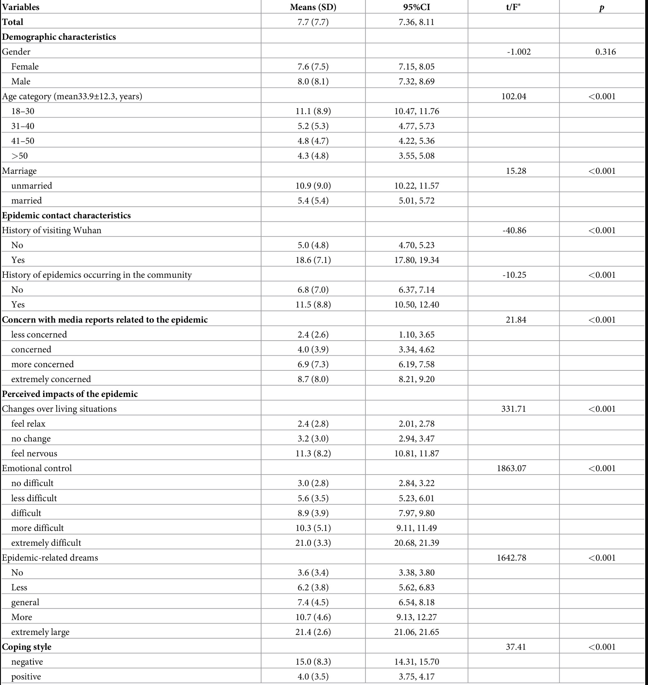

```{r setup, include=FALSE}
knitr::opts_chunk$set(echo = FALSE, message = FALSE, warning = FALSE)
```

# Introduction

In this exercise we will reproduce part of a published table from a study looking at the predictors of psychological distress for a sample of people in China in early 2020 during the COVID-19 pandemic.

## The study

- The paper was published in the PLOS ONE journal and can be viewed online [here](https://doi.org/10.1371/journal.pone.0233410).
- A copy of the paper is in `paper/distress_paper.pdf`.
- The survey data used was made available for download by the authors.

## The outcome: K6 psychological distress

The study quantified psychological distress using the Kessler Psychological Distress Scale (K6), a 6-item screening tool that measures symptoms of psychological distress.

It contains six questions that ask participants to rate how often they have felt 

- ‘nervous’, 
- ‘hopeless’, 
- ‘restless or fidgety’, 
- ‘so depressed that nothing could cheer you up’, 
- ‘that everything was an effort’, and 
- ‘worthless’ 
during the past 30 days. 

Each item is scored 0-4; the six items are summed for a total from 0 to 24, where higher scores mean more distress. In the data, this variable is called `total_scores_of_K6`.

## Reproducing Table 2

Table 2 in the paper reports the mean K6 score by participant characteristic. For each characteristic, they show Mean (SD), 95% CI, and one t or F test comparing groups.



We will practice building and interpreting t-tests and ANOVAs by reproducing part of Table 2. We will reproduce the first four characteristics only (Gender, Age category, Marriage, and History of visiting Wuhan).

## Parts of this exercise

This exercise has two parts:

- In **Part 1**, we will build out the Table 2 from the paper. This part follows the same four steps as the live demo, `rsr_week_05_demo_prevend.Rmd`, so you can refer to it for guidance.
- In **Part 2**, which is optional and ungraded, we will practice calculating power and sample size for a follow-up study.

# PART 1: Replicate the table

## Load packages

Fill in the blanks in the code below to load the packages we will need: `readxl`, `tidyverse`, `gt`, `here`, and `janitor`.

We also load `inspectdf`, which we will use to visualize the variables. The CRAN version of this package has been removed, so we install the GRAPH Courses version from GitHub with `p_load_current_gh()`.

```{r load-packages}
if (!require(pacman)) install.packages("pacman")
pacman::p_load(_______)

pacman::p_load_current_gh("the-graph-courses/inspectdf")
```

## Step 1: Import and label the data

First we import and take a look at the data.
Run the code below to import the data then use the glimpse function to get a sense of the dataset.

```{r data-preview}
survey <- read_excel(here("data/distress_data.xlsx"))
```

```{r glimpse-data}
________(survey)
```

**Question**: How many rows and columns does the raw imported dataset have?

Answer: _______ 

**Question**: What are the variable types? Will we need to convert any variable types?

Answer: _______

Before calculating means and standard deviations, check for missing values. Running `summary()` on the whole dataset reports a count of missing values for each variable on the `NA's` line.

```{r missing-check}
summary(survey)
```

**Question**: Do any of the variables in the dataset have missing values?

Answer: _______

All the columns are coded as numeric, even though many are categorical. The codebook in `data/distress_codebook.xls` gives us the labels for the categorical variables. Below we:

-  use the codebook to label the categorical variables
-  convert the age variable to a categorical variable with four groups, as was done in the paper

We will keep the original variable names from the dataset for the analysis steps. The paper-style row labels for the table come later, after we reshape the data.

Fill in any blanks in the code below, then run the code to check that the dataset has the correct structure.

Remember that you can check the demo code for examples of how to do similar transformations.

```{r import}
survey <- survey %>%
  mutate(
    # convert the gender variable to a factor with two levels
    gender = _______(gender, levels = c(0, 1), labels = c("Female", "Male")),
    # making the age variable categorical with four groups as in the paper
    age = ____(
      age,
      breaks = c(-Inf, 30, 40, 50, Inf),
      labels = c("18-30", "31-40", "41-50", ">50")
    ),
    # convert the marriage variable to a factor with two levels
    # code 1 = married, 0 = unmarried. Code 2 probably means divorced though this is missing in the codebook
    marriage = _______(
      if_else(marriage == 1, "married", "unmarried"),
      levels = c("unmarried", "married")
    ),
    history_of_visiting_SEA = factor(
      history_of_visiting_SEA,
      ______ = c(0, 1),
      ______ = c("No", "Yes")
    )
  ) %>%
  select(total_scores_of_K6, gender, age, marriage, history_of_visiting_SEA)

```

Checkpoint: After selecting variables, the dataset should have 1599 rows and 5 columns.

Call the tabyl function to check the four categorical variables before continuing.

```{r group-checks}
tabyl(survey, gender)
tabyl(survey, age)
tabyl(survey, ________) # marriage
tabyl(survey, ________) # history_of_visiting_SEA
```

We can also visualize all four categorical variables at once with `inspect_cat()` from `{inspectdf}`, piped into `show_plot()`.

```{r inspect-cat}
inspect_cat(survey) %>% show_plot()
```

**Question**: How many men are in the dataset? How many people had visited Wuhan in the past month?

Answer: _______

## Step 2: Descriptive stats for every group

Now, we will calculate the average K6 score by each of the four categorical variables, as well as the standard deviation, standard error, and 95% confidence interval.

First, we reshape the data to long form so each row is one person in one group of one characteristic.

```{r reshape}
survey_long <- survey %>%
  pivot_longer(
    cols = -total_scores_of_K6,
    names_to = "variable",
    values_to = "group"
  )

survey_long
```

Using this, we can easily calculate the summary statistics for every group in one pipeline. For example, below we calculate the number of people in each group.

```{r count-example}
survey_long %>%
  group_by(variable, group) %>%
  summarise(
    n = n()
  )
```

Now let's do something like that but for all the descriptive statistics we want to calculate:

```{r descriptives}
group_stats <- survey_long %>%
  group_by(variable, group) %>%
  summarise(
    # n is the number of people in each group
    n = n(),
    # average K6 score of each group
    mean = mean(_____),
    sd = sd(total_scores_of_K6),
    # standard error is sd divided by the square root of n
    se = ________, 
    # 95% CI: leave 2.5% in each tail, so get the quantile for the 0.975 point using qt()
    ci_95_low_end = mean - qt(0.975, df = n - 1) * se,
    # same for the upper bound, but adding instead of subtracting
    ci_95_high_end = _______ + qt(0.975, df = n - 1) * se,
    .groups = "drop"
  ) %>%
  # relabel variable names for the table, then arrange to match the paper
  mutate(
    variable = factor(
      variable,
      levels = c("gender", "age", "marriage", "history_of_visiting_SEA"),
      labels = c("Gender", "Age category", "Marriage", "History of visiting Wuhan")
    )
  ) %>%
  arrange(variable, group)

group_stats
```

**Question**: For history of visiting Wuhan, which group has the higher mean distress score?

Your answer:

## Step 3: The tests

Next, we want to test for differences in K6 score between the groups.

We will use a t-test for variables with two groups and a one-way ANOVA for variables with three or more groups.

In these tests, we will use `var.equal = TRUE`, which assumes equal variance between the groups. This is done to match the published table, even though it may not be the most appropriate assumption in this case.

First, the gender t-test. Gender has two groups, so we use a t-test.

```{r test-gender}
gender_t <- t.test(total_scores_of_K6 ~ gender, data = survey, var.equal = TRUE)
gender_t
```

**Question**: At alpha = 0.05, is the gender difference statistically significant? Do we reject or fail to reject the null hypothesis?

Your answer:

**Question**: Given this decision, which kind of decision error is it possible that we might have made for the gender t-test, Type I (False positive) or Type II (False negative)? What would that error mean here?

Your answer:

Next, the age ANOVA. Age category has four groups, so we use a one-way ANOVA.

```{r test-age}
age_aov <- aov(total_scores_of_K6 ~ _____, data = survey)
summary(age_aov)
```

**Question**: For the age ANOVA, is the age difference statistically significant? What does this tell us about the groups?

Your answer:

**Question**: Given this decision, which kind of decision error is it possible that we might have made for the ANOVA, Type I or Type II? What would that error mean here?

Your answer:

Finally, fill in the tests to compare the mean K6 score between married and unmarried people, and between people who had visited Wuhan in the past month and those who had not. Both have two groups, so both use a t-test. Then look at the output.

```{r test-rest}
# Equal variance t test for marriage
marriage_t <- _____(_________________)
marriage_t

# Equal variance t test for history of visiting Wuhan
wuhan_t <- _____(_________________)
wuhan_t
```

## Step 4: Assemble the table with `gt`

The code below turns your summaries and tests into a publication-style table.

We have filled this section in for you. We think that when doing statistical research projects in the age of LLMs, you should focus first on checking that the statistical code and outputs are correct. You can then use tools such as LLMs to help with table formatting, as long as you verify that the formatted table matches the results from the statistical code that you either wrote by hand or read through very carefully.

You do not need to edit these chunks. Run them and check that the t/F and p values match the target table image.

First, we extract the ANOVA F statistic and p-value.

```{r anova-extract}
age_f <- summary(age_aov)[[1]]$`F value`[1]
age_p <- summary(age_aov)[[1]]$`Pr(>F)`[1]

age_f
age_p
```

Then, we assemble the table with the `gt` package.

```{r build-table}
results_table <- group_stats %>%
  mutate(
    `Mean (SD)` = paste0(
      format(round(mean, 1), nsmall = 1),
      " (",
      format(round(sd, 1), nsmall = 1),
      ")"
    ),
    `95% CI` = paste0(
      format(round(ci_95_low_end, 2), nsmall = 2),
      ", ",
      format(round(ci_95_high_end, 2), nsmall = 2)
    ),

    statistic = case_when(
      variable == "Gender" ~ as.numeric(gender_t$statistic),
      variable == "Age category" ~ age_f,
      variable == "Marriage" ~ as.numeric(marriage_t$statistic),
      variable == "History of visiting Wuhan" ~ as.numeric(wuhan_t$statistic)
    ),
    p_value = case_when(
      variable == "Gender" ~ gender_t$p.value,
      variable == "Age category" ~ age_p,
      variable == "Marriage" ~ marriage_t$p.value,
      variable == "History of visiting Wuhan" ~ wuhan_t$p.value
    ),
    stat_text = as.character(round(statistic, 2)),
    p_text = if_else(p_value < 0.001, "<0.001", as.character(round(p_value, 3)))
  ) %>%
  group_by(variable) %>%
  mutate(row_in_block = row_number()) %>%
  ungroup() %>%
  mutate(
    `t/F` = if_else(row_in_block == 1, stat_text, ""),
    p = if_else(row_in_block == 1, p_text, "")
  )
```

Now, we render the table with the `gt` package.

```{r render-table}
results_table %>%
  select(variable, group, `Mean (SD)`, `95% CI`, `t/F`, p) %>%
  gt(groupname_col = "variable", rowname_col = "group") %>%
  tab_header(title = "Psychological distress (K6) by characteristic") %>%
  tab_style(
    style = cell_text(weight = "bold"),
    locations = cells_row_groups()
  ) %>%
  tab_options(table.width = pct(100))
```

**Question**: Because you did not write the gt code yourself (we wrote it for you, and in the future, LLMs might write such formatting code for you), it is a good idea to cross check all values in the table against the raw test output from your `t.test()` or `aov()` functions to make sure it is correct. For now, check the Marriage rows test. Compare the table values to the output from `t.test()`. What did you find? Are there any differences worth highlighting? (e.g. is the p-value reported exactly the same way?)

Your answer:

**Question**: Which characteristics are statistically significant at alpha = 0.05?

Your answer:

**Question**: Choose one significant result and report it in plain language as you would in a results section of a paper. 

Your answer:

## LLM formatting practice

Sometimes tables are more informative when they have a small in-cell bar showing the key values we want to highlight. This is possible with gt, using the gtExtras package. 

Practice using LLMs for formatting by asking your favorite LLM for a version of the table that adds an in-cell bar for the mean K6 score. Before asking, run:

```{r glimpse-results}
glimpse(results_table)
```

Then write a prompt that includes the object name, the output from the glimpse function showing the structure of the data, and the package you want to use.

```{r llm-bars}
# pacman::p_load(gtExtras)
# Paste and test your LLM-generated code here.
```

# PART 2 OPTIONAL UNGRADED CHALLENGE: Power and sample size for a follow-up study

Suppose this survey is pilot data. You now want to run a two-arm intervention study to reduce K6 distress.

Before collecting new data, you need to estimate how many participants per group are required.
We will use `power.t.test()` and the pilot standard deviation from this dataset.

```{r pilot-sd}
pilot_sd <- sd(survey$total_scores_of_K6)
round(pilot_sd, 1)
```

## Sample size for 80% power

Suppose a 2-point reduction in mean K6 score is the smallest difference worth detecting.

```{r power-80}
power.t.test(
  delta = _____,
  sd = _____,
  sig.level = 0.05,
  power = 0.80,
  type = "two.sample"
)
```

How many participants are needed per group? Round up.

Your answer:


**Question**: If the chance of detecting a 2-point difference is 80% with our sample size, what happens if the actual difference is 4 points? Do we have a higher or lower chance of detecting it?

Your answer:

## Smaller difference

Now you decide that even a 1-point difference is worth detecting.

```{r power-delta-1}
power.t.test(
  delta = _____,
  sd = _____,
  sig.level = 0.05,
  power = 0.80,
  type = "two.sample"
)
```

Does the required sample size go up or down compared with the 2-point version? Why?

Your answer:
