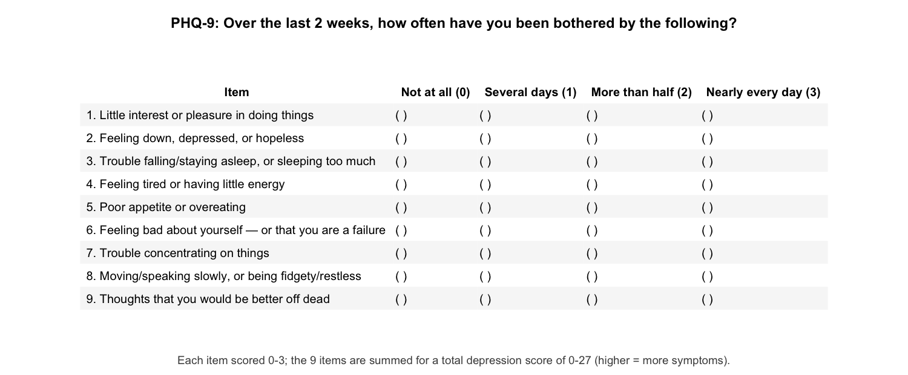

```{r setup, include=FALSE}
knitr::opts_chunk$set(echo = FALSE, message = FALSE, warning = FALSE)
```

# Introduction

In this exercise we will build the **simple linear regression** column of a published table, using the study's own data. We will fit the first few rows together, then you will add one more predictor on your own. Along the way we will compare our numbers to the paper and find two places where the published table does not match a fresh analysis of the data.


## The study

- Girma et al. (2021), *Depression and its determinants among adolescents in Jimma town, Southwest Ethiopia*, PLOS ONE. A copy is in `paper/depression_paper.pdf`.
- The survey data the authors released is in `data/depression_data.xls`.

## The outcome: the PHQ-9 depression score

The authors measured depression with the **PHQ-9 (Patient Health Questionnaire-9)**, a widely used screening tool. It asks how often, over the last two weeks, a person has been bothered by nine problems. For example, one item asks about *"Little interest or pleasure in doing things"* and another about *"Feeling down, depressed, or hopeless."* Each item is rated from 0 ("Not at all") to 3 ("Nearly every day").



The nine item scores are summed into a total from 0 to 27, where higher means more depressive symptoms. In the data this total is the column we rename to `depression_score`.

## The table we will build

Table 2 of the paper reports, for each explanatory variable, a **simple linear regression** column (one predictor at a time) and a **multiple linear regression** column (all predictors together). We will build only the **simple linear regression** column. Each cell is a **beta coefficient (β)** and its **95% confidence interval**.


## Parts of this exercise

- **Part 1**: Fit and check the first three rows (age, sex, and grade level) and compare them to the paper.
- **Part 2**: Add two more predictors of your own choosing.
- **Part 3**: See how simple regression relates to the t-test and ANOVA from last week, and why that matters for continuous predictors.

# PART 1: Build and check the first rows

## Load packages

Fill in the two missing package names. The others are already listed for you.

```{r load-packages}
if (!require(pacman)) install.packages("pacman")
pacman::p_load(readxl, tidyverse, here, janitor, ______, ______)
```

## Step 1: Import, clean names, and label every predictor

First import the data and `glimpse()` it to see what we are working with.

```{r data-import}
survey <- read_excel(here("data/depression_data.xls"))
```

```{r glimpse-raw}
________(survey)
```

The raw column names are cryptic and inconsistent (`AGECHRON`, `SEXRESPO`, `RESIDECE`; note the misspelling of "residence"). Let's pass the data through `janitor::clean_names()` to make every name lower case and tidy, then use `rename()` to give the six predictors we might use clear English names, plus the outcome.

```{r clean-rename}
survey <- survey %>%
  clean_names() %>%
  rename(
    depression_score = scoredep,
    chronological_age = agechron,
    oslo_social_support = osl3,
    sex = sexrespo,
    school_ownership = schoolty,
    residence = residece, # fixes the original misspelling
    grade_level = gradelev
  )
```

Four of these predictors are categorical but stored as numeric codes, so we need to label them now. We are going to order the levels so the **reference group is first**, following the paper. The codes are below:

- `sex` (0 = Female, 1 = Male)
- `school_ownership` (0 = Private, 1 = Public)
- `residence` (0 = Urban, 1 = Rural)
- `grade_level` (1 = Grade 9, 2 = Grade 10, 3 = Grade 11, 4 = Grade 12)

We show the `sex` factor as an example. Fill in the blanks for the other three categorical variables.

```{r label}
survey <- survey %>%
  mutate(
    sex = factor(sex, levels = c(0, 1), labels = c("Female", "Male")),
    school_ownership = factor(school_ownership, levels = ______, labels = ______),
    residence = factor(residence, levels = c(0, 1), labels = ______),
    grade_level = factor(
      grade_level,
      levels = ______,
      labels = ______
    )
  ) %>%
  select(
    depression_score, chronological_age, oslo_social_support,
    sex, school_ownership, residence, grade_level
  )

nrow(survey)
```

Checkpoint: 546 rows and 7 columns.

Now we glimpse the labelled data. These six predictors are the ones you can use in the rest of the exercise.

```{r glimpse-data}
glimpse(survey)
```

**Question**: Which predictors are **continuous**? Which are **binary** (two groups)? Which are **polytomous** (three or more groups)? List each predictor under one heading.

Answer:

- Continuous: _______
- Binary: _______
- Polytomous: _______

## Step 2: Run one simple linear regression per predictor

We start with three predictors, one of each type: `chronological_age` (continuous), `sex` (binary), and `grade_level` (polytomous). A simple regression uses **one predictor at a time**. The outcome is always `depression_score`.

The age model is filled in as an example. Fill in the predictors for the other two models.

```{r models}
age_mod   <- lm(depression_score ~ chronological_age, data = survey)
sex_mod   <- lm(___________ ~ ______, data = __________)
grade_mod <- lm(___________ ~ ______, data = __________)
```

Let's look at the sex model with `summary()`.

```{r sex-summary}
summary(sex_mod)
```

**Question**: In `summary(sex_mod)`, which sex is the reference group? In one sentence, what does the `sexMale` coefficient tell you?

Answer: _______

## Step 3: Extract the beta and 95% CI with `broom`

`summary()` is good for reading one model. To build a table we want the numbers in a data frame. `broom::tidy()` does that, and `conf.int = TRUE` adds the 95% CI as columns.

```{r tidy-example}
tidy(sex_mod, conf.int = TRUE)
tidy(grade_mod, conf.int = TRUE)
```


To turn this into paper-style rows we use two small helpers, one for categorical predictors and one for continuous predictors.

### Helper for categorical predictors

Below we write one helper function, `reg_rows()`, for categorical predictors.

It will:
- drop the intercept
- strip the variable name off `"sexMale"` to leave `"Male"`
- add back a **reference row** with β = 0

```{r helper-cat}
reg_rows <- function(model, var_name, var_label, ref_label) {
  # non-reference rows: drop the intercept, clean the level label
  non_ref <- tidy(model, conf.int = TRUE) %>%
    filter(term != "(Intercept)") %>%
    mutate(level = str_remove(term, var_name)) %>%
    transmute(variable = var_label, level, beta = estimate, low = conf.low, high = conf.high)

  # the reference row: beta is 0 by definition, CI is blank
  ref <- tibble(variable = var_label, level = ref_label, beta = 0, low = NA_real_, high = NA_real_)

  bind_rows(ref, non_ref)
}
```

Run it once on the sex model and compare the result to the raw `tidy()` output above.

```{r helper-cat-demo}
reg_rows(sex_mod, var_name = "sex", var_label = "Sex", ref_label = "Female")
```

**Question**: Compared with `tidy(sex_mod, conf.int = TRUE)`, name one change that `reg_rows()` made.

Answer: _______

### Helper for continuous predictors

Next, we write one helper function, `cont_row()`, for continuous predictors.

A continuous predictor has no reference group and just one row, so `cont_row()` is simpler: it keeps the single slope row and labels it.

```{r helper-cont}
cont_row <- function(model, var_name, var_label, level_label) {
  tidy(model, conf.int = TRUE) %>%
    filter(term == var_name) %>%
    transmute(variable = var_label, level = level_label, beta = estimate, low = conf.low, high = conf.high)
}
```

```{r helper-cont-demo}
cont_row(age_mod, "chronological_age", "Chronological age", "Per 1-year increase")
```

### Build the first three rows

Now we stack age, sex, and grade into one results frame. Fill in the variable name for the grade model (the reference label is already filled in for you).

```{r combine}
results <- bind_rows(
  cont_row(age_mod, "chronological_age", "Chronological age", "Per 1-year increase"),
  reg_rows(sex_mod, "______", "Sex", ref_label = "______"),
  reg_rows(grade_mod, "grade_level", "Grade level", ref_label = "Grade 9")
)

results
```

## Step 4: Assemble the table with `gt`

The formatting below is filled in for you. As in the previous table building exercise, we think it's most important to focus on getting the statistics right; formatting can be delegated to a template like this or to an LLM, **as long as you check the values against the model output**. 

Below we write a function, `make_table()`, to assemble the table with `gt`.

We wrap it in a function so we can reuse it after you add your own predictors in Part 2.

```{r make-table-fn}
make_table <- function(results_df) {
  results_df %>%
    mutate(
      `Beta (95% CI)` = if_else(
        is.na(low),
        "Reference",
        paste0(
          format(round(beta, 2), nsmall = 2), " (",
          format(round(low, 2), nsmall = 2), " to ",
          format(round(high, 2), nsmall = 2), ")"
        )
      )
    ) %>%
    select(variable, level, `Beta (95% CI)`) %>%
    gt(groupname_col = "variable", rowname_col = "level") %>%
    tab_header(
      title = "Depression (PHQ-9) score by participant characteristic",
      subtitle = "Simple (bivariable) linear regression"
    ) %>%
    tab_style(style = cell_text(weight = "bold"), locations = cells_row_groups()) %>%
    tab_options(table.width = pct(100))
}

```

Now let's call that function on our results.

```{r make-table-call}
make_table(results)
```

## Check these three rows against the paper

Compare your three rows to the paper's simple linear regression column (the Table 2 image near the top).

```{r compare-1}
results %>% filter(!is.na(low)) %>% mutate(across(c(beta, low, high), ~ round(.x, 2)))
```

**Question**: Which of these three predictors matches the paper exactly (to two decimals)?

Your answer:

**Question**: The **chronological age** row does not match. What β and 95% CI does your model give, and what does the paper report? (This is the paper's first error.)

Your answer:

**Question**: The **grade level** rows also do not match. The paper states Grade 9 is the reference, but its Grade 10 and Grade 12 betas do not equal a Grade-9-reference regression on the data. What betas does your model give for Grade 10 and Grade 12, and what does the paper report? (This is the paper's second error. Note that age and grade are closely related — older students are in higher grades — so it is striking that both errors fall on this pair.)

Your answer:

# PART 2: Add two predictors of your own

You have now used `chronological_age`, `sex`, and `grade_level`. Three predictors remain:

- `school_ownership`, binary (Private / Public)
- `residence`, binary (Urban / Rural)
- `oslo_social_support`, continuous (Oslo 3-item social support score)

**Choose two** of these three and add them to the table. 

Fill in the blanks below.

```{r my-models}
# Fit two models with lm() and `depression_score` as the outcome, then save them as my_mod_1 and my_mod_2
my_mod_1 <- 
my_mod_2 <- 
```

```{r my-rows}
# Now turn each model into table rows.
# Binary:    reg_rows(model, "var_name", "Nice label", ref_label = "Reference level")
# Continuous: cont_row(model, "var_name", "Nice label", "Per 1-point increase")

my_row_1 <- ______
my_row_2 <- ______
```

Before you bind these rows into the full table, stack them and print the result. Check that the variable names, level labels, betas, and confidence limits look reasonable for both predictors.

```{r check-my-rows}
my_rows <- bind_rows(my_row_1, my_row_2)
my_rows
```

If anything looks wrong (for example, a missing reference row or a level label that still includes the variable name), fix the lines above before continuing.

```{r combine-full}
results_full <- bind_rows(results, my_rows)

make_table(results_full)
```

**Question**: For each predictor you added, does its 95% CI include 0?

Your answer:

**Question**: Do your two added rows match the paper's simple linear regression column?

Your answer:

# PART 3: One framework for t-tests, ANOVA, and continuous predictors

Last week you compared group means with a **t-test** (two groups) and **ANOVA** (three or more groups). This part shows that simple linear regression answers the same questions for categorical predictors, while also handling continuous predictors that those tests cannot take.

## A binary predictor: regression and the t-test

When the predictor has two groups, `lm()` fits one mean for the reference group (in the intercept) and the **difference** between the other group and the reference (in the slope). For sex, the intercept is the mean depression score among females, and the `sexMale` coefficient is how much higher or lower males score on average.

A two-sample t-test also compares the two group means. It asks whether the difference between them could plausibly be zero. Under equal variances, that test and the regression slope test are the same calculation.

Run both below and compare the output.

```{r ttest-vs-reg}
t.test(depression_score ~ sex, data = survey, var.equal = TRUE)
tidy(sex_mod)
```

**Question**: Compare the p-value from `t.test()` with the p-value for `sexMale` in `tidy(sex_mod)`. What do you notice? (The t statistics may differ in sign depending on which group is subtracted from which; the p-values should match.)

Your answer:

**Question**: The `sexMale` estimate in `tidy(sex_mod)` is the difference in mean depression score between males and females. Run the code below to compute those two group means yourself, then subtract female from male. Does your hand calculation match the regression coefficient (up to rounding)?

```{r check-means}
survey %>%
  group_by(sex) %>%
  summarise(mean_dep = mean(depression_score))
```

Your answer:

## A polytomous predictor: regression and ANOVA

With more than two groups, there is no single slope. Instead, `lm()` creates one coefficient per non-reference level (Grade 10, Grade 11, Grade 12), each comparing that grade to Grade 9.

A one-way ANOVA does not report those individual comparisons. It asks one **overall** question: is there any difference among the group means? That overall test comes from the regression too. Scroll to the bottom of `summary(grade_mod)` for the model's F statistic and p-value, which test whether the set of grade coefficients are all zero together.

Run both below.

```{r anova-vs-reg}
summary(aov(depression_score ~ grade_level, data = survey))
summary(grade_mod)
```

**Question**: Compare the p-value from the ANOVA with the p-value at the bottom of `summary(grade_mod)`. What do you notice?

Your answer:

**Question**: Do the ANOVA F statistic and the F statistic from `summary(grade_mod)` match?

Your answer:

## Continuous predictors

The t-test and ANOVA both compare group means, so they only work with categorical predictors. To use one with a continuous variable like age or social support, you would first have to cut it into groups, throwing away information in the process.

Regression has no such limit. You already saw this with `chronological_age` in Part 1: a continuous predictor goes into the same `lm()` call and comes out as a single slope, the change in mean depression score per one-unit increase in the predictor.

**Question**: The paper's table mixes categorical predictors (sex, residence) with continuous ones (age, social support) in a single column. In one or two sentences, why does regression make this easier than using t-tests and ANOVAs?

Your answer:
