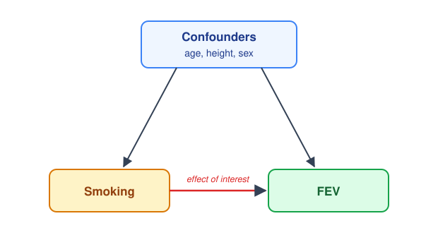

```{r setup, include=FALSE}
knitr::opts_chunk$set(echo = TRUE, message = FALSE, warning = FALSE)
```

# Introduction

In a previous workshop, we used a dataset of forced expiratory volume (FEV) from East Boston in the 1970s to learn about the uses of regression: describing relationships, predicting outcomes, and controlling for another variable. 

In this workshop, we revisit that dataset to again look at the effect of smoking on FEV. Our goal is to answer the question: what is the estimated effect of smoking on FEV in children and adolescents?

## Dataset description

The dataset contains 654 youths aged 3 to 19 from East Boston in the 1970s. The outcome is **forced expiratory volume** (`fev_l`), measured in litres. Higher values mean better lung function.

# Load packages and data

Use `p_load()` to load `tidyverse`, `here`, `modelsummary`, and `equatiomatic`. The GitHub line below loads `inspectdf`.

```{r load-packages}
if (!require(pacman)) install.packages("pacman")
pacman::p_load(________)
pacman::p_load_gh("the-graph-courses/inspectdf")
```

Now, glimpse, then inspect the data with the inspect_cat() and inspect_num() functions from inspectdf.

```{r load-data}
fev <- read_csv(here("data/fev_kahn.csv"))
glimpse(fev)
inspect_cat(fev) %>% show_plot()
inspect_num(fev) %>% show_plot()
```

**Checkpoint:** `fev` should have **654 rows and 5 columns**.

Question: Which variables are numeric, and which look roughly symmetric?

## Set the reference levels

`read_csv()` reads `smoke` and `sex` in as plain character columns. When you pass a character column to `lm()`, R silently converts it to a factor and uses the **alphabetically first** level as the reference (baseline) group. Every coefficient is then a comparison *against* that reference. 

It is preferred to set the reference levels explicitly, with `factor()` and the `levels` argument. The first level listed becomes the reference.

We want **non-smokers** as the reference for `smoke`, and **females** as the reference for `sex`, so that the coefficients read as "smokers compared to non-smokers" and "males compared to females".

```{r set-factors}
fev <- fev %>%
  mutate(
    smoke = factor(smoke, levels = c("non_smoker", "smoker")),
    sex = factor(sex, levels = c(________, ________))
  )

levels(fev$smoke)
levels(fev$sex)
```

**Question:** If female is the reference level, what would we expect to see in the model output when we fit a model that includes sex?

A) A row with the coefficient for sexfemale

```
              Estimate [...]   
(Intercept)    2.451      
sexfemale      0.361      [...]
```

B) A row with the coefficient for sexmale

```
              Estimate [...]   
(Intercept)    2.451      
sexmale        0.361      [...]
```

Ans:

# Part 1: Define the effect and the confounding problem

## Part 1a: The raw smoking difference

Start by calculating the mean FEV, mean height, and mean age for smokers and non-smokers.

```{r smoke-summary}
fev %>%
  group_by(_______) %>%
  summarise(
    mean_fev = ___________,
    mean_height = ___________,
    mean_age = ___________
  )
```

**Question:** Which group has higher mean FEV in the raw summary?

Ans:

**Question:** Which group is older and taller on average?

Ans:

We can visualise the FEV difference with a boxplot and jittered points.

```{r smoke-plot}
ggplot(fev, aes(x = smoke, y = fev_l)) +
  geom_jitter(width = 0.15, alpha = 0.4) +
  geom_boxplot(alpha = 0.7) +
  labs(
    x = "Smoking status",
    y = "FEV (litres)",
    title = "FEV by smoking status"
  )
```

Let's now fit a model with smoking as the only predictor.

```{r model-1}
m1_smoke <- ___________
summary(m1_smoke)
```

**Question:** What is the `smokesmoker` coefficient? Write a one-sentence interpretation of it.

Ans:

**Question:** In one sentence, why might the raw comparison be misleading?

Ans:

It can also help to see the equation the model is actually fitting. The `equatiomatic` package does this for you: `extract_eq()` builds the equation from the fitted model, and `preview_eq()` renders it so you can look at it in the RStudio Viewer.

```{r model-1-equation}
extract_eq(m1_smoke, use_coefs = TRUE) %>% preview_eq()
```


## Part 1b: Confounders and a simple DAG

To estimate the smoking effect cleanly, we want to adjust for **confounders**: variables that might affect both whether a youth smokes and their FEV.

In this dataset, age, height, and sex are all plausible confounders. The DAG below shows this structure:

{width=70%}

We will therefore want to control for these. 

Note that we are deciding these *before* fitting the model(s). This is what modern guidelines recommend: choosing which variables to adjust for ahead of time, based on subject-matter knowledge (including drawing a DAG like the one above), rather than fishing through the variables for significant ones.

That kind of fishing (selecting variables based on their significance in the data) is more defensible when the only goal is to *predict* the outcome as accurately as possible, rather than to *explain* the effect of one particular exposure.

# Part 2: Fit a sequence of adjusted models

In Part 1a, the raw model showed a misleading smoking effect. Now we add confounders one at a time. Each model has the same outcome (`fev_l`).

Write the full `lm()` call for each model. 

## Part 2a: Model 2, add age

Age is a plausible confounder because smokers are older on average, and FEV increases strongly with age. Write an lm() call to predict `fev_l` from `smoke` and `age_yrs`.

```{r model-2}
m2_age <- ___________
summary(m2_age)
```

**Question:** What happened to the smoking coefficient after adjusting for age?

Ans:

## Part 2b: Model 3, add height

Height is also a plausible confounder because smokers are taller on average, and height is strongly related to lung volume. Add height to the model.

```{r model-3}
m3_age_height <- ___________
summary(m3_age_height)
```

**Question:** Interpret the smoking coefficient in this model using the phrase "holding age and height constant."

Ans:

## Part 2c: Model 4, add sex

Finally, add sex. Sex may be related to body size and lung function, and it could also differ between smokers and non-smokers.

```{r model-4}
m4_age_height_sex <- ___________
summary(m4_age_height_sex)
```

Let's look at the equation for this one too, and compare it to Model 1.

```{r model-4-equation}
extract_eq(________, use_coefs = TRUE) %>% preview_eq()
```

**Question:** Again, interpret the smoking coefficient in this model. At alpha = 0.05, is the adjusted smoking coefficient statistically significant in Model 4?

Ans:

# Part 3: Compare models side by side

Now, we can put all four models into a list, then use `modelsummary()` to compare them in one table. This shows how the smoking coefficient and model fit change as we add confounders:

```{r model-comparison}
model_list <- list(
  "1. Smoking only" = m1_smoke,
  "2. + age" = m2_age,
  "3. + height" = m3_age_height,
  "4. + sex" = m4_age_height_sex
)

modelsummary(
  model_list,
  estimate = "{estimate}",
  statistic = c("[{conf.low}, {conf.high}]", "p = {p.value}"), # two lines under each estimate
  conf_level = 0.95,
  fmt = 3, # decimal places
  coef_map = c(
    "smokesmoker" = "Smoking (smoker vs non-smoker)",
    "age_yrs" = "Age (years)",
    "height_in" = "Height (inches)",
    "sexmale" = "Sex (male vs female)"
  ),
  gof_map = list( # goodness-of-fit statistics to show, and how to label them
    list(raw = "nobs", clean = "N (youths)", fmt = 0),
    list(raw = "r.squared", clean = "R-squared", fmt = 3),
    list(raw = "adj.r.squared", clean = "Adjusted R-squared", fmt = 3)
  ),
  title = "Estimated smoking effect on FEV (litres), by adjustment set",
  notes = "Each cell shows the estimate, the 95% confidence interval, and the p-value. Outcome is FEV in litres.",
  output = "gt" # render as a nicely formatted gt table
)
```

The table reports two related measures of model fit:

- **R-squared** is the proportion of the variation in FEV that the model explains, from 0 to 1. A problem with R-squared is that it can *only go up* when you add a predictor, even if that predictor is useless. So it always rewards bigger models.
- **Adjusted R-squared** fixes this by adding a small penalty for each extra predictor. It only rises if a new predictor improves the fit by more than we would expect from chance. This makes it more honest when comparing models with different numbers of predictors.

**Question:** Look at the R-squared row across the four models. What happens to it as we add predictors, and does the adjusted R-squared behave the same way?

Ans:


# Part 4: Report the result

Write a short paragraph reporting the result from the final model.

Begin by stating what the final model adjusted for. Then report the adjusted smoking estimate, its 95% confidence interval. Also report the adjusted R-squared. Use association language rather than cause-and-effect language.

ANSWER:


# Optional challenge: Prediction from the adjusted model

Our goal in this workshop was to *explain* the smoking effect, not to build the best possible prediction model. Even so, once we have fitted a regression model, we can also use it to predict FEV for new individuals. If you have time, work through this section.

Use Model 4 to predict FEV for two otherwise similar 12-year-old, 60-inch-tall males: one non-smoker and one smoker.

```{r predict-nonsmoker}
new_nonsmoker <- tibble(
  smoke = "non_smoker",
  age_yrs = 12,
  height_in = 60,
  sex = "male"
)

predict(m4_age_height_sex, newdata = new_nonsmoker)
```

```{r predict-smoker}
new_smoker <- tibble(
  smoke = "______",
  age_yrs = ______,
  height_in = ______,
  sex = "____"
)

predict(__________, newdata = __________)
```

**Question:** How far apart are the two predictions? How does that difference relate to the smoking coefficient in Model 4?

Ans:

Extract the coefficients and calculate the smoker prediction by hand.

```{r coefficients}
coef(m4_age_height_sex)
```

```{r prediction-by-hand}
b <- coef(m4_age_height_sex)

b["(Intercept)"] +
  b["height_in"] * ______ +
  b["age_yrs"] * ______ +
  b["sexmale"] * ______ +
  b["smokesmoker"] * ______
```

**Question:** Does your hand calculation match `predict()`?

Ans:
