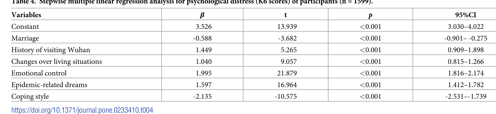

```{r setup, include=FALSE}
knitr::opts_chunk$set(echo = FALSE, message = FALSE, warning = FALSE)
```

# Introduction

In Workshop 5 we reproduced part of **Table 2** from Wang et al. (2020): a table of group means and t/F tests, one predictor at a time. In this workshop we return to the same paper and same dataset, and reproduce **Table 4**: the paper's **multiple linear regression** model, where several predictors are considered together.

## The study

- The paper was published in the PLOS ONE journal and can be viewed online [here](https://doi.org/10.1371/journal.pone.0233410).
- A copy of the paper is in `paper/distress_paper.pdf`.
- The survey data used was made available for download by the authors, and is the same file as Workshop 5: `data/distress_data.xlsx`.

## The outcome, again: K6 psychological distress

As in Workshop 5, the outcome is `total_scores_of_K6`, the Kessler Psychological Distress Scale (K6) total score, from 0 to 24. Higher values mean more distress.

## What the paper actually did: stepwise selection

The authors describe their approach as a **stepwise multiple linear regression**. In a stepwise procedure, a statistical algorithm repeatedly adds or removes predictors from a larger candidate list, based on whether each predictor improves the model by some criterion (commonly a p-value threshold). The paper started with a longer list of candidate predictors (gender, age, marriage, history of visiting Wuhan, history of epidemics in the community, concern with media reports, and all three "perceived impacts" items, plus coping style) and the stepwise procedure kept only some of them.

**We will not perform the stepwise selection ourselves.** Stepwise selection has well-documented statistical problems (it can overstate significance and the exact variables kept can be unstable), and it is not something we've covered in this course. Instead, we will do something more useful for learning multiple regression: **fit the final six-predictor model directly**, using the variables the paper says its stepwise procedure landed on, and compare our coefficients to theirs.

## Reproducing Table 4

Table 4 in the paper reports the final multiple regression model: an intercept ("Constant") plus six predictors, each with a coefficient (labeled β, though these are unstandardized), a t statistic, a p-value, and a 95% CI.



The six predictors in the final model are:

- `marriage`: 0 = unmarried, 1 = married
- `history_of_visiting_SEA`: history of visiting Wuhan in the past month, 0 = No, 1 = Yes
- `changes_over_living_situations`: perceived impact on daily living situations (ordinal, kept as its raw numeric code, as the paper's Table 3 specifies "Primary Value")
- `emotional_control`: perceived difficulty controlling emotions (ordinal, kept as its raw numeric code)
- `epidemic-related_dreams`: frequency of epidemic-related dreams (ordinal, kept as its raw numeric code)
- `coping_style`: 0 = negative, 1 = positive

Notice that three of these predictors (`changes_over_living_situations`, `emotional_control`, `epidemic-related_dreams`) are entered as plain numeric codes rather than as categorical factors. This is a modeling choice the paper made (per its Table 3), treating multi-level ordinal survey items as if they were continuous. We will follow the same approach here to reproduce their numbers, but keep in mind this assumes each one-step increase in the ordinal scale has the same-sized effect on K6, which may or may not be realistic.

# PART 1: Prepare the data

## Load packages

Use `p_load()` to load the following packages: `readxl`, `tidyverse`, `here`, `janitor`, `broom`, and `gt`.

```{r load-packages}
if (!require(pacman)) install.packages("pacman")
pacman::p_load(_______)
```

## Step 1: Import and clean names

```{r data-import}
survey <- read_excel(here("data/distress_data.xlsx"))
survey <- clean_names(survey)
glimpse(survey)
```

**Question**: After `clean_names()`, what did the column `epidemic-related_dreams` become? (Hint: look at the glimpse output.)

Answer: _______

## Step 2: Label the categorical predictors

Fill in the blanks below to recode `marriage`, `history_of_visiting_sea`, and `coping_style` into labeled factors, matching the codebook and Table 3 of the paper. Leave the three ordinal "perceived impact" variables as numeric, as discussed above.

```{r label-vars}
survey <- survey %>%
  mutate(
    # 0 = unmarried, 1 = married. Code 2 is undefined in the codebook, so it becomes NA here.
    marriage = factor(marriage, levels = c(0, 1), labels = c("unmarried", "married")),
    # 0 = No, 1 = Yes
    history_of_visiting_sea = _______(
      history_of_visiting_sea,
      levels = c(0, 1),
      labels = c("No", "Yes")
    ),
    # 0 = negative, 1 = positive
    coping_style = factor(
      coping_style,
      levels = c(0, 1),
      labels = c("_______", "_______")
    )
  )

summary(survey$marriage)
```

**Question**: How many rows have `marriage` equal to `NA` after this recoding? Why do you think that is?

Answer: _______

## Step 3: Select the variables for the model

```{r select-vars}
model_data <- survey %>%
  select(
    total_scores_of_k6,
    marriage,
    history_of_visiting_sea,
    changes_over_living_situations,
    emotional_control,
    epidemic_related_dreams,
    coping_style
  )

summary(model_data)
```

**Question**: Which variable(s) have missing values after selecting? How many rows would be dropped from the regression as a result?

Answer: _______

# PART 2: Fit the multiple regression model

## Step 4: Fit the model

Fill in the blanks below to fit a linear model predicting `total_scores_of_k6` from all six predictors at once.

```{r fit-model}
distress_model <- lm(
  total_scores_of_k6 ~ marriage + _______ + changes_over_living_situations +
    emotional_control + _______ + coping_style,
  data = model_data
)

summary(distress_model)
```

**Question**: How many observations were used to fit this model (see the bottom of the summary output, or check `nobs(distress_model)`)? Does this match the number you predicted in the previous question?

Answer: _______

**Question**: What is the model's R-squared? How does it compare with the paper's reported R-squared of 0.862?

Answer: _______

## Step 5: Get confidence intervals

```{r model-ci}
confint(_______)
```

## Step 6: Compare to the paper, row by row

The paper's Table 4 values (rounded) are:

| Variable | β | t | p | 95% CI |
|---|---|---|---|---|
| Constant | 3.526 | 13.939 | <0.001 | 3.030, 4.022 |
| Marriage | -0.588 | -3.682 | <0.001 | -0.901, -0.275 |
| History of visiting Wuhan | 1.449 | 5.265 | <0.001 | 0.909, 1.898 |
| Changes over living situations | 1.040 | 9.057 | <0.001 | 0.815, 1.266 |
| Emotional control | 1.995 | 21.879 | <0.001 | 1.816, 2.174 |
| Epidemic-related dreams | 1.597 | 16.964 | <0.001 | 1.412, 1.782 |
| Coping style | -2.135 | -10.575 | <0.001 | -2.531, -1.739 |

**Question**: Compare your `marriage` coefficient to the paper's -0.588. Is it close? Note that the paper coded married as the reference group differently than we may have (check the sign and the direction of the comparison, married vs unmarried, in your model's factor levels).

Answer: _______

**Question**: For which predictor(s) is your coefficient closest to the paper's value? For which is it furthest off? A perfect match is not expected, since we skipped the stepwise variable-selection step and the paper does not report exactly how it handled the ambiguous `marriage` code.

Answer: _______

**Question**: Every predictor in both your model and the paper's model has p < 0.001. Does a very small p-value tell us that a predictor has a *large* or *practically important* effect on distress? What does it actually tell us?

Answer: _______

## Step 7: Build a publication-style table

We have filled in this section for you, since it is table-formatting code rather than statistical code. As in Workshop 5, focus your energy on checking that the statistical values are correct; you can lean on tools such as LLMs for the surrounding formatting code, as long as you verify the numbers against your own `lm()` output.

```{r build-table}
tidy_model <- tidy(distress_model, conf.int = TRUE) %>%
  mutate(
    term = case_when(
      term == "(Intercept)" ~ "Constant",
      term == "marriagemarried" ~ "Marriage",
      term == "history_of_visiting_seaYes" ~ "History of visiting Wuhan",
      term == "changes_over_living_situations" ~ "Changes over living situations",
      term == "emotional_control" ~ "Emotional control",
      term == "epidemic_related_dreams" ~ "Epidemic-related dreams",
      term == "coping_stylepositive" ~ "Coping style",
      TRUE ~ term
    ),
    beta = round(estimate, 3),
    t_stat = round(statistic, 3),
    p_text = if_else(p.value < 0.001, "<0.001", as.character(round(p.value, 3))),
    ci = paste0(round(conf.low, 3), ", ", round(conf.high, 3))
  )

tidy_model %>%
  select(term, beta, t_stat, p_text, ci) %>%
  gt() %>%
  cols_label(
    term = "Variable",
    beta = "β",
    t_stat = "t",
    p_text = "p",
    ci = "95% CI"
  ) %>%
  tab_header(title = "Multiple linear regression for psychological distress (K6 scores)") %>%
  tab_options(table.width = pct(100))
```

**Question**: Look at the sign of the `Coping style` row in your table. In our recoding, the reference group is "negative" coping and the row shown is for "positive" coping. Is your coefficient's sign consistent with the paper's finding that people with a *negative* coping style have *higher* distress?

Answer: _______

# PART 3: Thinking critically about this model

The paper interprets its multiple regression as identifying the "influence factors of psychological distress," meaning it treats these six predictors as if they causally raise or lower distress. Before accepting that framing, it is worth asking whether the study design supports it.

**Question**: This is a cross-sectional survey: every variable, including distress and coping style, was measured at the same point in time (Feb 1-4, 2020), during the first days of the outbreak. What kind of study design would be needed to establish that negative coping style *causes* higher distress, rather than the other way around, or both influencing each other?

Answer: _______

**Question**: Consider the `coping_style` predictor specifically. It seems just as plausible that someone who is already highly distressed adopts more negative coping behaviors (for example, worrying more, complaining more) as a *response* to distress, rather than negative coping causing the distress. This is sometimes called **reverse causation**. Can you think of a similar reverse-causation concern for `emotional_control` (perceived difficulty controlling one's emotions) or `epidemic-related_dreams`?

Answer: _______

**Question**: Look again at the K6 items that make up the outcome (`total_scores_of_K6`): feeling nervous, hopeless, restless, depressed, that everything is an effort, and worthless. Now look at the `emotional_control` predictor (difficulty controlling emotions) and the `epidemic-related_dreams` predictor (frequency of distressing dreams, which is a recognized symptom of trauma-related distress). Do any of these predictors seem conceptually very close to, or overlapping with, the outcome they are meant to predict? Why might that inflate the model's R-squared in a way that is not very informative?

Answer: _______

**Question**: Given these concerns, suggest one way you would rewrite a results sentence about `coping_style` to be more careful about causal language than the paper's original wording ("negative coping style ... had higher level of psychological distress").

Answer: _______

# Wrap-up

**Question**: In one paragraph, summarize what you were and were not able to replicate from Table 4, and give your overall assessment of how confidently we can interpret this multiple regression as showing what "causes" psychological distress.

Answer: _______
