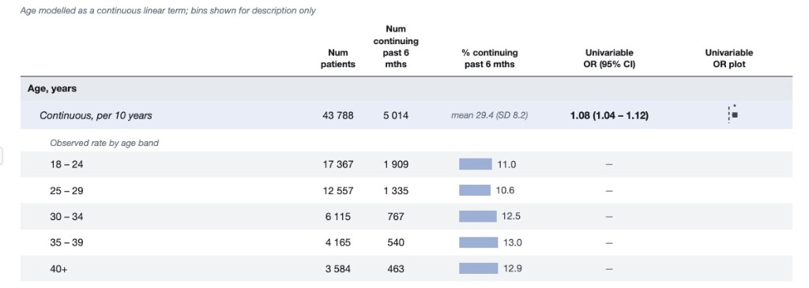

```{r setup, include=FALSE}
knitr::opts_chunk$set(echo = TRUE, message = FALSE, warning = FALSE)
```

# Introduction

In Week 10 you fitted **univariable** logistic regression models for mortality after burns, following [Kim et al. (2017)](https://doi.org/10.1371/journal.pone.0185195).

This week we move to a **multivariable** model using the same four predictors as Week 10, then check model assumptions and compare functional forms for age.


The paper's Table 2 also includes mechanical ventilation and carboxyhemoglobin, but those are not part of this workshop.

Today's goals:

1. Refit the four univariable models from Week 10 (mostly written for you).
2. Write and interpret a multivariable logistic regression.
3. Run `check_model()` diagnostics and interpret them for a logistic model.
4. Compare linear, decade-group, and quadratic forms for age using AIC and plots.
5. Optional challenge: build a dense results table with raw counts and forest-style OR plots.

# PART 1: Load and prepare the data

## Load packages

```{r load-packages}
if (!require(pacman)) install.packages("pacman")
pacman::p_load(tidyverse, readxl, here, janitor, broom, equatiomatic, gt,
               performance, see, patchwork)
pacman::p_load_gh("the-graph-courses/inspectdf")
```

## Import and clean

We use the same cleaned dataset as Week 10: mortality, age, TBSA burned, inhalation injury, and PF ratio group.

```{r import-clean}
burns_raw <- read_excel(here("data/S1Dataset_burns.xlsx"), sheet = "Sheet2") %>%
  clean_names()

burns <- burns_raw %>%
  rename(mortality = mortaltiy, age_years = age, tbsa_percent = tbsa) %>%
  mutate(
    mortality = factor(mortality, levels = c(0, 1),
                       labels = c("Survived", "Died")),
    inhalation_injury = factor(in_hdiv, levels = 0:3,
                               labels = c("Normal", "Subjective", "Upper", "Lower")),
    pf_ratio_group = factor(pfdivide, levels = 0:3,
                            labels = c(">300", "200-300", "100-200", "<100"))
  ) %>%
  select(mortality, age_years, tbsa_percent, inhalation_injury, pf_ratio_group)

glimpse(burns)
burns %>% tabyl(mortality)
```

**Question 1.1:** How many patients are in this dataset?

Ans 1.1: ______

**Answer:** **676** patients.

**Question 1.2:** What are the four predictors we will include in the multivariable model?

Ans 1.2: ______

**Answer:** **Age**, **TBSA burned**, **inhalation injury**, and **PF ratio group**.

# PART 2: Univariable models

You already know how to fit these from Week 10. The code below is filled in so you can move quickly to the multivariable section. Run each chunk and skim the odds ratios.

```{r uni-models}
age_uni <- glm(mortality ~ age_years, family = binomial, data = burns)
tbsa_uni <- glm(mortality ~ tbsa_percent, family = binomial, data = burns)
inhalation_uni <- glm(mortality ~ inhalation_injury, family = binomial, data = burns)
pf_uni <- glm(mortality ~ pf_ratio_group, family = binomial, data = burns)

uni_results <- bind_rows(
  Age = tidy(age_uni, conf.int = TRUE, exponentiate = TRUE),
  TBSA = tidy(tbsa_uni, conf.int = TRUE, exponentiate = TRUE),
  `Inhalation injury` = tidy(inhalation_uni, conf.int = TRUE, exponentiate = TRUE),
  `PF ratio` = tidy(pf_uni, conf.int = TRUE, exponentiate = TRUE),
  .id = "predictor"
) %>%
  filter(term != "(Intercept)")

uni_results
```

**Question 2.1:** In the univariable results, which continuous predictors have 95% CIs that exclude 1?

Ans 2.1: ______

**Answer:** **Age** and **TBSA**.

**Question 2.2:** In the univariable inhalation-injury model, which non-reference group has the highest odds of mortality compared with Normal?

Ans 2.2: ______

**Answer:** The **Upper** group.

# PART 3: Multivariable model

Now fit one model that includes all four predictors together: age, TBSA, inhalation injury, and PF ratio group.

## Fit the model

Fill in the formula. Outcome first, then predictors separated by `+`.

```{r multivar-model-q, eval=FALSE}
multivar_model <- glm(
  ________ ~ ________ + ________ + ________ + ________,
  family = binomial,
  data = ________
)
summary(multivar_model)
```

**Solution:**

```{r multivar-model}
multivar_model <- glm(
  mortality ~ age_years + tbsa_percent + inhalation_injury + pf_ratio_group,
  family = binomial,
  data = burns
)
summary(multivar_model)
```

## Display the equation

```{r multivar-equation}
extract_eq(multivar_model, use_coefs = TRUE, wrap = TRUE, terms_per_line = 3) %>%
  preview_eq()
```

**Question 3.1:** How many parameters does this model have, including the intercept? (Count the coefficient rows in `summary()`.)

Ans 3.1: ______

**Answer:** **9** parameters (intercept + age + TBSA + 3 inhalation contrasts + 3 PF contrasts).

**Question 3.2:** With `n = nrow(burns)` and that many parameters, do we meet a rough guideline of at least 10 observations per parameter?

Ans 3.2: ______

**Answer:** Yes. With \(n = 676\) and 9 parameters, we have about **75** observations per parameter, well above 10.

## Odds ratios

```{r multivar-results-q, eval=FALSE}
multivar_results <- tidy(________, conf.int = ________, exponentiate = ________)
multivar_results
```

**Solution:**

```{r multivar-results}
multivar_results <- tidy(multivar_model, conf.int = TRUE, exponentiate = TRUE)
multivar_results
```

**Question 3.3:** Complete the interpretation for age in the multivariable model.

Ans 3.3:

> After adjusting for TBSA, inhalation injury, and PF ratio group, each additional year of age was associated with about ______ times the odds of mortality (OR ______, 95% CI ______ to ______).

**Answer:** After adjusting for TBSA, inhalation injury, and PF ratio group, each additional year of age was associated with about **1.06** times the odds of mortality (OR **1.06**, 95% CI **1.04** to **1.09**).

**Question 3.4:** Compare the univariable and multivariable ORs for Upper inhalation injury (versus Normal). Did the adjusted OR move closer to 1, farther from 1, or stay about the same? What does that suggest?

Ans 3.4: ______

**Answer:** The univariable Upper OR is about **4.44**; the multivariable OR is about **3.99**. It moves modestly toward 1, suggesting much of the Upper association remains after adjustment, but some of the crude association may have been shared with other predictors.

**Question 3.5:** In the multivariable model, which predictors still have statistically significant associations with mortality (CI excludes 1, or p < 0.05)?

Ans 3.5: ______

**Answer:** **Age**, **TBSA**, **Upper inhalation** (vs Normal), and **Lower inhalation** (vs Normal). PF ratio contrasts and Subjective inhalation are not significant after adjustment.

## Side-by-side univariable and multivariable table

The formatting code is provided. Check that the numbers match the model objects you understand.

```{r combined-table}
model_rows <- bind_rows(
  uni_results %>% mutate(model = "Univariable"),
  multivar_results %>%
    filter(term != "(Intercept)") %>%
    mutate(predictor = case_when(
      term == "age_years" ~ "Age",
      term == "tbsa_percent" ~ "TBSA",
      str_detect(term, "inhalation_injury") ~ "Inhalation injury",
      str_detect(term, "pf_ratio_group") ~ "PF ratio",
      TRUE ~ term
    ),
    model = "Multivariable")
) %>%
  transmute(
    predictor,
    model,
    term,
    OR = estimate,
    conf_low = conf.low,
    conf_high = conf.high,
    p_value = p.value
  )

model_rows %>%
  mutate(
    `95% CI` = sprintf("%.3f to %.3f", conf_low, conf_high),
    p_value = scales::pvalue(p_value, accuracy = 0.001)
  ) %>%
  select(predictor, model, term, OR, `95% CI`, p_value) %>%
  gt(groupname_col = "predictor") %>%
  cols_label(term = "Term", OR = "OR", p_value = "p-value") %>%
  fmt_number(columns = OR, decimals = 3) %>%
  tab_header(title = md("**Univariable and multivariable logistic regression**"))
```

**Final reporting task:** Using the multivariable results, complete this paragraph.

Ans:

> In a multivariable logistic regression model (n = ______), each additional year of age was associated with ______% higher odds of mortality (OR ______, 95% CI ______ to ______), and each additional percentage point of TBSA burned was associated with ______% higher odds (OR ______, 95% CI ______ to ______). Compared with Normal inhalation status, the Upper group had OR ______ (95% CI ______ to ______). After adjustment, the PF ratio group contrasts were ______ (significant / not significant) at the 0.05 level.

**Answer:** In a multivariable logistic regression model (n = **676**), each additional year of age was associated with **6% higher odds** of mortality (OR **1.06**, 95% CI **1.04** to **1.09**), and each additional percentage point of TBSA burned was associated with **9% higher odds** (OR **1.09**, 95% CI **1.08** to **1.11**). Compared with Normal inhalation status, the Upper group had OR **3.95** (95% CI **1.76** to **9.00**). After adjustment, the PF ratio group contrasts were **not significant** at the 0.05 level.

# PART 4: Assumption checks for logistic regression

In Week 9 you used the SUNSHINE checklist for **linear** regression. Many of the same ideas apply to logistic regression, with a few important differences.

{width=100%}

## What changes for logistic models?

| Check | Linear regression | Logistic regression |
|:--|:--|:--|
| Shape | Residual vs fitted should look flat (linear mean) | The relationship should be roughly **linear in the log-odds**. `check_model()` shows **binned residuals** for this |
| Homogeneity | Residual spread should be constant | Binary outcomes have variance tied to \(p(1-p)\), so classical constant-variance is not the same target |
| Normality of residuals | Often checked, least critical in large samples | **Not an assumption** of logistic regression. Residuals from a 0/1 outcome cannot be normal |
| Multicollinearity, influence, sample size, design | Same ideas | Same ideas |

So when `check_model()` shows a QQ / normality-style panel for a logistic model, treat it as less central than for linear models. A "bad" QQ plot does **not** by itself mean the logistic model is invalid. Focus especially on **binned residuals**, **collinearity**, and **influential points**.

## Run `check_model()`

```{r check-model, fig.width=10, fig.height=9}
check_model(multivar_model)
```

**Question 4.1:** Which panel is the main "shape" check for this logistic model, and what would a reassuring pattern look like?

Ans 4.1: ______

**Answer:** The **binned residuals** panel. A reassuring pattern has bin averages scattered around 0 without a strong systematic curve across the range of fitted values (most points inside the error bounds).

**Question 4.2:** Do any predictors show concerning collinearity (high VIF)?

Ans 4.2: ______

**Answer:** Typically no severe multicollinearity among these predictors. VIFs should stay in a comfortable range (well below common teaching cutoffs such as 5 or 10). Confirm on your own `check_model()` output.

**Question 4.3:** The normality / QQ panel may look far from a straight line. Is that a reason to discard the logistic model? Why or why not?

Ans 4.3: ______

**Answer:** No. Logistic regression does **not** assume normally distributed residuals. Binary outcomes produce residuals that cannot look normal even when the model is appropriate. That is why `check_model()` still shows a QQ-style panel for some GLMs, but it is much less informative here than for linear regression. Prefer binned residuals and influence/collinearity checks.

**Question 4.4:** Looking at the influential-observations panel, do any points look like they dominate the fit?

Ans 4.4: ______

**Answer:** Usually no single point dominates (Cook's distance stays small relative to common guidelines). If one or two points stand out on your plot, note them and consider a sensitivity check that refits without them.

# PART 5: Comparing functional forms for age

How you enter a continuous variable is usually guided by prior knowledge and what similar papers do. When you are unsure, you can compare a few pre-specified forms with **AIC** (lower is better, among models fit to the same outcome and rows).

We will compare three forms for age:

1. Linear: `age_years`
2. Decade groups: 18-29, 30-39, ..., 70+
3. Quadratic: `age_years + age_years^2`

```{r age-forms-data}
burns_age <- burns %>%
  mutate(
    age_decade = cut(
      age_years,
      breaks = c(18, 29, 39, 49, 59, 69, Inf),
      labels = c("18-29", "30-39", "40-49", "50-59", "60-69", "70+"),
      include.lowest = TRUE
    )
  )
```

## Fit the three models

The linear model is already available as `age_uni`. Fit the other two.

```{r age-forms-models-q, eval=FALSE}
age_decade_model <- glm(________ ~ ________, family = binomial, data = burns_age)

age_quad_model <- glm(________ ~ ________ + I(________^2), family = binomial, data = burns_age)

AIC(age_uni)
AIC(age_decade_model)
AIC(age_quad_model)
```

**Solution:**

```{r age-forms-models}
age_decade_model <- glm(mortality ~ age_decade, family = binomial, data = burns_age)

age_quad_model <- glm(mortality ~ age_years + I(age_years^2), family = binomial, data = burns_age)

AIC(age_uni)
AIC(age_decade_model)
AIC(age_quad_model)
```

**Question 5.1:** Which functional form has the lowest AIC? By roughly how many points does it beat the next-best option?

Ans 5.1: ______

**Answer:** The **linear** age model has the lowest AIC (about **742.8**). The quadratic is nearly identical (about **742.9**). Decade groups are worse (about **748.1**), roughly **5** AIC points higher than linear.

**Question 5.2:** Should you always report the form with the lowest AIC, even if you tried dozens of shapes after seeing the data?

Ans 5.2: ______

**Answer:** No. Prefer a small set of forms supported by theory, prior evidence, or a pre-specified plan. Mining many shapes and reporting only the winner inflates the chance of a spuriously good fit. AIC is a comparison tool among candidates you already had reason to consider.

## Visual comparison: log-odds and probability

Below we plot fitted curves on both the log-odds scale and the probability scale. Decade groups use `geom_step()` because the fitted value is constant within each decade.

```{r age-forms-plot-data}
age_grid <- tibble(age_years = 18:90) %>%
  mutate(
    age_decade = cut(
      age_years,
      breaks = c(18, 29, 39, 49, 59, 69, Inf),
      labels = c("18-29", "30-39", "40-49", "50-59", "60-69", "70+"),
      include.lowest = TRUE
    )
  )

age_curves <- bind_rows(
  age_grid %>%
    mutate(
      form = "Linear",
      log_odds = predict(age_uni, newdata = ., type = "link"),
      probability = predict(age_uni, newdata = ., type = "response")
    ),
  age_grid %>%
    mutate(
      form = "Decade groups",
      log_odds = predict(age_decade_model, newdata = ., type = "link"),
      probability = predict(age_decade_model, newdata = ., type = "response")
    ),
  age_grid %>%
    mutate(
      form = "Quadratic",
      log_odds = predict(age_quad_model, newdata = ., type = "link"),
      probability = predict(age_quad_model, newdata = ., type = "response")
    )
)
```

```{r age-forms-plots, fig.width=9, fig.height=7}
p_log_odds <- ggplot(age_curves, aes(age_years, log_odds, color = form)) +
  geom_line(data = filter(age_curves, form != "Decade groups"), linewidth = 1) +
  geom_step(data = filter(age_curves, form == "Decade groups"), linewidth = 1) +
  labs(x = "Age (years)", y = "Log odds of mortality", color = NULL,
       title = "Fitted log odds") +
  theme(legend.position = "bottom")

p_prob <- ggplot(age_curves, aes(age_years, probability, color = form)) +
  geom_line(data = filter(age_curves, form != "Decade groups"), linewidth = 1) +
  geom_step(data = filter(age_curves, form == "Decade groups"), linewidth = 1) +
  labs(x = "Age (years)", y = "Probability of mortality", color = NULL,
       title = "Fitted probability") +
  theme(legend.position = "bottom")

p_log_odds / p_prob
```

**Question 5.3:** On the log-odds plot, what shape do you expect for the linear age model? What about the decade-group model?

Ans 5.3: ______

**Answer:** Linear age should be a **straight line** on the log-odds scale (and a smooth sigmoid on the probability scale). Decade groups should be a **step function**: flat within each decade, with jumps at the cut points (`geom_step`).

# Optional challenge: dense regression table with LLM help

Some papers combine raw counts, percentages, univariable ORs, multivariable ORs, and a forest-style plot in one figure.

For categorical predictors, the usual forest plot of OR points and CIs works well. For **continuous** predictors, a useful pattern is:

- still show **binned** raw counts and percentages for description, and
- in the OR plot column, draw a **curve** of the odds ratio (with CI ribbon) across the predictor range, rather than a single point.



An earlier categorical-only example lives here:

<https://github.com/kendavidn/yaounde_serocovpop_shared/blob/v1.0.0/scripts/infection_regn_2.R>

That script does **not** handle continuous predictors. Use an LLM to help adapt the idea to your burns models, and use the screenshot above as a visual target for continuous rows.

A worked example that builds this kind of table from scratch (binary, continuous, and polytomous predictors) with the MASS `birthwt` dataset is in:

`scripts/birthwt_regression_table_example.Rmd`

```{r forest-plot-challenge, eval=FALSE}
# Your code here (optional). Ask an LLM for help, then check every number
# against tidy() output from models you understand.
```

# Reference

Kim Y, Kym D, Hur J, Yoon J, Yim H, Cho YS, et al. (2017). Does inhalation injury predict mortality in burns patients or require redefinition? *PLOS ONE*, 12(9), e0185195. <https://doi.org/10.1371/journal.pone.0185195>
