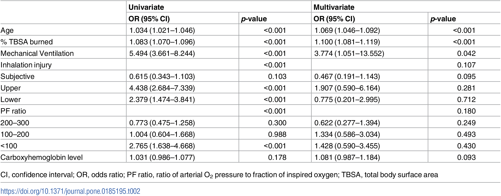
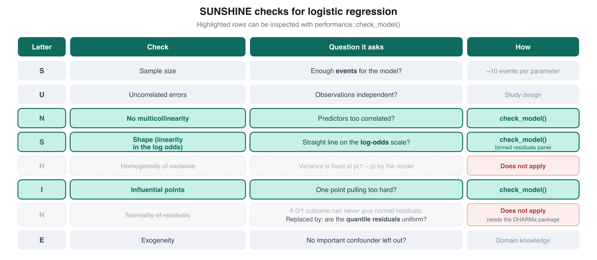
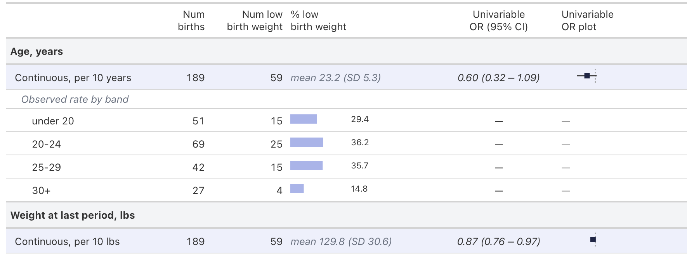

```{r setup, include=FALSE}
knitr::opts_chunk$set(echo = TRUE, message = FALSE, warning = FALSE)
```

# Introduction

Last week we fitted **univariable** logistic regression models for four predictors of mortality after burns, using data from [Kim et al. (2017)](https://doi.org/10.1371/journal.pone.0185195).

That reproduced the left-hand half of the paper's Table 2. This week we finish the job:

- we add the fifth predictor, **carboxyhemoglobin level**,
- we fit the **multivariable** model that fills in the right-hand half of the table,
- we **check the model's assumptions**,
- and we use **AIC** to ask whether age has been entered into the model in a sensible form.



## A note on mechanical ventilation

You will see a **Mechanical Ventilation** row in Table 2, but there is no ventilation column in the shared dataset.

Last week we wondered whether inhalation injury could stand in for it, since ventilated patients are likely to be the ones with airway injury. The counts rule this out:

- the paper reports **274** patients ventilated within 2 days of admission,
- but only **179** patients are in the Upper or Lower inhalation groups,
- and only **297** patients have any inhalation injury at all.

Neither number is 274, so mechanical ventilation cannot be rebuilt from what we have. We will fit the model without it, and later we will see that this omission has a large and very visible effect on our results. That turns out to be one of the more interesting things we learn today.

# PART 1: Load and prepare the data

## Load packages

We use the same packages as last week, plus a few for model checking (`performance`, `see`, `DHARMa`), model comparison (`modelsummary`), and plot layout (`patchwork`).

`DHARMa` matters more than it looks. We will come back to why in Part 4.

```{r load-packages}
if (!require(pacman)) install.packages("pacman")
pacman::p_load(tidyverse, readxl, here, janitor, broom, equatiomatic, gt,
               performance, see, DHARMa, modelsummary, patchwork)
pacman::p_load_gh("the-graph-courses/inspectdf")
```

## Import and clean the data

This is the same cleaning code as last week, with one addition: we now also keep `co_hemo`, the carboxyhemoglobin level, and rename it `co_hb`.

```{r import-data}
burns_raw <- read_excel(here("data/S1Dataset_burns.xlsx"), sheet = "Sheet2") %>%
  clean_names() %>%
  select(mortaltiy, age, tbsa, co_hemo, in_hdiv, pfdivide)

burns_all <- burns_raw %>%
  rename(mortality = mortaltiy, age_years = age,
         tbsa_percent = tbsa, co_hb = co_hemo) %>%
  mutate(
    mortality = factor(mortality, levels = c(0, 1),
                       labels = c("Survived", "Died")),
    inhalation_injury = factor(in_hdiv, levels = 0:3,
                               labels = c("Normal", "Subjective", "Upper", "Lower")),
    pf_ratio_group = factor(pfdivide, levels = 0:3,
                            labels = c(">300", "200-300", "100-200", "<100"))
  ) %>%
  select(mortality, age_years, tbsa_percent, co_hb,
         inhalation_injury, pf_ratio_group)

glimpse(burns_all)
```

## Check for missing values

Before fitting a multivariable model, always look at how much data is missing. Multivariable models are much more sensitive to this than univariable ones, and the reason will become clear in a moment.

```{r missing-values}
burns_all %>%
  summarise(across(everything(), ~ sum(is.na(.)))) %>%
  pivot_longer(everything(), names_to = "variable", values_to = "n_missing")
```

**Question 1.1:** Which variable has missing values, and how many?

Ans 1.1: ______

---

By default, `glm()` quietly drops any row with a missing value in *any* variable in the formula. This is called a **complete case analysis**.

For a univariable model of age, that costs us nothing, because age is never missing. But the multivariable model includes carboxyhemoglobin, so every patient missing that one measurement is dropped from the whole model.

Rather than let this happen silently, let's make it explicit by building the analysis dataset ourselves.

```{r complete-cases}
burns <- burns_all %>% drop_na()

nrow(burns_all)
nrow(burns)
```

**Question 1.2:** How many patients are in the complete-case dataset, and how many were dropped?

Ans 1.2: ______

---

**Question 1.3:** Suppose patients with missing carboxyhemoglobin were systematically different from the rest, for example because the test was only ordered when clinicians suspected smoke exposure. What problem would that create for our multivariable model?

Ans 1.3: ______

---

Let's also count our outcome in the analysis dataset, because for logistic regression the number of **events** matters more than the number of rows. We come back to this in Part 4.

```{r outcome-count}
burns %>% tabyl(mortality)
```

# PART 2: The univariable models

Before building a multivariable model, we fit each predictor on its own. You did exactly this last week, so **all of the code in this part is written for you**. Read it, run it, and focus your energy on the interpretation questions.

One change from last week: we fit the univariable models on `burns_all`, the full dataset, so that each predictor uses every patient for whom it was actually measured. This is what the paper did, and it reproduces their Univariate column exactly.

```{r univariable-models}
uni_age        <- glm(mortality ~ age_years,         family = binomial, data = burns_all)
uni_tbsa       <- glm(mortality ~ tbsa_percent,      family = binomial, data = burns_all)
uni_inhalation <- glm(mortality ~ inhalation_injury, family = binomial, data = burns_all)
uni_pf         <- glm(mortality ~ pf_ratio_group,    family = binomial, data = burns_all)
uni_cohb       <- glm(mortality ~ co_hb,             family = binomial, data = burns_all)
```

Now we collect all five sets of results into one tidy table of odds ratios.

```{r univariable-results}
univariable_results <- bind_rows(
  tidy(uni_age,        conf.int = TRUE, exponentiate = TRUE),
  tidy(uni_tbsa,       conf.int = TRUE, exponentiate = TRUE),
  tidy(uni_inhalation, conf.int = TRUE, exponentiate = TRUE),
  tidy(uni_pf,         conf.int = TRUE, exponentiate = TRUE),
  tidy(uni_cohb,       conf.int = TRUE, exponentiate = TRUE)
) %>%
  filter(term != "(Intercept)") %>%
  select(term, OR = estimate, conf.low, conf.high, p.value)

univariable_results %>%
  mutate(across(where(is.numeric), ~ round(., 3)))
```

**Question 2.1:** Compare these odds ratios with the Univariate column of Table 2 above. Do they match?

Ans 2.1: ______

---

**Question 2.2:** Notice that each of the five odds ratios above comes from a *separate* model. What does the odds ratio for `co_hb` currently adjust for?

Ans 2.2: ______

# PART 3: The multivariable model

Now we fit a single model containing all five predictors at once.

The interpretation of each coefficient changes fundamentally. In Part 2, the age odds ratio described the total association between age and mortality. Here, it describes the association between age and mortality **among patients who are identical on the other four predictors**. We say the estimate is *adjusted for* the other predictors.

## Fit the model

Fit a logistic regression with `mortality` as the outcome and all five predictors: `age_years`, `tbsa_percent`, `inhalation_injury`, `pf_ratio_group` and `co_hb`. Use the `burns` (complete case) dataset.

Remember that predictors are added to the right-hand side of the formula with `+`.

```{r multivariable-model}
multivar_model <- ______(
  mortality ~ ______ + ______ + ______ + ______ + ______,
  family = ______,
  data = ______
)

summary(multivar_model)
```

**Question 3.1:** How many observations did the model use? (Look at the degrees of freedom line, or run `nobs(multivar_model)`.) Does this match your answer to Question 1.2?

Ans 3.1: ______

---

## Write out the equation

`extract_eq()` builds the fitted equation from the model.

```{r multivariable-equation}
extract_eq(multivar_model, use_coefs = TRUE, wrap = TRUE, terms_per_line = 2) %>%
  preview_eq()
```

**Question 3.2:** The left-hand side of the equation is $\log\left[\frac{P(\text{mortality} = \text{Died})}{1 - P(\text{mortality} = \text{Died})}\right]$. In words, what quantity is the model producing on the left-hand side, and what would you do to convert it into a probability?

Ans 3.2: ______

---

## Get the adjusted odds ratios

Use `tidy()` to convert the coefficients into odds ratios with confidence intervals. Remember the two arguments that request confidence intervals and exponentiation.

```{r multivariable-results}
multivariable_results <- tidy(multivar_model, conf.int = ______, exponentiate = ______) %>%
  filter(term != "(Intercept)") %>%
  select(term, OR = estimate, conf.low, conf.high, p.value)

multivariable_results %>%
  mutate(across(where(is.numeric), ~ round(., 3)))
```

**Question 3.3:** Write a full interpretation of the **age** odds ratio, in the style we have been using. State the OR, the direction, what it is adjusted for, and whether it is statistically significant.

Ans 3.3: ______

---

**Question 3.4:** Write a full interpretation of the **TBSA** odds ratio.

Ans 3.4: ______

---

**Question 3.5:** Write a full interpretation of the odds ratio for **carboxyhemoglobin**.

Ans 3.5: ______

## Compare the univariable and multivariable estimates

Placing the two sets of estimates side by side is the quickest way to see what adjustment did.

```{r compare-uni-multi}
comparison <- univariable_results %>%
  select(term, uni_OR = OR, uni_low = conf.low, uni_high = conf.high) %>%
  left_join(
    multivariable_results %>%
      select(term, multi_OR = OR, multi_low = conf.low, multi_high = conf.high),
    by = "term"
  ) %>%
  mutate(across(where(is.numeric), ~ round(., 3)))

comparison
```

**Question 3.6:** For which predictors did the odds ratio move *away* from 1 after adjustment (that is, the association got stronger)?

Ans 3.6: ______

---

**Question 3.7:** The paper's multivariate column reports OR 1.907 for Upper inhalation injury, with a confidence interval that comfortably crosses 1. Our model gives a clearly significant estimate that is roughly twice as large. Given what we said in the Introduction about mechanical ventilation, why might our estimate differ so much from theirs?

Ans 3.7: ______

---

**Question 3.8:** Thinking about Question 3.7 more generally: if a predictor is significant in your model but the true causal driver is a variable you did not measure, what is the danger in reporting your estimate without comment?

Ans 3.8: ______

# PART 4: Checking the model assumptions

In Week 9 we used the SUNSHINE checklist to examine a linear model. Logistic regression uses **most** of the same checks, but two of the letters change meaning completely.



The two struck-out rows are the important ones to understand:

- **Homogeneity of variance does not apply.** In a linear model the error variance is a separate parameter that we assume is constant. In logistic regression the variance of a binary outcome is fixed by its own mean at $p(1-p)$. There is no free variance parameter, so there is nothing to assume and nothing to check.

- **Normality of residuals does not apply.** The outcome is 0 or 1. For any given fitted probability there are only two possible residual values, so the residuals form two arcs and can never be normally distributed. Asking a 0/1 outcome to produce normal residuals is asking for something impossible.

## Sample size: count events, not rows

For linear regression our rule of thumb was about 10 observations per parameter. For logistic regression the binding constraint is the number of **events** — here, deaths — because that is what actually carries the information about the outcome.

The usual rule of thumb is at least **10 events per predictor parameter**.

```{r events-per-parameter}
n_events <- sum(burns$mortality == "Died")
n_parameters <- length(coef(multivar_model)) - 1   # exclude the intercept

n_events
n_parameters
n_events / n_parameters
```

**Question 4.1:** Do we have enough events for this model?

Ans 4.1: ______

---

## Run `check_model()`

Now run the diagnostic panel. The function is the same one you used in Week 9, and it adapts automatically to the fact that this is a logistic model.

```{r check-model, fig.width=11, fig.height=9}
______(multivar_model)
```

**Question 4.2:** Which panels appear here that did *not* appear for the linear model in Week 9? Which panel from Week 9 has disappeared?

Ans 4.2: ______

---

### A warning about the normality panel

If your bottom-left panel is titled **"Distribution of Quantile Residuals"** with a *Standard Uniform* axis, and the points sit neatly on the line, everything is working correctly.

If instead it says **"Normality of Residuals"** with a *Standard Normal* axis and the points curve dramatically away from the line, then `DHARMa` is not installed on your machine.

This is worth understanding, because the failure is silent. Internally, `check_model()` chooses between two kinds of residual:

- **Quantile residuals** (the right choice for logistic models). These are built by simulating new outcomes from the fitted model and asking where each observed value falls in that simulated distribution. If the model is correct, they are uniformly distributed no matter what family you used. Computing them requires `DHARMa`.
- **Deviance residuals** (the fallback). For a binary outcome these are never normal, as explained above.

When `DHARMa` is missing, `check_model()` quietly falls back to deviance residuals and then plots them against a normal distribution — a check that is guaranteed to fail. **The alarming output is an artefact of the missing package, not a problem with your model.**

If you saw the wrong version, install `DHARMa` and run the chunk again:

```{r install-dharma, eval=FALSE}
install.packages("DHARMa")
```

**Question 4.3:** Suppose a colleague sends you a logistic model diagnostic showing severe non-normality of residuals, and asks whether they should transform their outcome. What would you tell them?

Ans 4.3: ______

---

## Shape: linearity on the log-odds scale

The **S** in SUNSHINE still applies, but the linearity assumption has moved scales. We are not assuming that mortality is a straight-line function of age. We are assuming that the **log odds** of mortality is a straight-line function of age.

The **binned residuals** panel is what checks this. Since we cannot see a pattern in individual 0/1 residuals, the plot sorts patients by fitted probability, groups them into bins, and plots the average residual in each bin. If the model has the shape right, those averages should scatter around zero with no trend.

Let's look at the numbers behind that panel.

```{r binned-residuals}
binned_residuals(multivar_model)
```

**Question 4.4:** Does this agree with the panel in `check_model()`?

Ans 4.4: ______

---

That result looks alarming, so let's not stop there. A single diagnostic that disagrees with everything else is usually telling you something about the diagnostic rather than the model. Two more checks:

```{r formal-fit-checks}
# Hosmer-Lemeshow: compares observed and predicted counts across risk groups
performance_hosmer(multivar_model)

# Tjur's R2: how far apart are the mean fitted probabilities for the two groups?
r2_tjur(multivar_model)
```

**Question 4.5:** The Hosmer-Lemeshow test and Tjur's R² both suggest the model is doing well, while the binned residual plot suggests poor fit. Look at the spread of fitted probabilities below. Can you see why the binned residual plot might be unfairly harsh here?

```{r fitted-spread}
quantile(fitted(multivar_model), probs = seq(0, 1, 0.1)) %>% round(3)
```

Ans 4.5: ______

---

## Multicollinearity and influential points

```{r check-collinearity}
check_collinearity(multivar_model)
```

```{r check-outliers}
check_outliers(multivar_model)
```

**Question 4.6:** Are either of these a concern?

Ans 4.6: ______

# PART 5: Choosing a functional form with AIC

So far we have entered age as a single continuous term, which forces the log odds of mortality to change by the same amount for every additional year — the same step from 20 to 21 as from 70 to 71. That is an assumption, and we have not tested it.

**In practice, how you enter a variable into a model should usually be decided by prior knowledge and by what the existing literature does**, not by fishing through the data for whatever fits best. Trying enough forms will always turn up something that looks good by chance.

But when you genuinely do not know, and you have a small number of well-motivated candidates, AIC gives you a principled way to compare them. Recall from the pre-work:

$$\mathrm{AIC} = \text{residual deviance} + 2k$$

Lower is better, and the $2k$ penalty stops us from simply preferring whichever model has the most parameters. AIC has no absolute scale — only differences between models fitted to **the same outcome and the same rows** are meaningful.

We will compare three ways of entering age:

| Form | How age enters | Assumption |
|:--|:--|:--|
| Linear | `age_years` | Constant change in log odds per year |
| Quadratic | `age_years + I(age_years^2)` | Log odds curve, allowed to bend once |
| Decades | a factor with 6 age bands | Each band gets its own log odds, no shape imposed |

First, create the decade version of age.

```{r age-decades}
burns <- burns %>%
  mutate(age_decade = cut(age_years,
                          breaks = c(17, 29, 39, 49, 59, 69, Inf),
                          labels = c("18-29", "30-39", "40-49",
                                     "50-59", "60-69", "70+")))

burns %>% tabyl(age_decade)
```

Now fit the three models. Each keeps the other four predictors exactly as they were; only the age term changes. The linear one is done for you — fill in the other two.

```{r functional-form-models}
model_age_linear <- glm(
  mortality ~ age_years + tbsa_percent + inhalation_injury + pf_ratio_group + co_hb,
  family = binomial, data = burns
)

model_age_quadratic <- glm(
  mortality ~ ______ + I(______^2) + tbsa_percent + inhalation_injury +
    pf_ratio_group + co_hb,
  family = binomial, data = burns
)

model_age_decades <- glm(
  mortality ~ ______ + tbsa_percent + inhalation_injury + pf_ratio_group + co_hb,
  family = binomial, data = burns
)
```

Compare them with `modelsummary()`, which reports AIC and log-likelihood for each.

```{r functional-form-aic}
modelsummary(
  list("Linear" = model_age_linear,
       "Quadratic" = model_age_quadratic,
       "Decades" = model_age_decades),
  gof_map = c("nobs", "aic", "logLik"),
  coef_omit = ".*",
  output = "gt"
)
```

**Question 5.1:** Do all three models use the same number of observations? Why does that matter before comparing AIC?

Ans 5.1: ______

---

**Question 5.2:** Which form has the lowest AIC, and by how much?

Ans 5.2: ______

---

## See what the three forms actually fit

AIC gives us a number, but it is much easier to judge a functional form by looking at it. Below we predict mortality across the full age range, holding the other four predictors fixed at typical values, and plot the result on both the log-odds and the probability scale.

All of this plotting code is provided.

```{r functional-form-plot, fig.width=11, fig.height=4.5}
# Hold the other predictors constant at a "typical patient" profile.
typical_patient <- tibble(
  tbsa_percent      = median(burns$tbsa_percent),
  co_hb             = median(burns$co_hb),
  inhalation_injury = factor("Normal", levels = levels(burns$inhalation_injury)),
  pf_ratio_group    = factor(">300",   levels = levels(burns$pf_ratio_group))
)

prediction_grid <- tibble(age_years = 18:92) %>%
  mutate(age_decade = cut(age_years,
                          breaks = c(17, 29, 39, 49, 59, 69, Inf),
                          labels = c("18-29", "30-39", "40-49",
                                     "50-59", "60-69", "70+"))) %>%
  crossing(typical_patient)

# type = "link" gives the log odds; plogis() converts log odds to probability.
predictions <- bind_rows(
  prediction_grid %>%
    mutate(form = "Linear",
           log_odds = predict(model_age_linear, newdata = ., type = "link")),
  prediction_grid %>%
    mutate(form = "Quadratic",
           log_odds = predict(model_age_quadratic, newdata = ., type = "link")),
  prediction_grid %>%
    mutate(form = "Decades",
           log_odds = predict(model_age_decades, newdata = ., type = "link"))
) %>%
  mutate(probability = plogis(log_odds),
         form = factor(form, levels = c("Linear", "Quadratic", "Decades")))

form_colours <- c("Linear" = "#00565e", "Quadratic" = "#b83b5e", "Decades" = "#d69f00")

# The two smooth forms are drawn with geom_line(). The decade model is a step
# function -- it only changes at a band boundary -- so it needs geom_step().
plot_log_odds <- ggplot() +
  geom_line(data = filter(predictions, form != "Decades"),
            aes(age_years, log_odds, colour = form), linewidth = 1.1) +
  geom_step(data = filter(predictions, form == "Decades"),
            aes(age_years, log_odds, colour = form), linewidth = 1.1) +
  scale_colour_manual(values = form_colours) +
  labs(title = "Log-odds scale", x = "Age (years)",
       y = "Fitted log odds of mortality", colour = "Form of age") +
  theme_minimal()

plot_probability <- ggplot() +
  geom_line(data = filter(predictions, form != "Decades"),
            aes(age_years, probability, colour = form), linewidth = 1.1) +
  geom_step(data = filter(predictions, form == "Decades"),
            aes(age_years, probability, colour = form), linewidth = 1.1) +
  scale_colour_manual(values = form_colours) +
  scale_y_continuous(labels = scales::percent) +
  labs(title = "Probability scale", x = "Age (years)",
       y = "Fitted probability of mortality", colour = "Form of age") +
  theme_minimal()

(plot_log_odds | plot_probability) +
  plot_layout(guides = "collect") &
  theme(legend.position = "bottom")
```

**Question 5.3:** On the log-odds panel, the linear model is a straight line by construction. What shape do the other two forms suggest instead, and do they agree with each other?

Ans 5.3: ______

---

**Question 5.4:** Why is the decade model drawn as a staircase?

Ans 5.4: ______

---

**Question 5.5:** The AIC difference between the best and worst form here is small. Taking into account both the AIC and the plots, which form would you report, and why? There is no single right answer — justify your choice.

Ans 5.5: ______

# PART 6: Report the results

Finally, we combine the univariable and multivariable results into one table in the style of the paper's Table 2.

All of the formatting code is provided. As always, it is fine to use a template or ask an LLM for help with presentation code, as long as you check the formatted numbers against model output you understand.

```{r final-table}
term_labels <- c(
  age_years                   = "Age, per year",
  tbsa_percent                = "% TBSA burned, per percentage point",
  inhalation_injurySubjective = "Subjective vs Normal",
  inhalation_injuryUpper      = "Upper vs Normal",
  inhalation_injuryLower      = "Lower vs Normal",
  `pf_ratio_group200-300`     = "200-300 vs >300",
  `pf_ratio_group100-200`     = "100-200 vs >300",
  `pf_ratio_group<100`        = "<100 vs >300",
  co_hb                       = "Carboxyhemoglobin, per unit"
)

term_groups <- c(
  age_years = "Age", tbsa_percent = "% TBSA burned",
  inhalation_injurySubjective = "Inhalation injury",
  inhalation_injuryUpper      = "Inhalation injury",
  inhalation_injuryLower      = "Inhalation injury",
  `pf_ratio_group200-300` = "PF ratio",
  `pf_ratio_group100-200` = "PF ratio",
  `pf_ratio_group<100`    = "PF ratio",
  co_hb = "Carboxyhemoglobin"
)

format_or <- function(or, lo, hi) sprintf("%.3f (%.3f-%.3f)", or, lo, hi)

final_table <- univariable_results %>%
  transmute(term,
            uni = format_or(OR, conf.low, conf.high),
            uni_p = scales::pvalue(p.value, accuracy = 0.001)) %>%
  left_join(
    multivariable_results %>%
      transmute(term,
                multi = format_or(OR, conf.low, conf.high),
                multi_p = scales::pvalue(p.value, accuracy = 0.001)),
    by = "term"
  ) %>%
  mutate(predictor = factor(term_groups[term], levels = unique(term_groups)),
         comparison = term_labels[term]) %>%
  select(predictor, comparison, uni, uni_p, multi, multi_p)

final_table %>%
  gt(groupname_col = "predictor") %>%
  cols_label(comparison = "", uni = "OR (95% CI)", uni_p = "p-value",
             multi = "OR (95% CI)", multi_p = "p-value") %>%
  tab_spanner(label = "Univariable", columns = c(uni, uni_p)) %>%
  tab_spanner(label = "Multivariable (adjusted)", columns = c(multi, multi_p)) %>%
  cols_align(align = "center", columns = c(uni, uni_p, multi, multi_p)) %>%
  tab_header(
    title = md("**Predictors of mortality after burns**"),
    subtitle = md("*Univariable models use all available data; the multivariable model uses 583 complete cases*")
  ) %>%
  tab_source_note(md("Data from Kim et al. (2017), PLOS ONE 12(9): e0185195."))
```

**Final reporting task:** Write a short results paragraph describing the multivariable model, in the style of a journal article. Mention how many patients and deaths the model used, which predictors remained significant after adjustment, and at least one limitation.

Ans 6.1: ______

# Optional challenge: build a figure-table with LLM help

Some papers combine the numbers and a forest plot into a single figure-table. Your challenge is to produce one for the burns univariable results, using an LLM to help write the code.

For inspiration, see Fig 2 here: <https://gh.bmj.com/content/10/12/e018739#F2>

You can also adapt this script: <https://github.com/kendavidn/yaounde_serocovpop_shared/blob/v1.0.0/scripts/infection_regn_2.R>

## The catch

That example script only contains **categorical** predictors, so an LLM copying its structure will often get stuck on `age_years`, `tbsa_percent` and `co_hb`. A continuous variable has no groups, so there is no count to print and no bar to draw.

The standard solution used by published tables is:

> **Model** the continuous variable as continuous, so it gets one odds ratio.
> **Describe** it in bins, so the reader can still see the raw rates.

The bin rows carry counts and a bar but no odds ratio, because no model was fitted to them. It looks like this:



A complete worked example of building this from scratch, using a different dataset, is in [`scripts/regression_table_from_scratch.R`](scripts/regression_table_from_scratch.R). Read it if you get stuck, or run it to see the output.

Two more things worth telling your LLM:

- Rescale continuous odds ratios to a readable unit, such as per 10 years, using `exp(10 * beta)`. An odds ratio of 1.034 per year is hard to read; per decade it becomes 1.40.
- Plot odds ratios on a **log scale**, so that OR 0.5 and OR 2 sit the same distance either side of 1.

```{r challenge}
# Your code here
```

# Reference

Kim Y, Kym D, Hur J, Yoon J, Yim H, Cho YS, et al. (2017). Does inhalation injury predict mortality in burns patients or require redefinition? *PLOS ONE*, 12(9), e0185195. <https://doi.org/10.1371/journal.pone.0185195>
