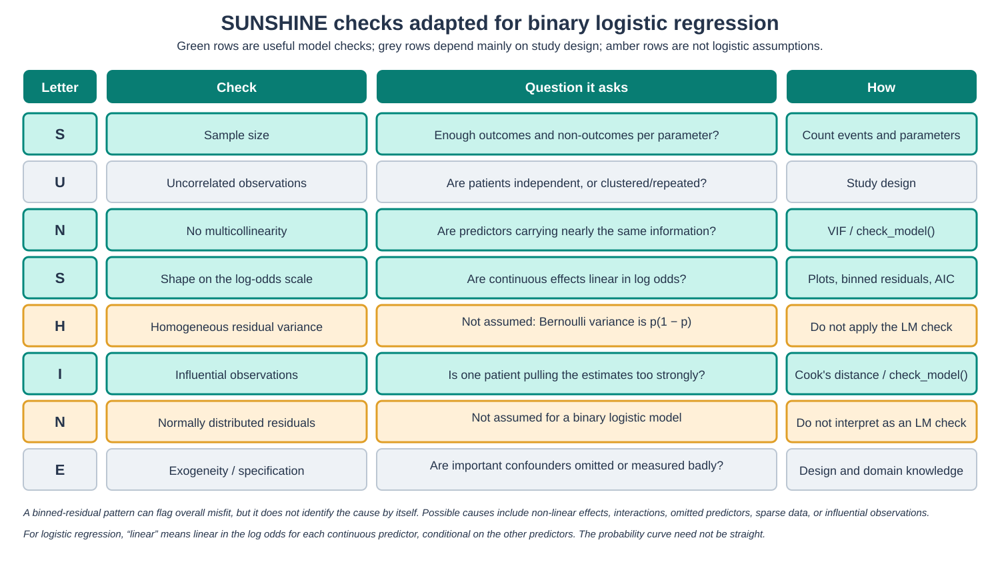
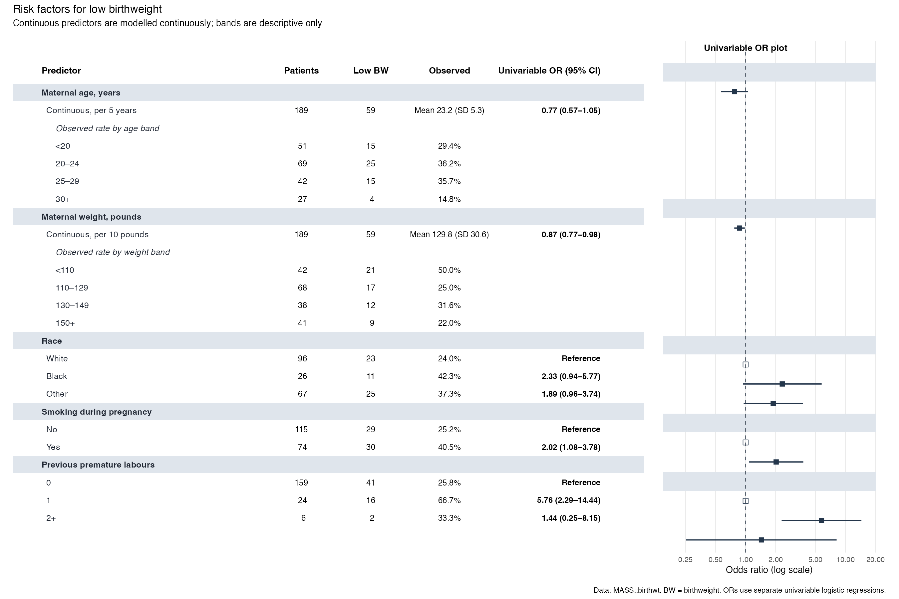

```{r setup, include=FALSE}
knitr::opts_chunk$set(echo = TRUE, message = FALSE, warning = FALSE)
```

# Introduction

In Workshop 10, we fitted separate univariable logistic regressions for mortality after burns. We will now reproduce as much as possible of the full analysis in [Kim et al. (2017)](https://doi.org/10.1371/journal.pone.0185195).

By the end of this workshop, you should be able to:

- fit and interpret a multivariable logistic regression;
- write its equation on the log-odds scale;
- compare univariable and adjusted odds ratios;
- choose and interpret useful checks for a binary logistic model; and
- compare a few pre-specified functional forms using AIC and plots.


## An important replication boundary

The paper's adjusted model included mechanical ventilation, but the shared patient-level workbook does not contain that variable. We cannot recover it from inhalation-injury category:

- Upper and lower inhalation injury together identify 179 patients.
- The paper reports 274 mechanically ventilated patients.
- Even within the upper and lower groups, ventilation was not applied to everyone.

Creating a ventilation proxy from inhalation injury would therefore misclassify patients. It would also be mathematically redundant if entered alongside the four-level inhalation variable. We will fit the fullest model supported by the released data and treat its difference from the paper as a reproducibility finding.

# PART 1: Load and prepare the data

## Load packages

```{r load-packages}
if (!requireNamespace("pacman", quietly = TRUE)) install.packages("pacman")
pacman::p_load(tidyverse, readxl, here, janitor, broom, gtsummary,
               modelsummary, performance, see, patchwork, gt)
```

## Import the study data

```{r import-data}
burns_raw <- read_excel(here("data/S1Dataset_burns.xlsx"), sheet = "Sheet2") %>%
  clean_names() %>%
  select(mortaltiy, age, tbsa, co_hemo, in_hdiv, pfdivide)

glimpse(burns_raw)
```

The coding is documented in `data/codebook_gpt5_x7q2.md`. We use labelled factors so that model output is easier to read.

```{r clean-data}
burns <- burns_raw %>%
  rename(
    mortality = mortaltiy,
    age_years = age,
    tbsa_percent = tbsa
  ) %>%
  mutate(
    mortality = factor(mortality, levels = c(0, 1),
                       labels = c("Survived", "Died")),
    inhalation_injury = factor(in_hdiv, levels = 0:3,
                               labels = c("Normal", "Subjective", "Upper", "Lower")),
    pf_ratio_group = factor(pfdivide, levels = 0:3,
                            labels = c(">300", "200-300", "100-200", "<100"))
  ) %>%
  select(mortality, age_years, tbsa_percent, inhalation_injury,
         pf_ratio_group, co_hemo)

glimpse(burns)
```

## Check the outcome and missing data

```{r data-checks}
burns %>% tabyl(mortality)

burns %>%
  summarise(across(everything(), ~ sum(is.na(.x)))) %>%
  pivot_longer(everything(), names_to = "variable", values_to = "missing")
```

**Question 1.1:** Which workshop variable has missing values?

Ans 1.1: ______

<!-- SOLUTION: q1_1 -->

**Question 1.2:** How many values are missing?

Ans 1.2: ______

<!-- SOLUTION: q1_2 -->

The following count confirms why upper and lower inhalation injury cannot be used as an equivalent for mechanical ventilation.

```{r ventilation-boundary}
burns %>%
  summarise(
    upper_or_lower = sum(inhalation_injury %in% c("Upper", "Lower")),
    ventilation_reported_in_paper = 274
  )
```

**Question 1.3:** Would coding every Upper or Lower patient as mechanically ventilated reproduce the paper's ventilation variable?

Ans 1.3: ______

<!-- SOLUTION: q1_3 -->

# PART 2: Reproduce the univariable models

You fitted most of these models in Workshop 10. The code is supplied so that we can focus on the multivariable model.

```{r univariable-models}
age_univ <- glm(mortality ~ age_years, family = binomial, data = burns)
tbsa_univ <- glm(mortality ~ tbsa_percent, family = binomial, data = burns)
inhalation_univ <- glm(mortality ~ inhalation_injury, family = binomial, data = burns)
pf_univ <- glm(mortality ~ pf_ratio_group, family = binomial, data = burns)
co_hemo_univ <- glm(mortality ~ co_hemo, family = binomial, data = burns)
```

Before formatting a table, inspect one model in the usual way.

```{r co-hemo-summary}
summary(co_hemo_univ)
```

**Question 2.1:** Does the carboxyhemoglobin coefficient imply higher or lower estimated odds of mortality as carboxyhemoglobin increases?

Ans 2.1: ______

<!-- SOLUTION: q2_1 -->

**Question 2.2:** At the 0.05 level, is there evidence of a univariable association between carboxyhemoglobin and mortality?

Ans 2.2: ______

<!-- SOLUTION: q2_2 -->

Now combine the five models. The intercept is omitted, and the coefficients are exponentiated to odds ratios.

```{r univariable-table}
univariable_models <- list(
  "Age" = age_univ,
  "TBSA" = tbsa_univ,
  "Inhalation injury" = inhalation_univ,
  "PF ratio group" = pf_univ,
  "Carboxyhemoglobin" = co_hemo_univ
)

modelsummary(
  univariable_models,
  exponentiate = TRUE,
  coef_omit = "Intercept",
  statistic = "conf.int",
  stars = TRUE,
  output = "gt"
)
```

**Question 2.3:** Which continuous predictors have statistically significant univariable associations with mortality?

Ans 2.3: ______

<!-- SOLUTION: q2_3 -->

**Question 2.4:** Which inhalation-injury levels have statistically significant univariable odds ratios compared with Normal?

Ans 2.4: ______

<!-- SOLUTION: q2_4 -->

**Question 2.5:** Which PF-ratio level has a statistically significant univariable odds ratio compared with >300?

Ans 2.5: ______

<!-- SOLUTION: q2_5 -->

These estimates reproduce the paper's univariable results. Small confidence-interval differences may occur because software can use profile-likelihood or Wald intervals.

# PART 3: Fit the multivariable model

## Define one analysis cohort

`glm()` uses complete cases for all variables in its formula. Because carboxyhemoglobin has missing values, create and inspect the complete-case dataset explicitly.

```{r analysis-cohort}
burns_model_data <- burns %>%
  drop_na(co_hemo)

burns_model_data %>%
  summarise(
    patients = n(),
    deaths = sum(mortality == "Died"),
    survivors = sum(mortality == "Survived")
  )
```

**Question 3.1:** How many patients will the multivariable model use?

Ans 3.1: ______

<!-- SOLUTION: q3_1 -->

Our model will estimate 10 parameters: one intercept, two continuous-predictor coefficients, three inhalation comparisons, three PF-ratio comparisons, and one carboxyhemoglobin coefficient.

**Question 3.2:** Approximately how many deaths are available per estimated parameter?

Ans 3.2: ______

<!-- SOLUTION: q3_2 -->

## Fit the model by hand

Use mortality as the outcome. Include age, TBSA, inhalation injury, PF-ratio group, and carboxyhemoglobin in one model.

```{r multivariable-model-student, eval=FALSE}
# Outcome: mortality
# Predictors: age_years, tbsa_percent, inhalation_injury,
#             pf_ratio_group, and co_hemo
multiv_model <- glm(
  ________ ~ ________ + ________ + ________ + ________ + ________,
  family = ________,
  data = ________
)

summary(________)
```

<!-- SOLUTION: code_multiv_model -->

**Question 3.3:** Did the model-fitting algorithm converge?

Ans 3.3: ______

<!-- SOLUTION: q3_3 -->

## Write the equation

Let \(p\) be the probability that a patient died. The left side of a logistic-regression equation is the log odds:

$$
\log\left(\frac{p}{1-p}\right)
$$

The continuous predictors enter directly. Each non-reference category enters as an indicator that equals 1 for that category and 0 otherwise.

**Question 3.4:** Write the full model equation using \(\beta_0\) through \(\beta_9\). You may abbreviate the indicator names.

Ans 3.4: ______

<!-- SOLUTION: q3_4 -->

## Convert coefficients to adjusted odds ratios

Complete the `tidy()` call.

```{r multivariable-tidy-student, eval=FALSE}
multiv_results <- tidy(
  ________,
  conf.int = ________,
  exponentiate = ________
)

multiv_results
```

<!-- SOLUTION: code_multiv_tidy -->

**Question 3.5:** Interpret the adjusted age odds ratio in one sentence. Include the outcome, the unit of age, and the fact that the other variables are held constant.

Ans 3.5: ______

<!-- SOLUTION: q3_5 -->

**Question 3.6:** Interpret the adjusted TBSA odds ratio in one sentence. Remember that one unit is one percentage point of body surface area burned.

Ans 3.6: ______

<!-- SOLUTION: q3_6 -->

**Question 3.7:** Compared with Normal inhalation status, what does the adjusted Upper odds ratio mean?

Ans 3.7: ______

<!-- SOLUTION: q3_7 -->

These are adjusted associations. They are not automatically causal effects. Causal interpretation would require a defensible adjustment set, adequate measurement, and appropriate study design.

## Compare univariable and adjusted results on the same rows

The univariable models in Part 2 used all available observations for each predictor. The table below re-fits the univariable models within the 583-patient complete-case cohort, so changes from the left column to the right column reflect adjustment rather than a change in rows.

```{r crude-adjusted-table}
crude_table <- burns_model_data %>%
  select(mortality, age_years, tbsa_percent, inhalation_injury,
         pf_ratio_group, co_hemo) %>%
  tbl_uvregression(
    y = mortality,
    method = glm,
    method.args = list(family = binomial),
    exponentiate = TRUE
  )

adjusted_table <- tbl_regression(multiv_model, exponentiate = TRUE)

tbl_merge(
  list(crude_table, adjusted_table),
  tab_spanner = c("**Univariable OR (95% CI)**",
                  "**Adjusted OR (95% CI)**")
)
```

**Question 3.8:** Which two continuous predictors become more strongly associated with mortality after adjustment?

Ans 3.8: ______

<!-- SOLUTION: q3_8 -->

## Compare our adjusted estimates with the paper

The paper's adjusted estimates came from a model that also contained mechanical ventilation. The code below places the published odds ratios beside ours.

```{r paper-comparison}
paper_adjusted <- tribble(
  ~term, ~paper_or,
  "age_years", 1.069,
  "tbsa_percent", 1.100,
  "inhalation_injurySubjective", 0.467,
  "inhalation_injuryUpper", 1.907,
  "inhalation_injuryLower", 0.775,
  "pf_ratio_group200-300", 0.622,
  "pf_ratio_group100-200", 1.334,
  "pf_ratio_group<100", 1.428,
  "co_hemo", 1.081
)

comparison_table <- tidy(multiv_model, exponentiate = TRUE) %>%
  filter(term != "(Intercept)") %>%
  select(term, our_or = estimate) %>%
  left_join(paper_adjusted, by = "term") %>%
  mutate(across(c(our_or, paper_or), ~ round(.x, 3)))

comparison_table
```

**Question 3.9:** Which family of coefficients differs most noticeably between our model and the paper?

Ans 3.9: ______

<!-- SOLUTION: q3_9 -->

The paper reports one overall p-value for each multi-level categorical predictor. A likelihood-ratio test compares the model with and without the whole predictor.

```{r global-tests}
drop1(multiv_model, test = "Chisq")
```

**Question 3.10:** In our available-data model, is inhalation injury associated with mortality as a whole?

Ans 3.10: ______

<!-- SOLUTION: q3_10 -->

The paper's corresponding global p-value was 0.107. The missing ventilation variable is a plausible explanation for the different inhalation result, but it is not the only possible explanation. Exact software settings, missing-data handling, and undocumented analysis choices can also matter.

# PART 4: Check a binary logistic model

The SUNSHINE reminder from linear regression is still useful, but two rows change for logistic regression.

{width=100%}

For a binary logistic model:

- continuous predictors are assumed to be linear in the **log odds**, conditional on the other predictors;
- residuals are not assumed to be normally distributed;
- residual variance is not assumed to be constant, because a Bernoulli outcome has variance \(p(1-p)\);
- independence, adequate sample size, low collinearity, lack of extreme influence, and defensible model specification still matter.

## Design and convergence

Each row represents one patient. The article does not describe repeated observations for a patient.

**Question 4.1:** Based on the available description, is independence of observations obviously violated?

Ans 4.1: ______

<!-- SOLUTION: q4_1 -->

```{r convergence-check}
multiv_model$converged
```

A converged model with finite coefficients is reassuring. It does not prove that separation is impossible, but this output gives no obvious separation warning.

## Run relevant `check_model()` panels

`check_model()` is a general function for many model types. We request the panels that are most useful here.

```{r check-model, fig.width=11, fig.height=8}
check_model(
  multiv_model,
  check = c("pp_check", "binned_residuals", "vif", "outliers")
)
```

**Question 4.2:** Does the collinearity panel show a serious problem?

Ans 4.2: ______

<!-- SOLUTION: q4_2 -->

**Question 4.3:** Does the influential-observations panel show a point beyond the Cook's-distance contours?

Ans 4.3: ______

<!-- SOLUTION: q4_3 -->

**Question 4.4:** In the posterior predictive check, are the observed outcome counts compatible with the model-predicted intervals?

Ans 4.4: ______

<!-- SOLUTION: q4_4 -->

**Question 4.5:** What concern is visible in the binned-residual plot?

Ans 4.5: ______

<!-- SOLUTION: q4_5 -->

A binned-residual plot groups patients with similar fitted probabilities and plots the average residual in each group. If the model were true, we would expect about 95% of the binned averages to fall inside the bounds.

Red points suggest systematic model-data mismatch. They do not identify the reason. Possible causes include a non-linear continuous effect, an omitted predictor, an interaction, sparse observations at extreme probabilities, or influential cases.

## Why might a Normality panel appear?

If you call `check_model(multiv_model)` with every possible check, some package versions or residual settings may show a panel labelled "Normality of Residuals." That does **not** turn normal residuals into an assumption of logistic regression.

The function supports many model classes and can display a half-normal plot of absolute standardized deviance residuals for a generalized linear model. Such a plot may help reveal unusually large residuals or poor prediction in a range, but it should not be interpreted as the linear-regression normality assumption. The package authors explicitly note that residual normality is not an appropriate assumption for logistic regression. See the official [`check_model()` documentation](https://easystats.github.io/performance/reference/check_model.html) and [diagnostics vignette](https://easystats.github.io/performance/articles/check_model.html).

# PART 5: Compare functional forms for age

Subject knowledge and prior literature should guide how a continuous predictor enters a model. AIC can help compare a small set of plausible, pre-specified alternatives fitted to the same outcome and the same rows.

We will compare:

1. exact age with one linear term;
2. exact age plus an age-squared term; and
3. age categories by decade.

The age-squared model allows a smooth curve on the log-odds scale. The decade model estimates a separate level for each group and therefore uses more parameters.

## Create decade groups

```{r age-decade}
burns_model_data <- burns_model_data %>%
  mutate(
    age_decade = cut(
      age_years,
      breaks = c(17, 29, 39, 49, 59, 69, 79, Inf),
      labels = c("18-29", "30-39", "40-49", "50-59",
                 "60-69", "70-79", "80+"),
      include.lowest = TRUE
    )
  )

burns_model_data %>% count(age_decade)
```

## Fit the candidate models

Keep every other predictor the same. Fill in only the age form that changes.

```{r age-form-models-student, eval=FALSE}
age_linear_model <- multiv_model

age_quadratic_model <- glm(
  mortality ~ ________ + tbsa_percent + inhalation_injury +
    pf_ratio_group + co_hemo,
  family = binomial,
  data = burns_model_data
)

age_decade_model <- glm(
  mortality ~ ________ + tbsa_percent + inhalation_injury +
    pf_ratio_group + co_hemo,
  family = binomial,
  data = burns_model_data
)

AIC(age_linear_model, age_quadratic_model, age_decade_model)
```

<!-- SOLUTION: code_age_forms -->

**Question 5.1:** Which candidate model has the lowest AIC?

Ans 5.1: ______

<!-- SOLUTION: q5_1 -->

**Question 5.2:** How much lower is its AIC than the linear-age model's AIC?

Ans 5.2: ______

<!-- SOLUTION: q5_2 -->

AIC has no absolute "good" value. Only differences between models fitted to the same outcome and the same observations are meaningful. A difference below about 2 is usually weak evidence for preferring one candidate over another.

## Visualise the three fitted forms

To isolate age for the plot, hold all other predictors at fixed values: median TBSA, Normal inhalation status, PF ratio >300, and median carboxyhemoglobin.

First create and print the age values and prediction profile.

```{r age-prediction-profile}
age_values <- 18:92
age_values

prediction_profile <- tibble(
  age_years = age_values,
  tbsa_percent = median(burns_model_data$tbsa_percent),
  inhalation_injury = factor("Normal", levels = levels(burns_model_data$inhalation_injury)),
  pf_ratio_group = factor(">300", levels = levels(burns_model_data$pf_ratio_group)),
  co_hemo = median(burns_model_data$co_hemo)
) %>%
  mutate(
    age_decade = cut(
      age_years,
      breaks = c(17, 29, 39, 49, 59, 69, 79, Inf),
      labels = c("18-29", "30-39", "40-49", "50-59",
                 "60-69", "70-79", "80+"),
      include.lowest = TRUE
    )
  )

prediction_profile
```

Each row below represents one age and the fitted log odds and probability under one candidate model.

```{r age-predictions}
age_predictions <- bind_rows(
  prediction_profile %>%
    transmute(
      age_years,
      form = "Linear age",
      log_odds = predict(age_linear_model, newdata = prediction_profile, type = "link"),
      probability = predict(age_linear_model, newdata = prediction_profile, type = "response")
    ),
  prediction_profile %>%
    transmute(
      age_years,
      form = "Age + age squared",
      log_odds = predict(age_quadratic_model, newdata = prediction_profile, type = "link"),
      probability = predict(age_quadratic_model, newdata = prediction_profile, type = "response")
    ),
  prediction_profile %>%
    transmute(
      age_years,
      form = "Decade groups",
      log_odds = predict(age_decade_model, newdata = prediction_profile, type = "link"),
      probability = predict(age_decade_model, newdata = prediction_profile, type = "response")
    )
)

age_predictions
```

```{r age-form-plots, fig.width=12, fig.height=5}
form_colors <- c(
  "Linear age" = "#00565e",
  "Age + age squared" = "#b83b5e",
  "Decade groups" = "#d69f00"
)

log_odds_plot <- ggplot(age_predictions, aes(age_years, log_odds, color = form)) +
  geom_line(data = filter(age_predictions, form != "Decade groups"), linewidth = 1.1) +
  geom_step(data = filter(age_predictions, form == "Decade groups"), linewidth = 1.1) +
  scale_color_manual(values = form_colors) +
  labs(x = "Age (years)", y = "Fitted log odds", color = "Age form")

probability_plot <- ggplot(age_predictions, aes(age_years, probability, color = form)) +
  geom_line(data = filter(age_predictions, form != "Decade groups"), linewidth = 1.1) +
  geom_step(data = filter(age_predictions, form == "Decade groups"), linewidth = 1.1) +
  scale_color_manual(values = form_colors) +
  scale_y_continuous(labels = scales::percent) +
  labs(x = "Age (years)", y = "Fitted mortality probability", color = "Age form")

log_odds_plot + probability_plot
```

**Question 5.3:** In which panel must the simple linear-age model be a straight line?

Ans 5.3: ______

<!-- SOLUTION: q5_3 -->

**Question 5.4:** Why does the decade-group model form steps?

Ans 5.4: ______

<!-- SOLUTION: q5_4 -->

**Question 5.5:** Does the AIC comparison strongly distinguish the decade and quadratic models?

Ans 5.5: ______

<!-- SOLUTION: q5_5 -->

The available data suggest that a purely linear age effect may be too restrictive after adjustment. The decade and quadratic models have very similar AIC values. In real research, we would combine subject knowledge, a pre-specified plan, adequate sample size, plots, and perhaps a spline rather than testing many forms and reporting only the winner.

# Optional challenge: an LLM-assisted table and forest plot

Ask an LLM to combine:

- raw counts and outcome percentages;
- univariable odds ratios and 95% confidence intervals; and
- a forest plot in the same figure.

For a continuous predictor, keep the predictor continuous in the model. Show categories underneath only to describe raw outcome proportions. State the odds-ratio unit clearly, such as per 5 years or per 10 pounds.

The completed example below uses `MASS::birthwt` with age, maternal weight, race, smoking, and previous premature labours. It contains continuous, binary, and multi-level predictors.

{width=100%}

Use the [worked example script](scripts/birthwt_univariable_forest_table_gpt5_x7q2.R) or browse the [Workshop 11 scripts folder on GitHub](https://github.com/the-graph-courses/rsr_2026_t2_materials/tree/main/rsr_week_11_workshop_gpt5_x7q2/scripts).

A useful LLM prompt is:

> Using R, ggplot2, broom, and patchwork, build one publication-style figure containing descriptive counts, outcome percentages, univariable odds ratios with 95% confidence intervals, and an aligned forest plot. Model age per 5 years and maternal weight per 10 pounds as continuous predictors. Under each continuous analysis row, show raw outcome proportions by descriptive bands only. Include reference rows for categorical predictors, use a logarithmic odds-ratio axis, and save a high-resolution PNG. Explain the row-building logic so I can adapt it to another dataset.

```{r forest-challenge-student, eval=FALSE}
# Paste and adapt your LLM-assisted code here.
```

<!-- SOLUTION: code_forest_challenge -->

# Reference

Kim Y, Kym D, Hur J, et al. Does inhalation injury predict mortality in burns patients or require redefinition? *PLOS ONE*. 2017;12(9):e0185195. <https://doi.org/10.1371/journal.pone.0185195>

