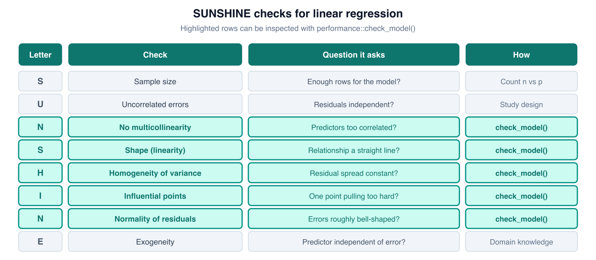

```{r setup, include=FALSE}
knitr::opts_chunk$set(echo = TRUE, message = FALSE, warning = FALSE)
```

# Introduction

In week 10, we used univariable logistic regression to study predictors of mortality after burns, replicating the univariable column of Table 2 in [Kim et al. (2017)](https://doi.org/10.1371/journal.pone.0185195).

In this workshop, we go one step further and replicate the **multivariable** column, which adjusts each predictor's association for all the other predictors.


We will model six predictors:

- Age
- Total body surface area burned (TBSA)
- Mechanical ventilation (a derived proxy; see Part 1)
- Inhalation injury
- PF ratio group
- Carboxyhemoglobin level

Along the way, we will check the model's assumptions and compare different functional forms for age using AIC.

# PART 1: Load and prepare the data

## Load packages

First, load the packages used in this workshop. Two new additions are `performance` and `see`, which provide the `check_model()` diagnostic panel, and `patchwork`, which combines plots side by side.

```{r load-packages}
if (!require(pacman)) install.packages("pacman")
pacman::p_load(tidyverse, readxl, here, janitor, broom, equatiomatic, gt, patchwork, performance, see)
pacman::p_load_gh("the-graph-courses/inspectdf")
```

## Import the study data

As in week 10, we import the second sheet of the workbook and standardize its column names. This time we also keep the carboxyhemoglobin column, `CoHemo`, which is named `co_hemo` after `clean_names()`.

Fill in the missing column name below.

```{r import-data}
burns_raw <- read_excel(here("data/S1Dataset_burns.xlsx"), sheet = "Sheet2") %>%
  clean_names() %>%
  select(mortaltiy, age, tbsa, ______, in_hdiv, pfdivide)

glimpse(burns_raw)
```

## Inspect the raw variables

Inspect the variables before changing their names, types, or labels.

```{r inspect-raw-data}
inspect_cat(burns_raw) %>% show_plot()
inspect_num(burns_raw) %>% show_plot()
```

## Missing carboxyhemoglobin values

The carboxyhemoglobin measurement was not available for every patient. Count how many values are missing.

```{r count-missing}
# Count the missing values in the co_hemo column of burns_raw
sum(is.na(burns_raw$______))
```

**Question 1.1:** How many patients have a missing carboxyhemoglobin value? What will happen to these patients when we fit a model that includes `co_hemo`?

Ans 1.1: ______

## Rename, recode, and derive variables

Now, let's clean the variables, using the same schema as week 10:

- `mortaltiy`: 0 = Survived, 1 = Died
- `in_hdiv`: 0 = Normal, 1 = Subjective, 2 = Upper, 3 = Lower
- `pfdivide`: 0 = >300, 1 = 200-300, 2 = 100-200, 3 = <100

We also derive a new binary variable, `mech_vent`, as a **proxy** for mechanical ventilation. The dataset has no ventilation column, but the paper's methods section tells us that patients with compromised airways who were intubated were placed in the Upper or Lower inhalation groups. We therefore approximate the ventilation group as the patients in those two groups.

Fill in the correct functions below.

```{r clean-data}
burns <- burns_raw %>%
  # Change the names of these columns
  ______(mortality = mortaltiy, age_years = age, tbsa_percent = tbsa) %>%
  # Change these variables to labelled factors
  ______(
    mortality = ______(mortality, levels = c(0, 1),
                       labels = c("Survived", "Died")),
    inhalation_injury = ______(in_hdiv, levels = 0:3,
                               labels = c("Normal", "Subjective", "Upper", "Lower")),
    pf_ratio_group = ______(pfdivide, levels = 0:3,
                            labels = c(">300", "200-300", "100-200", "<100")),
    # Proxy for mechanical ventilation: "Yes" for Upper/Lower, "No" otherwise.
    # Hint: the %in% operator tests whether each value is in a set.
    mech_vent = ______(inhalation_injury ______ c("Upper", "Lower"),
                       levels = c(FALSE, TRUE), labels = c("No", "Yes"))
  ) %>%
  # Keep only the variables we will use in this workshop
  ______(mortality, age_years, tbsa_percent, co_hemo,
         inhalation_injury, mech_vent, pf_ratio_group)

glimpse(burns)
```

**Question 1.2:** Our proxy treats every Upper or Lower patient as "ventilated" and every Normal or Subjective patient as "not ventilated". In the paper, mechanical ventilation was actually performed in 48 of 81 Upper patients (59.3%) and 84 of 98 Lower patients (85.7%). What does this tell you about the quality of our proxy?

Ans 1.2: ______

The cross-tabulation below confirms that our derived variable is an exact function of the inhalation groups.

```{r vent-cross-check}
burns %>% tabyl(inhalation_injury, mech_vent)
```

**Question 1.3:** Because `mech_vent` is derived entirely from `inhalation_injury`, the two variables cannot enter the same regression model. In your own words, why not?

Ans 1.3: ______

## Outcome summary

As a reminder, here is the outcome distribution.

```{r outcome-summary}
burns %>% tabyl(mortality)
```

# PART 2: Univariable models for all six predictors

In week 10 you wrote univariable models yourself, so this week the code is provided for you. Read each section, run the chunks, and focus on interpretation.

We fit one model per predictor:

```{r univariable-models}
age_model        <- glm(mortality ~ age_years, family = binomial, data = burns)
tbsa_model       <- glm(mortality ~ tbsa_percent, family = binomial, data = burns)
mech_vent_model  <- glm(mortality ~ mech_vent, family = binomial, data = burns)
inhalation_model <- glm(mortality ~ inhalation_injury, family = binomial, data = burns)
pf_group_model   <- glm(mortality ~ pf_ratio_group, family = binomial, data = burns)
co_hemo_model    <- glm(mortality ~ co_hemo, family = binomial, data = burns)
```

And we extract odds ratios with confidence intervals:

```{r univariable-results}
age_results        <- tidy(age_model, conf.int = TRUE, exponentiate = TRUE)
tbsa_results       <- tidy(tbsa_model, conf.int = TRUE, exponentiate = TRUE)
mech_vent_results  <- tidy(mech_vent_model, conf.int = TRUE, exponentiate = TRUE)
inhalation_results <- tidy(inhalation_model, conf.int = TRUE, exponentiate = TRUE)
pf_results         <- tidy(pf_group_model, conf.int = TRUE, exponentiate = TRUE)
co_hemo_results    <- tidy(co_hemo_model, conf.int = TRUE, exponentiate = TRUE)
```

The formatting code below combines all six models into one table, matching the order of the paper's Table 2. All formatting code is provided; as always, check the formatted values against model output that you understand.

```{r combined-univariable-table}
uni_model_results <- bind_rows(
  "Age" = age_results,
  "TBSA burned" = tbsa_results,
  "Mechanical ventilation (proxy)" = mech_vent_results,
  "Inhalation injury" = inhalation_results,
  "PF ratio" = pf_results,
  "Carboxyhemoglobin" = co_hemo_results,
  .id = "predictor"
) %>%
  filter(term != "(Intercept)") %>%
  transmute(
    predictor,
    comparison = recode(
      term,
      age_years = "Per 1-year increase",
      tbsa_percent = "Per 1-percentage-point increase",
      mech_ventYes = "Yes vs No",
      inhalation_injurySubjective = "Subjective vs Normal",
      inhalation_injuryUpper = "Upper vs Normal",
      inhalation_injuryLower = "Lower vs Normal",
      `pf_ratio_group200-300` = "200-300 vs >300",
      `pf_ratio_group100-200` = "100-200 vs >300",
      `pf_ratio_group<100` = "<100 vs >300",
      co_hemo = "Per 1-percentage-point increase"
    ),
    OR = estimate,
    conf_low = conf.low,
    conf_high = conf.high,
    p_value = p.value
  )

uni_reference_rows <- tribble(
  ~predictor,                         ~comparison,          ~OR, ~conf_low, ~conf_high, ~p_value,
  "Mechanical ventilation (proxy)",   "No (reference)",       1,   NA_real_,   NA_real_, NA_real_,
  "Inhalation injury",                "Normal (reference)",   1,   NA_real_,   NA_real_, NA_real_,
  "PF ratio",                         ">300 (reference)",     1,   NA_real_,   NA_real_, NA_real_
)

uni_all_results <- bind_rows(uni_model_results, uni_reference_rows) %>%
  mutate(
    predictor = factor(
      predictor,
      levels = c("Age", "TBSA burned", "Mechanical ventilation (proxy)",
                 "Inhalation injury", "PF ratio", "Carboxyhemoglobin")
    ),
    is_reference = str_detect(comparison, "reference"),
    `95% CI` = if_else(
      is_reference,
      "Reference",
      sprintf("%.3f to %.3f", conf_low, conf_high)
    ),
    p_value = if_else(
      is.na(p_value),
      "",
      scales::pvalue(p_value, accuracy = 0.001)
    )
  ) %>%
  arrange(predictor, desc(is_reference)) %>%
  select(predictor, comparison, OR, `95% CI`, p_value)

uni_all_results %>%
  gt(groupname_col = "predictor") %>%
  cols_label(
    comparison = "Comparison",
    OR = "OR",
    `95% CI` = "95% CI",
    p_value = "p-value"
  ) %>%
  fmt_number(columns = OR, decimals = 3) %>%
  cols_align(align = "center", columns = c(OR, `95% CI`, p_value)) %>%
  tab_header(title = md("**Univariable logistic regression results**"))
```

**Question 2.1:** Write a full interpretation of the carboxyhemoglobin row. Include the OR, what one "unit" means here, whether the 95% CI crosses 1, and statistical significance. Compare with the paper's univariable result of OR 1.031 (95% CI 0.986 to 1.077, p = 0.178).

Ans 2.1: ______

**Question 2.2:** Our ventilation proxy has OR 3.510 (95% CI 2.424 to 5.094), while the paper's measured ventilation variable had OR 5.494 (95% CI 3.661 to 8.244). Both point in the same direction, but ours is weaker. Suggest one reason why a proxy might produce a smaller odds ratio than the true measured variable.

Ans 2.2: ______

**Question 2.3:** Looking at the combined table, which predictors were statistically significant in the univariable models?

Ans 2.3: ______

# PART 3: Multivariable logistic regression

A univariable model estimates each predictor's **crude** association with the outcome. That association may be **confounded**: for example, older patients may also have larger burns, so part of age's univariable association could actually reflect TBSA.

A multivariable model estimates each predictor's association while **holding the other predictors constant**. We say the estimates are "adjusted for" the other predictors.

## The multivariable equation

For our five-predictor model, the equation on the log-odds scale has one intercept and one coefficient per comparison:

> log-odds(mortality) = β₀ + β₁(age) + β₂(TBSA) + β₃(Subjective) + β₄(______) + β₅(______) + β₆(PF 200-300) + β₇(______) + β₈(PF <100) + β₉(______)

**Question 3.1:** Fill in the four blanks in the equation above.

Ans 3.1: ______

**Question 3.2:** In this equation, what does exp(β₄) represent? And why are there no terms for "Normal" inhalation status or PF ratio ">300"?

Ans 3.2: ______

## Fit the multivariable model

Now fit the model yourself. Use all five predictors: exact age, exact TBSA, the four-level inhalation injury factor, the four-level PF ratio factor, and exact carboxyhemoglobin.

```{r multivariable-model}
# Outcome: mortality. Five predictors, separated by + signs.
mv_model <- glm(mortality ~ ______ + ______ + ______ + ______ + ______,
                family = ______, data = ______)
summary(mv_model)
```

**Question 3.3:** The output notes that some observations were "deleted due to missingness". How many patients does this model use, and why is it fewer than 676?

Ans 3.3: ______

## The fitted equation and adjusted odds ratios

Display the fitted equation.

```{r multivariable-equation}
# Model object: mv_model.
extract_eq(______, use_coefs = TRUE) %>% preview_eq()
```

Now display the adjusted odds ratios with confidence intervals.

```{r multivariable-results}
# Model: mv_model. Request confidence intervals and exponentiated estimates.
mv_results <- tidy(______, conf.int = ______, exponentiate = ______)
mv_results
```

**Question 3.4:** Write one sentence interpreting the adjusted age odds ratio (OR 1.068, 95% CI 1.046 to 1.091). How does it compare with the univariable estimate of 1.034?

Ans 3.4: ______

**Question 3.5:** In our multivariable model, the Upper inhalation group has OR 3.993 (95% CI 1.635 to 9.945, p = 0.003). In the paper's multivariable model, which also adjusted for measured mechanical ventilation, the same group had OR 1.907 (95% CI 0.590 to 6.164, p = 0.281). What does this comparison suggest about why the Upper group's univariable association was so strong?

Ans 3.5: ______

**Question 3.6:** PF ratio <100 was a significant predictor in the univariable model (OR 2.765, p < 0.001) but not in the multivariable model (OR 1.547, p = 0.329). What does this change suggest?

Ans 3.6: ______

## Calculate a fitted probability by hand

Let's calculate the estimated mortality probability for one specific patient:

- 50 years old
- 30% TBSA burned
- Upper inhalation injury
- PF ratio >300 (the reference group, so no PF term is added)
- Carboxyhemoglobin of 2%

From the model summary, the relevant coefficients are approximately: intercept -9.1864, age 0.0656, TBSA 0.0953, Upper 1.3845, carboxyhemoglobin 0.0890.

Fill in the blanks to build up this patient's fitted log-odds.

```{r patient-log-odds}
patient_log_odds <- -9.1864 + (0.0656 * ______) + (0.0953 * ______) + ______ + (0.0890 * ______)

patient_probability <- 1 / (1 + exp(-patient_log_odds))
patient_probability
```

We can verify the calculation with `predict()`. All of this code is provided.

```{r patient-predict}
new_patient <- tibble(
  age_years = 50,
  tbsa_percent = 30,
  inhalation_injury = "Upper",
  pf_ratio_group = ">300",
  co_hemo = 2
)

predict(mv_model, newdata = new_patient, type = "response")
```

**Question 3.7:** Does the hand-calculated probability match the result from `predict()`? What is this patient's estimated mortality probability, as a percentage?

Ans 3.7: ______

## Adding the ventilation proxy: a collinearity problem

The paper's multivariable model included mechanical ventilation alongside the inhalation groups. We might be tempted to do the same with our proxy. Run the provided demonstration below.

```{r collinearity-demo}
demo_both <- glm(mortality ~ age_years + tbsa_percent + inhalation_injury + mech_vent +
                   pf_ratio_group + co_hemo,
                 family = binomial, data = burns)

coef(demo_both)
```

**Question 3.8:** What happened to the `mech_ventYes` coefficient, and why?

Ans 3.8: ______

Since we cannot include both variables, one option is to **swap** them: replace the four-level inhalation factor with the two-level ventilation proxy. This also parallels the paper's headline finding that mechanical ventilation is a key risk factor.

Fit this swapped model yourself.

```{r vent-swap-model}
# Replace inhalation_injury with the mech_vent proxy. Keep the other four predictors.
mv_vent_model <- glm(mortality ~ age_years + tbsa_percent + ______ + pf_ratio_group + co_hemo,
                     family = ______, data = burns)

mv_vent_results <- tidy(______, conf.int = TRUE, exponentiate = ______)
mv_vent_results
```

**Question 3.9:** Interpret the ventilation row of the swapped model. How does it compare with the paper's multivariable estimate of OR 3.774 (95% CI 1.051 to 13.552, p = 0.042)?

Ans 3.9: ______

Finally, compare the fit of our two multivariable models with AIC. Recall from the pre-work that AIC = residual deviance + 2k, where k is the number of estimated parameters, and that AIC can only be compared between models fitted to the same outcome and the same rows.

```{r compare-aic}
# Pass the two multivariable model objects to AIC()
AIC(______, ______)
```

**Question 3.10:** The two models have almost identical AIC values (within 0.1 of each other), but the ventilation-swap model uses two fewer parameters. What does this tell you about the information carried by the ventilation proxy and the four-level inhalation variable?

Ans 3.10: ______

# PART 4: Model assumption checks

In week 9 you used the SUNSHINE checklist for **linear** regression. Many of the same ideas apply to logistic regression, with a few important differences.

{width=100%}

Here is how each letter translates to a logistic model:

| Letter | Check | What it means for logistic regression |
|:--|:--|:--|
| **S** | Sample size | A common rule of thumb is at least 10 **events** (here, deaths) per estimated parameter |
| **U** | Uncorrelated residuals | Observations should be independent (a study-design question) |
| **N** | No influential points | Check with Cook's-distance-style panels |
| **S** | Shape | Continuous predictors are assumed to be **linear in the log-odds** (not linear in the probability) |
| **H** | Homogeneity of variance | Not a separate assumption: binomial variance is p(1-p), fully determined by the fitted probability |
| **I** | Into the model | The right variables, in the right functional form |
| **N** | Normality of residuals | **Not assumed** for logistic regression; see below |
| **E** | Expanded (low) collinearity | Check with variance inflation factors (VIF) |

## Sample size check

The code below counts the events among the complete-case rows and divides by the number of estimated parameters.

```{r events-per-parameter}
burns_complete <- burns[complete.cases(burns), ]

events <- sum(burns_complete$mortality == "Died")
n_parameters <- length(coef(mv_model))

events / n_parameters
```

**Question 4.1:** How many parameters does `mv_model` estimate (including the intercept)?

Ans 4.1: ______

**Question 4.2:** Based on the guideline of at least 10 events per parameter, do we have enough events for this model?

Ans 4.2: ______

## Run `check_model()`

Now, let's run the full diagnostic panel for the checks that can be performed visually.

```{r check-model, fig.width=10, fig.height=9}
check_model(mv_model)
```

Use the plots to answer the questions below.

**Question 4.3:** Read the collinearity panel. Which predictors show the highest VIF, and is it severe?

Ans 4.3: ______

**Question 4.4:** Read the binned-residuals panel. Ideally about 95% of the binned residuals fall inside the error bounds. What do you see, and what might it suggest about the model's shape?

Ans 4.4: ______

**Question 4.5:** The normality-of-residuals panel shows huge deviations from the reference line. Is this a problem for a logistic regression model? Why does `check_model()` display this panel at all for a logistic model?

Ans 4.5: ______

## A more suitable residual check

For logistic regression, the ordinary residuals are not expected to be normal, because each residual compares a 0/1 outcome with a fitted probability. In fact, if you call `check_normality(mv_model)` directly, the function itself tells you that GLM residuals are not expected to follow a normal distribution, and points you to **simulated quantile residuals** instead.

The idea: we simulate many plausible outcome datasets from the fitted model, then ask whether the observed data look like a typical simulation. If the model family is appropriate, the resulting quantile residuals should be uniformly distributed.

```{r simulated-residuals}
simulated_res <- simulate_residuals(mv_model)
check_residuals(simulated_res)
```

**Question 4.6:** What does this test conclude for our model?

Ans 4.6: ______

# PART 5: Functional forms and AIC

The "Shape" and "Into the model" checks ask whether each predictor enters the model in the right **functional form**. For a continuous predictor in a logistic model, the default form assumes the effect is **linear in the log-odds**: each one-unit increase adds the same amount to the log-odds, wherever on the scale it occurs.

How should you choose the form? In practice, the choice is usually guided by prior knowledge and by what the existing literature does (for example, burns severity scores such as ABSI treat age as a linear term). But if you have doubts, you can compare a small set of sensible candidate forms with AIC, as you did in the pre-work. Comparing every form you can imagine makes it easy to select a pattern that arose by chance, so keep the candidate set small and justified.

Below we compare three forms for age, using simple univariable models so all 676 patients can be used:

1. **Linear**: age enters as a single continuous term
2. **Decade groups**: age is cut into familiar decade bands
3. **Quadratic**: age enters together with an age-squared term

## Check the shape visually: empirical log-odds

First, let's look at the data. The code below groups patients into decade bands and converts each band's observed mortality proportion into log-odds. If age's effect is linear in the log-odds, these points should rise along a roughly straight line.

```{r age-decade-variable}
burns <- burns %>%
  mutate(age_decade = cut(age_years,
                          breaks = c(17, 29, 39, 49, 59, 69, 79, Inf),
                          labels = c("18-29", "30s", "40s", "50s", "60s", "70s", "80+"),
                          include.lowest = TRUE))

burns %>% tabyl(age_decade)
```

```{r empirical-log-odds}
age_shape_summary <- burns %>%
  group_by(age_decade) %>%
  summarise(
    age_mid = median(age_years),
    patients = n(),
    observed_probability = mean(mortality == "Died"),
    observed_log_odds = log(observed_probability / (1 - observed_probability)),
    .groups = "drop"
  )

age_shape_summary
```

**Question 5.1:** Looking at the `observed_log_odds` column, does the relationship with age look roughly linear?

Ans 5.1: ______

## Fit the three candidate forms

Fit the three models yourself.

```{r age-form-models}
# 1. Linear: mortality ~ age_years
age_linear_model <- glm(mortality ~ ______, family = binomial, data = burns)

# 2. Decade groups: mortality ~ age_decade
age_decade_model <- glm(mortality ~ ______, family = binomial, data = burns)

# 3. Quadratic: mortality ~ age_years + I(age_years^2)
age_quad_model <- glm(mortality ~ age_years + I(______), family = binomial, data = burns)
```

Now compare the three models with AIC.

```{r age-form-aic}
# Pass the three model objects to AIC()
AIC(______, ______, ______)
```

**Question 5.2:** Which functional form would you keep, and why? Comment on both the AIC values and the number of parameters.

Ans 5.2: ______

## See the three forms on two scales

The provided code below predicts the fitted values of each model across ages 18 to 90, on both the log-odds scale and the probability scale.

```{r age-form-predictions}
age_grid <- tibble(age_years = 18:90) %>%
  mutate(age_decade = cut(age_years,
                          breaks = c(17, 29, 39, 49, 59, 69, 79, Inf),
                          labels = c("18-29", "30s", "40s", "50s", "60s", "70s", "80+"),
                          include.lowest = TRUE))

age_predictions <- age_grid %>%
  mutate(
    linear_log_odds = predict(age_linear_model, newdata = ., type = "link"),
    decade_log_odds = predict(age_decade_model, newdata = ., type = "link"),
    quad_log_odds   = predict(age_quad_model,   newdata = ., type = "link")
  ) %>%
  mutate(across(ends_with("log_odds"), ~ 1 / (1 + exp(-.x)),
                .names = "{str_replace(.col, 'log_odds', 'prob')}"))

age_predictions
```

```{r age-form-plots, fig.width=11, fig.height=5}
form_colors <- c("Linear" = "#00565e", "Quadratic" = "#b83b5e", "Decade groups" = "#d69f00")

plot_log_odds <- ggplot(age_predictions, aes(x = age_years)) +
  geom_point(data = age_shape_summary,
             aes(x = age_mid, y = observed_log_odds),
             color = "grey45", size = 2, alpha = 0.8) +
  geom_line(aes(y = linear_log_odds, color = "Linear"), linewidth = 1.1) +
  geom_line(aes(y = quad_log_odds, color = "Quadratic"), linewidth = 1.1) +
  geom_step(aes(y = decade_log_odds, color = "Decade groups"), linewidth = 1.1) +
  scale_color_manual(values = form_colors) +
  labs(x = "Age (years)", y = "Log-odds of mortality",
       title = "Log-odds scale", color = "Functional form") +
  theme_minimal(base_size = 10)

plot_probability <- ggplot(age_predictions, aes(x = age_years)) +
  geom_point(data = age_shape_summary,
             aes(x = age_mid, y = observed_probability),
             color = "grey45", size = 2, alpha = 0.8) +
  geom_line(aes(y = linear_prob, color = "Linear"), linewidth = 1.1) +
  geom_line(aes(y = quad_prob, color = "Quadratic"), linewidth = 1.1) +
  geom_step(aes(y = decade_prob, color = "Decade groups"), linewidth = 1.1) +
  scale_color_manual(values = form_colors) +
  labs(x = "Age (years)", y = "Probability of mortality",
       title = "Probability scale", color = "Functional form") +
  theme_minimal(base_size = 10)

plot_log_odds + plot_probability + plot_layout(guides = "collect")
```

The grey points are the observed decade-band values from the previous section.

**Question 5.3:** The linear model is a straight line on the log-odds scale but a curve on the probability scale. Why?

Ans 5.3: ______

**Question 5.4:** Why is `geom_step()` the right geom for the decade-group model?

Ans 5.4: ______

# PART 6: Report the multivariable results

**Final reporting task:** Complete this results paragraph using the multivariable model from Part 3.

Ans:

> In a multivariable logistic regression model adjusting for all other predictors, each additional year of age was associated with ______% higher odds of mortality (OR ______, 95% CI 1.046 to 1.091), and each additional percentage point of TBSA burned was associated with ______% higher odds (OR ______, 95% CI 1.083 to 1.120). Compared with Normal inhalation status, the Upper group had OR ______ (95% CI 1.635 to 9.945) and the Lower group had OR ______ (95% CI 1.091 to 5.163). Compared with PF ratio >300, the <100 group had OR ______ (95% CI 0.645 to 3.736), which ______ (was / was not) statistically significant. Each additional percentage point of carboxyhemoglobin had OR ______ (95% CI 0.995 to 1.183).

# CHALLENGE: A publication-style table with an LLM

Regression tables in papers often combine **raw numbers** (event counts and percentages) with **adjusted or unadjusted odds ratios** and a **forest plot**, all in one display, like the example below.


Writing this kind of formatting code by hand is slow, and it is a reasonable place to get help from an LLM. Your challenge:

1. Ask an LLM to write R code that produces a table like the one above for the **six univariable models** of this workshop, with one row per comparison, the raw deaths/N (%) for each category, the OR (95% CI), the p-value, and a forest plot.
2. Check every number against the model output you produced in Part 2. Never trust formatted values you cannot reproduce.

You can look at a worked example from a previous workshop in the course GitHub repository: [table4_replication_gpt5_a7k2](https://github.com/the-graph-courses/rsr_2026_t2_materials/tree/main/table4_replication_gpt5_a7k2) (with a second attempt in [llin_table4_grok_w8r3](https://github.com/the-graph-courses/rsr_2026_t2_materials/tree/main/llin_table4_grok_w8r3)).

One limitation of that example: all of its predictors are categorical, so an LLM imitating it may not know what to do with **continuous** predictors like age and TBSA, which have no natural categories for the raw n/N (%) columns. The usual solution, shown in the example image above, is:

> Model the predictor as continuous (one OR per unit increase), but still **cut it into categories for display**, so readers can see the raw event proportions.

The workshop folder contains a from-scratch example that uses exactly this idea on the `birthwt` dataset from the `MASS` package (outcome: low birth weight; predictors: continuous age and weight, binary smoking, polytomous race, and previous premature labours recoded as 0 / 1 / 2+). Study it and adapt its ideas:

`scripts/birthwt_regression_table_example.R`

# Reference

Kim Y, Kym D, Hur J, Yoon J, Yim H, Cho YS, et al. (2017). Does inhalation injury predict mortality in burns patients or require redefinition? *PLOS ONE*, 12(9), e0185195. <https://doi.org/10.1371/journal.pone.0185195>
