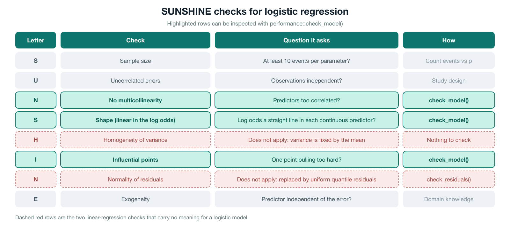
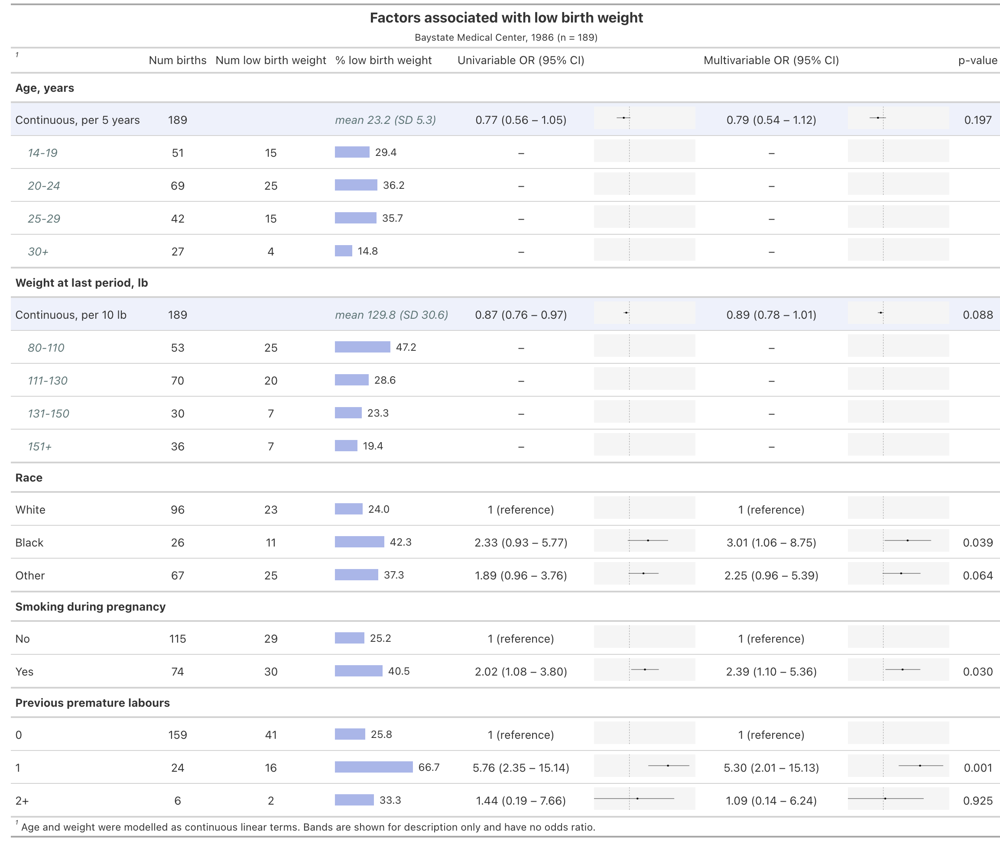

```{r setup, include=FALSE}
knitr::opts_chunk$set(echo = TRUE, message = FALSE, warning = FALSE)
```

# Introduction

Last week you fitted **univariable** logistic regression models for predictors of mortality after burns, using the data from [Kim et al. (2017)](https://doi.org/10.1371/journal.pone.0185195). Each model had one predictor, and each reproduced one cell of the left half of the paper's Table 2.

This week we complete the table. Table 2 has a second half.


We will:

1. Refit the univariable models, adding carboxyhemoglobin as a fifth predictor
2. Fit one **multivariable** model containing all five predictors at once
3. Check the model's assumptions
4. Use AIC to compare different ways of entering age into the model
5. Report the univariable and multivariable results side by side

One row of Table 2 will be missing from our replication: **mechanical ventilation**. The shared patient-level dataset does not contain a mechanical-ventilation column, and there is no way to reconstruct it. We will come back to what that means for our results.

# PART 1: Load and prepare the data

## Load packages

Load the packages below. `performance`, `see` and `DHARMa` are the diagnostics packages we will use in Part 4.

```{r load-packages}
if (!require(pacman)) install.packages("pacman")
pacman::p_load(tidyverse, readxl, here, janitor, broom, equatiomatic, gt,
               performance, see, DHARMa, patchwork)
pacman::p_load_gh("the-graph-courses/inspectdf")
```

## Import and clean

This is the same cleaning code you wrote last week, with one addition: we now keep `CoHemo`, the carboxyhemoglobin level, and rename it `carboxyhemoglobin`.

Fill in the three renamed variables on the `rename()` line.

```{r import-data-blank, eval=FALSE}
burns <- read_excel(here("data/S1Dataset_burns.xlsx"), sheet = "Sheet2") %>%
  clean_names() %>%
  # New names, in order: mortality, age_years, tbsa_percent, carboxyhemoglobin
  rename(________ = mortaltiy, ________ = age, ________ = tbsa,
         carboxyhemoglobin = co_hemo) %>%
  mutate(
    mortality = factor(mortality, levels = c(0, 1),
                       labels = c("Survived", "Died")),
    inhalation_injury = factor(in_hdiv, levels = 0:3,
                               labels = c("Normal", "Subjective", "Upper", "Lower")),
    pf_ratio_group = factor(pfdivide, levels = 0:3,
                            labels = c(">300", "200-300", "100-200", "<100"))
  ) %>%
  select(mortality, age_years, tbsa_percent, inhalation_injury,
         pf_ratio_group, carboxyhemoglobin)

glimpse(burns)
```

**Answer:**

```{r import-data}
burns <- read_excel(here("data/S1Dataset_burns.xlsx"), sheet = "Sheet2") %>%
  clean_names() %>%
  rename(mortality = mortaltiy, age_years = age, tbsa_percent = tbsa,
         carboxyhemoglobin = co_hemo) %>%
  mutate(
    mortality = factor(mortality, levels = c(0, 1),
                       labels = c("Survived", "Died")),
    inhalation_injury = factor(in_hdiv, levels = 0:3,
                               labels = c("Normal", "Subjective", "Upper", "Lower")),
    pf_ratio_group = factor(pfdivide, levels = 0:3,
                            labels = c(">300", "200-300", "100-200", "<100"))
  ) %>%
  select(mortality, age_years, tbsa_percent, inhalation_injury,
         pf_ratio_group, carboxyhemoglobin)

glimpse(burns)
```

Carboxyhemoglobin is the percentage of a patient's hemoglobin that is bound to carbon monoxide. It is measured on arrival and is used as a marker of smoke exposure.

## Check for missing values

Before fitting anything, count the missing values in each column.

```{r missing-values}
burns %>% summarise(across(everything(), ~ sum(is.na(.x))))
```

**Question 1.1:** Which variable has missing values, and how many patients are affected?

Ans 1.1:

**Answer:** Only `carboxyhemoglobin`, which is missing for **93 patients**.

This matters more than it might seem. When you give `glm()` a formula, R silently drops every row that is missing **any** variable in that formula. So a model containing carboxyhemoglobin will be fitted on fewer patients than a model without it. Keep an eye on this as we go.

```{r outcome-summary}
burns %>% tabyl(mortality)
```

**Question 1.2:** How many patients died, out of how many in total?

Ans 1.2:

**Answer:** 173 of 676 patients died, or 25.6%.

# PART 2: The five univariable models

You already know how to fit and interpret these, so the code is written out for you. Read it, run it, and check that the numbers match the univariate column of Table 2.

```{r univariable-models}
age_model <- glm(mortality ~ age_years, family = binomial, data = burns)
tbsa_model <- glm(mortality ~ tbsa_percent, family = binomial, data = burns)
inhalation_model <- glm(mortality ~ inhalation_injury, family = binomial, data = burns)
pf_model <- glm(mortality ~ pf_ratio_group, family = binomial, data = burns)
carboxy_model <- glm(mortality ~ carboxyhemoglobin, family = binomial, data = burns)
```

The paper reports Wald confidence intervals, so we use `confint.default()` rather than the profile-likelihood intervals that `tidy(conf.int = TRUE)` gives by default. The helper below tidies one model and attaches Wald intervals.

```{r tidy-helper}
tidy_wald <- function(model) {
  tidy(model, exponentiate = TRUE) %>%
    filter(term != "(Intercept)") %>%
    mutate(
      conf.low = exp(confint.default(model))[-1, 1],
      conf.high = exp(confint.default(model))[-1, 2],
      n = nobs(model)
    ) %>%
    select(term, estimate, conf.low, conf.high, p.value, n)
}

univariable_results <- bind_rows(
  tidy_wald(age_model),
  tidy_wald(tbsa_model),
  tidy_wald(inhalation_model),
  tidy_wald(pf_model),
  tidy_wald(carboxy_model)
)

univariable_results
```

**Question 2.1:** Compare the `estimate`, `conf.low` and `conf.high` columns with the univariate column of Table 2. Do they match?

Ans 2.1:

**Answer:** Yes. All five predictors reproduce the paper exactly to three decimal places: age 1.034 (1.021-1.046), TBSA 1.083 (1.070-1.096), Subjective 0.615 (0.343-1.103), Upper 4.438 (2.684-7.339), Lower 2.379 (1.474-3.841), PF 200-300 0.773 (0.475-1.258), PF 100-200 1.004 (0.604-1.668), PF <100 2.765 (1.638-4.668) and carboxyhemoglobin 1.031 (0.986-1.077).

**Question 2.2:** Look at the `n` column. Why is the carboxyhemoglobin row based on a different number of patients from the other rows?

Ans 2.2:

**Answer:** Carboxyhemoglobin is missing for 93 patients, and `glm()` drops rows with a missing value in the formula. That model uses 583 patients; the other four use all 676.

**Question 2.3:** Complete the interpretation of the carboxyhemoglobin odds ratio.

Ans 2.3:

> Each additional percentage point of carboxyhemoglobin was associated with about 1.031 times the odds of mortality. The 95% CI ______ (crossed / did not cross) 1, so this result ______ (was / was not) statistically significant.

**Answer:** The 95% CI (0.986 to 1.077) **crossed** 1, so this result **was not** statistically significant.

# PART 3: The multivariable model

Each univariable model answers a narrow question: *is this predictor associated with mortality, ignoring everything else?* But the predictors are related to each other. Older patients may have larger burns; patients with inhalation injury are likely to have worse PF ratios.

A multivariable model estimates the association of each predictor with mortality **while holding the other predictors constant**. Each odds ratio is now an *adjusted* odds ratio.

## Fit the model

Fit one model with `mortality` as the outcome and all five predictors. Predictors are added to the right-hand side of the formula with `+`.

```{r multivariable-model-blank, eval=FALSE}
# Predictors, in order: age_years, tbsa_percent, inhalation_injury,
# pf_ratio_group, carboxyhemoglobin
multivar_model <- glm(________ ~ ________, family = ________, data = ________)

summary(multivar_model)
```

**Answer:**

```{r multivariable-model}
multivar_model <- glm(
  mortality ~ age_years + tbsa_percent + inhalation_injury +
    pf_ratio_group + carboxyhemoglobin,
  family = binomial, data = burns
)

summary(multivar_model)
```

**Question 3.1:** Look at the bottom of the summary for the degrees of freedom, or run `nobs(multivar_model)`. How many patients were used to fit this model?

Ans 3.1:

**Answer:** 583.

```{r nobs-check}
nobs(multivar_model)
```

**Question 3.2:** Why is that number smaller than 676?

Ans 3.2:

**Answer:** The formula contains `carboxyhemoglobin`, which is missing for 93 patients. Those rows are dropped, leaving 676 − 93 = 583.

## The fitted equation

```{r multivariable-equation}
extract_eq(multivar_model, use_coefs = TRUE, wrap = TRUE, terms_per_line = 2) %>%
  preview_eq()
```

**Question 3.3:** The equation has a term for `Upper` inhalation injury but no term for `Normal` inhalation injury. Why not?

Ans 3.3:

**Answer:** `Normal` is the reference level. Its effect is absorbed into the intercept, and the other three coefficients are comparisons *against* Normal. A four-level factor needs only three coefficients.

## Adjusted odds ratios

Now use the `tidy_wald()` helper from Part 2 to get the adjusted odds ratios.

```{r multivariable-results-blank, eval=FALSE}
multivariable_results <- tidy_wald(________)

multivariable_results
```

**Answer:**

```{r multivariable-results}
multivariable_results <- tidy_wald(multivar_model)

multivariable_results
```

**Question 3.4:** Write a full interpretation of the adjusted age odds ratio. Include the OR, the unit of change, the direction, whether the CI crosses 1, and the phrase that signals adjustment.

Ans 3.4:

**Answer:** After adjusting for TBSA, inhalation injury, PF ratio group and carboxyhemoglobin, each additional year of age was associated with 1.068 times the odds of mortality, or 6.8% higher odds. The 95% CI (1.046 to 1.091) did not cross 1, so the association was statistically significant.

**Question 3.5:** In the univariable model, PF ratio <100 had an odds ratio of 2.765 (95% CI 1.638 to 4.668). What is its adjusted odds ratio, and is it still statistically significant?

Ans 3.5:

**Answer:** The adjusted odds ratio is 1.547, with a 95% CI of 0.645 to 3.714. The interval crosses 1, so it is no longer statistically significant.

**Question 3.6:** Suggest one reason the PF ratio <100 odds ratio moved towards 1 once the other predictors were added.

Ans 3.6:

**Answer:** A low PF ratio does not occur at random. Patients with poor oxygenation tend to have larger burns and inhalation injury, both of which raise mortality on their own. In the univariable model the PF ratio coefficient was picking up those effects as well as its own. Once TBSA and inhalation injury are in the model, that shared signal is attributed to them instead, and little is left for PF ratio.

## Compare our results with the paper

The code below puts the univariable and multivariable results side by side, in the layout of Table 2. All of the formatting code is written for you.

```{r comparison-table}
term_labels <- c(
  age_years = "Per 1 year",
  tbsa_percent = "Per 1 percentage point",
  inhalation_injurySubjective = "Subjective vs Normal",
  inhalation_injuryUpper = "Upper vs Normal",
  inhalation_injuryLower = "Lower vs Normal",
  `pf_ratio_group200-300` = "200-300 vs >300",
  `pf_ratio_group100-200` = "100-200 vs >300",
  `pf_ratio_group<100` = "<100 vs >300",
  carboxyhemoglobin = "Per 1 percentage point"
)

predictor_of <- c(
  age_years = "Age", tbsa_percent = "% TBSA burned",
  inhalation_injurySubjective = "Inhalation injury",
  inhalation_injuryUpper = "Inhalation injury",
  inhalation_injuryLower = "Inhalation injury",
  `pf_ratio_group200-300` = "PF ratio",
  `pf_ratio_group100-200` = "PF ratio",
  `pf_ratio_group<100` = "PF ratio",
  carboxyhemoglobin = "Carboxyhemoglobin"
)

format_or <- function(estimate, low, high) {
  sprintf("%.3f (%.3f-%.3f)", estimate, low, high)
}

comparison_table <- univariable_results %>%
  transmute(term, univariable = format_or(estimate, conf.low, conf.high),
            uni_p = scales::pvalue(p.value, accuracy = 0.001)) %>%
  left_join(
    multivariable_results %>%
      transmute(term, multivariable = format_or(estimate, conf.low, conf.high),
                multi_p = scales::pvalue(p.value, accuracy = 0.001)),
    by = "term"
  ) %>%
  mutate(predictor = predictor_of[term], comparison = term_labels[term]) %>%
  select(predictor, comparison, univariable, uni_p, multivariable, multi_p)

comparison_table %>%
  gt(groupname_col = "predictor") %>%
  cols_label(comparison = "", univariable = "Univariable OR (95% CI)",
             uni_p = "p-value", multivariable = "Multivariable OR (95% CI)",
             multi_p = "p-value") %>%
  cols_align(align = "center", columns = c(univariable, uni_p,
                                           multivariable, multi_p)) %>%
  tab_style(style = cell_text(weight = "bold"),
            locations = cells_row_groups()) %>%
  tab_header(title = md("**Our replication of Kim et al. Table 2**"),
             subtitle = "Univariable models: n = 676 (n = 583 for carboxyhemoglobin). Multivariable model: n = 583.")
```

**Question 3.7:** Compare your table with the paper's Table 2. Which of these come out close to the published multivariate column: age, TBSA, PF ratio, carboxyhemoglobin?

Ans 3.7:

**Answer:** All four are close. Age 1.068 versus the paper's 1.069; TBSA 1.100 versus 1.100; PF ratio 0.635 / 1.320 / 1.547 versus 0.622 / 1.334 / 1.428; carboxyhemoglobin 1.093 versus 1.081. Only inhalation injury is far off.

**Question 3.8:** The paper's adjusted odds ratios for inhalation injury (Subjective 0.467, Upper 1.907, Lower 0.775) are all much closer to 1 than ours. The paper's model contained one predictor that ours does not: mechanical ventilation. Patients who were mechanically ventilated were largely the ones with inhalation injury. Use that to explain the difference.

Ans 3.8:

**Answer:** Mechanical ventilation and inhalation injury carry much of the same information. In the paper's model, the two variables compete to explain the same patients, and mechanical ventilation takes most of the credit (adjusted OR 3.774), leaving the inhalation-injury coefficients close to 1. Our model has no mechanical-ventilation term, so inhalation injury keeps that signal and its odds ratios stay large (Upper 3.993, Lower 2.369).

This is worth taking seriously as a general lesson. An adjusted odds ratio is not a property of a predictor. It is a property of a predictor **in a particular model**. Change the other terms and it changes. That is why papers must report the full model, not just the coefficient they care about.

# PART 4: Checking the model

We now check whether the assumptions behind this model look reasonable. In Week 9 you used the SUNSHINE checklist for a linear model. Most of it carries over, but two of the letters change meaning.

{width=100%}

Two changes are worth stating clearly:

- **Homogeneity of variance does not apply.** In a linear model the residual variance is a separate parameter that we assume is constant. In a logistic model the variance of a 0/1 outcome is fixed at `p(1 - p)`, so it is *supposed* to change with the fitted probability. There is nothing to check.
- **Normality of residuals does not apply either.** The residuals of a logistic model cannot be normal: the outcome only takes two values. What we check instead is whether **randomised quantile residuals** follow a *uniform* distribution. These are simulated residuals that are uniform between 0 and 1 when the model is correct, whatever the outcome distribution.

## Sample size

For linear regression the rule of thumb was at least 10 observations per parameter. For logistic regression the binding constraint is the number of **events**, because a model can only learn about mortality from patients who actually died. The usual rule of thumb is at least **10 events per parameter**.

```{r events-per-parameter}
n_events <- sum(model.frame(multivar_model)$mortality == "Died")
n_parameters <- length(coef(multivar_model))

n_events
n_parameters
n_events / n_parameters
```

**Question 4.1:** Do we have enough events per parameter?

Ans 4.1:

**Answer:** Yes. There are 156 deaths among the 583 patients used, and 10 parameters, giving 15.6 events per parameter. That is comfortably above the rule of thumb of 10.

## Run `check_model()`

```{r check-model, fig.width=12, fig.height=9}
check_model(multivar_model)
```

Notice which panels you get. For a logistic model `check_model()` gives five, and the two that were most worrying in Week 9 — homogeneity of variance and normality of residuals — are simply not among them.

**Question 4.2:** Look at the collinearity panel. Are any VIFs above 5?

Ans 4.2:

**Answer:** No. All five VIFs sit between about 1.1 and 1.4, well inside the green "low correlation" band. Collinearity is not a problem here.

**Question 4.3:** The **binned residuals** panel splits patients into bins by their fitted probability, then plots the average residual in each bin. If the model were fitting well, the points would scatter around zero and stay inside the grey error bounds. Roughly what fraction of the points fall outside the bounds here?

Ans 4.3:

**Answer:** Only about half the bins are inside the bounds (`binned_residuals()` reports 46%). The points that stray are mostly at the two extremes: the model is somewhat over-confident at very low fitted probabilities and under-predicts mortality at very high ones. This is the weakest part of the model.

**Question 4.4:** The bottom panel, **Distribution of Quantile Residuals**, is a QQ plot of simulated quantile residuals against a uniform distribution. Do the dots follow the line?

Ans 4.4:

**Answer:** Yes, very closely. The dots lie almost exactly along the diagonal across the whole range, which is what we want.

**Question 4.5:** The influential-observations panel plots standardised residuals against leverage. Is any single point sitting outside the contour lines?

Ans 4.5:

**Answer:** No. A few points have visibly larger residuals than the rest, but none crosses the Cook's distance contours, so no single patient is driving the fit.

## Following up the checks formally

Each panel has a matching function that returns a verdict rather than a picture.

```{r check-collinearity}
check_collinearity(multivar_model)
```

```{r check-outliers}
check_outliers(multivar_model)
```

```{r binned-residuals}
binned_residuals(multivar_model)
```

Now try the normality check you used in Week 9, and read the message carefully.

```{r check-normality}
check_normality(multivar_model)
```

**Question 4.6:** What does `check_normality()` tell you to do instead?

Ans 4.6:

**Answer:** It refuses to run and says: *"Generalized linear model residuals are not expected to follow a normal distribution. Instead, please use `simulate_residuals()` and `check_residuals()` to test whether quantile residuals follow a uniform distribution."*

Do what it says. `simulate_residuals()` produces the randomised quantile residuals, and `check_residuals()` tests them against a uniform distribution.

```{r check-residuals}
simulated_residuals <- simulate_residuals(multivar_model)

check_residuals(simulated_residuals)
```

**Question 4.7:** Does this test flag a problem?

Ans 4.7:

**Answer:** No. It reports that the simulated residuals appear uniformly distributed, with a p-value well above 0.05, so there is no evidence of a distributional problem. (The p-value comes from a simulation, so it will shift each time you run it.)

This is the answer to a question that confuses many people: *if normality of residuals is meaningless for logistic regression, why does `check_model()` still draw a QQ plot?* It does not. It draws a QQ plot of **quantile residuals against a uniform distribution**, which is a different check with a similar-looking picture. If you ever do see a panel labelled "Normality of Residuals" for a logistic model, it means the simulated-residual machinery was unavailable and the function fell back on a plot that you should ignore.

## Shape: is the model linear in the log odds?

The `S` in SUNSHINE asks whether the relationship has the right shape. For a linear model we assumed the outcome was a straight-line function of each predictor. For a logistic model we assume the **log odds** of the outcome is a straight-line function of each continuous predictor.

We can look at this directly. Below we cut age into bands, calculate the observed log odds of mortality in each band, and plot them against the median age in the band. If the assumption holds, the points should sit close to a straight line.

The `+ 0.5` terms are a standard adjustment that keeps the log odds finite if a band happens to contain no deaths.

```{r age-empirical-logit, fig.width=7, fig.height=4.5}
age_logit_check <- burns %>%
  mutate(age_band = cut(age_years, breaks = c(18, 29, 39, 49, 59, 69, Inf),
                        labels = c("18-29", "30-39", "40-49", "50-59", "60-69", "70+"),
                        include.lowest = TRUE)) %>%
  group_by(age_band) %>%
  summarise(age_midpoint = median(age_years), patients = n(),
            deaths = sum(mortality == "Died")) %>%
  mutate(observed_log_odds = log((deaths + 0.5) / (patients - deaths + 0.5)))

age_logit_check

ggplot(age_logit_check, aes(age_midpoint, observed_log_odds)) +
  geom_point(size = 3) +
  geom_text(aes(label = age_band), vjust = -1, size = 3) +
  geom_smooth(method = "lm", se = FALSE, color = "#ee9b00") +
  labs(x = "Median age in band (years)", y = "Observed log odds of mortality",
       title = "Is mortality linear in the log odds of age?")
```

**Question 4.8:** Do the six points fall on a straight line, or is there a bend?

Ans 4.8:

**Answer:** There is a mild bend. The three youngest bands sit at roughly the same log odds, around −1.5, and the climb only really starts from the 50-59 band onwards. The pattern of misses is systematic rather than random: 18-29 sits well above the fitted line, 30-39 and 40-49 sit below it, and the oldest two sit above it again. That U shape is the signature of a curve, not a straight line.

Now do the same for TBSA. Use the bands 0-9, 10-19, 20-39, 40-59, 60+.

```{r tbsa-empirical-logit-blank, eval=FALSE}
tbsa_logit_check <- burns %>%
  mutate(tbsa_band = cut(tbsa_percent, breaks = c(0, 9, 19, 39, 59, Inf),
                         labels = c("0-9", "10-19", "20-39", "40-59", "60+"),
                         include.lowest = TRUE)) %>%
  # Grouping variable: tbsa_band
  group_by(________) %>%
  summarise(tbsa_midpoint = median(tbsa_percent), patients = n(),
            deaths = sum(mortality == "Died")) %>%
  mutate(observed_log_odds = log((deaths + 0.5) / (patients - deaths + 0.5)))

tbsa_logit_check

ggplot(tbsa_logit_check, aes(________, ________)) +
  geom_point(size = 3) +
  geom_text(aes(label = tbsa_band), vjust = -1, size = 3) +
  geom_smooth(method = "lm", se = FALSE, color = "#ee9b00") +
  labs(x = "Median TBSA in band (%)", y = "Observed log odds of mortality",
       title = "Is mortality linear in the log odds of TBSA?")
```

**Answer:**

```{r tbsa-empirical-logit, fig.width=7, fig.height=4.5}
tbsa_logit_check <- burns %>%
  mutate(tbsa_band = cut(tbsa_percent, breaks = c(0, 9, 19, 39, 59, Inf),
                         labels = c("0-9", "10-19", "20-39", "40-59", "60+"),
                         include.lowest = TRUE)) %>%
  group_by(tbsa_band) %>%
  summarise(tbsa_midpoint = median(tbsa_percent), patients = n(),
            deaths = sum(mortality == "Died")) %>%
  mutate(observed_log_odds = log((deaths + 0.5) / (patients - deaths + 0.5)))

tbsa_logit_check

ggplot(tbsa_logit_check, aes(tbsa_midpoint, observed_log_odds)) +
  geom_point(size = 3) +
  geom_text(aes(label = tbsa_band), vjust = -1, size = 3) +
  geom_smooth(method = "lm", se = FALSE, color = "#ee9b00") +
  labs(x = "Median TBSA in band (%)", y = "Observed log odds of mortality",
       title = "Is mortality linear in the log odds of TBSA?")
```

**Question 4.9:** Does TBSA look more or less linear in the log odds than age did?

Ans 4.9:

**Answer:** More linear. The log odds climb from about −3.5 to +1.2 across the five bands, and every point sits within about 0.2 of the fitted line. Compared with the spread of the data, those misses are much smaller than the ones we saw for age, so a single slope on the log-odds scale is a reasonable description of TBSA.

# PART 5: Choosing a functional form with AIC

The age plot suggested a slight bend. That raises a question we have not asked before: *how should age enter the model at all?*

**Most of the time this decision should not be made from the data.** It should follow prior knowledge, the categories used by previous studies in the field, or a pre-specified analysis plan. Trying every possible form and keeping the winner is a good way to fit noise.

But when you genuinely do not know, and you have a small set of defensible candidates, AIC gives you a way to compare them. Recall from the pre-work:

$$\mathrm{AIC} = \text{residual deviance} + 2k$$

where $k$ is the number of estimated parameters. Lower is better. AIC has no absolute scale, so only *differences* between models mean anything, and only when the models are fitted to the same outcome and the same rows.

We will compare three ways of entering age, holding the other four predictors fixed:

| Model | Form of age | Extra parameters for age |
|:--|:--|:--|
| `age_linear_model` | continuous, one slope | 1 |
| `age_band_model` | six age bands | 5 |
| `age_squared_model` | continuous plus a squared term | 2 |

First create the age bands as a variable in the data.

```{r age-band-variable}
burns <- burns %>%
  mutate(age_band = cut(age_years, breaks = c(18, 29, 39, 49, 59, 69, Inf),
                        labels = c("18-29", "30-39", "40-49", "50-59", "60-69", "70+"),
                        include.lowest = TRUE))
```

Now fit the three models. `age_linear_model` is the model you already fitted in Part 3.

```{r functional-form-models-blank, eval=FALSE}
age_linear_model <- multivar_model

age_band_model <- glm(
  mortality ~ age_band + tbsa_percent + inhalation_injury +
    pf_ratio_group + carboxyhemoglobin,
  family = binomial, data = burns
)

# Same as age_band_model, but with age_years and I(age_years^2) in place of age_band
age_squared_model <- glm(
  mortality ~ ________ + ________ + tbsa_percent + inhalation_injury +
    pf_ratio_group + carboxyhemoglobin,
  family = binomial, data = burns
)
```

**Answer:**

```{r functional-form-models}
age_linear_model <- multivar_model

age_band_model <- glm(
  mortality ~ age_band + tbsa_percent + inhalation_injury +
    pf_ratio_group + carboxyhemoglobin,
  family = binomial, data = burns
)

age_squared_model <- glm(
  mortality ~ age_years + I(age_years^2) + tbsa_percent + inhalation_injury +
    pf_ratio_group + carboxyhemoglobin,
  family = binomial, data = burns
)
```

Before comparing AIC values, confirm that all three models used the same rows. If they did not, the comparison would be meaningless.

```{r check-same-rows}
c(nobs(age_linear_model), nobs(age_band_model), nobs(age_squared_model))
```

**Question 5.1:** Did all three models use the same number of patients?

Ans 5.1:

**Answer:** Yes, 583 each. All three contain `carboxyhemoglobin`, so all three drop the same 93 rows, and `age_band` adds no new missing values.

Now compare them. `AIC()` accepts several models at once.

```{r compare-aic}
AIC(age_linear_model, age_band_model, age_squared_model)
```

**Question 5.2:** Which functional form has the lowest AIC?

Ans 5.2:

**Answer:** `age_squared_model`, at 320.7. The band model is 322.0 and the linear model is 325.2.

**Question 5.3:** How much lower is it than the linear form? (A difference of less than about 2 is usually considered negligible.)

Ans 5.3:

**Answer:** 325.2 − 320.7 = 4.5 lower. That is a real but modest improvement: enough to notice, not enough to overturn a well-motivated choice.

## See what the three forms actually fit

AIC gives one number per model. It is worth looking at what the models are claiming.

To draw an adjusted age curve we have to hold the other four predictors at fixed values, because each model's fitted probability depends on all of them. Below we use a patient with median TBSA and carboxyhemoglobin, no inhalation injury, and PF ratio above 300.

```{r prediction-grid}
age_grid <- tibble(
  age_years = 18:92,
  tbsa_percent = median(burns$tbsa_percent),
  carboxyhemoglobin = median(burns$carboxyhemoglobin, na.rm = TRUE),
  inhalation_injury = factor("Normal", levels = levels(burns$inhalation_injury)),
  pf_ratio_group = factor(">300", levels = levels(burns$pf_ratio_group))
) %>%
  mutate(age_band = cut(age_years, breaks = c(18, 29, 39, 49, 59, 69, Inf),
                        labels = c("18-29", "30-39", "40-49", "50-59", "60-69", "70+"),
                        include.lowest = TRUE))

age_grid
```

`type = "link"` returns fitted values on the log-odds scale. `type = "response"` returns them as probabilities.

```{r functional-form-predictions}
age_predictions <- age_grid %>%
  mutate(
    `Linear age` = predict(age_linear_model, newdata = ., type = "link"),
    `Age bands` = predict(age_band_model, newdata = ., type = "link"),
    `Age + age squared` = predict(age_squared_model, newdata = ., type = "link")
  ) %>%
  pivot_longer(c(`Linear age`, `Age bands`, `Age + age squared`),
               names_to = "form", values_to = "log_odds") %>%
  mutate(probability = 1 / (1 + exp(-log_odds)))

age_predictions
```

The two panels below show the same three models on the two scales. The banded model is drawn with `geom_step()`, because it holds one value across each whole band.

```{r functional-form-plot, fig.width=11, fig.height=4.5}
log_odds_panel <- ggplot(age_predictions, aes(age_years, log_odds, color = form)) +
  geom_line(data = ~ filter(.x, form != "Age bands"), linewidth = 1) +
  geom_step(data = ~ filter(.x, form == "Age bands"), linewidth = 1) +
  labs(x = "Age (years)", y = "Fitted log odds", color = "Functional form")

probability_panel <- log_odds_panel +
  aes(y = probability) +
  labs(y = "Fitted probability")

log_odds_panel + probability_panel + plot_layout(guides = "collect")
```

**Question 5.4:** On the log-odds panel, the linear model is a straight line by construction. What shape does the squared model take?

Ans 5.4:

**Answer:** An upward-opening curve. It is almost flat below about 40, then rises increasingly steeply. This matches the bend we saw in the empirical-logit plot: mortality risk barely changes across young adulthood and then accelerates.

**Question 5.5:** Where do the three forms disagree most?

Ans 5.5:

**Answer:** At the two ends. Below 35 the linear model predicts lower log odds than the other two, and above 80 the squared model climbs far above the linear one. In the middle, roughly 45 to 70, where most of the patients are, all three agree closely.

**Question 5.6:** Only three patients in this dataset are over 85. Does that change how much you would trust the right-hand end of the squared curve?

Ans 5.6:

**Answer:** Yes. The curve is steepest exactly where there is almost no data to support it. A quadratic term is forced to keep accelerating, so it will extrapolate aggressively past the last few observations. The fitted probability near 0.8 at age 92 rests on a handful of patients and should not be reported as a finding.

**Question 5.7:** Suppose you had to choose one form to report. Which would you choose, and what would you say about the choice in the methods section?

Ans 5.7:

**Answer:** Any of the three is defensible; what matters is saying which you chose and why. A reasonable answer: keep the linear form, because it is what the original paper used, because it gives a single interpretable odds ratio per year, and because the AIC advantage of the alternatives is small (4.5 and 3.1). Then state in the methods that age was modelled as a continuous linear term, that quadratic and banded forms were also examined, and that they produced similar conclusions. Reporting the comparison is what keeps the decision honest.

For the rest of this workshop we keep the linear form, because it is what the paper used and because the AIC advantage of the alternatives is small. That is a defensible decision, and it is one you should state rather than hide.

# PART 6: Report the results

The comparison table from Part 3 is the main deliverable. Print it once more and use it to complete the paragraph below.

```{r final-results}
comparison_table
```

**Final reporting task:** Complete this results paragraph.

Ans:

> We fitted a multivariable logistic regression model of in-hospital mortality on 583 patients with complete data. After adjustment, each additional year of age was associated with an odds ratio of ______ (95% CI 1.046 to 1.091) and each additional percentage point of TBSA burned with an odds ratio of ______ (95% CI 1.082 to 1.119). Compared with no inhalation injury, Upper injury had an adjusted odds ratio of ______ and Lower injury ______. None of the PF ratio comparisons reached statistical significance after adjustment, the largest being ______ for <100 versus >300. Model diagnostics showed ______ (acceptable / unacceptable) collinearity, with all VIFs below ______.

**Answer:**

> We fitted a multivariable logistic regression model of in-hospital mortality on 583 patients with complete data. After adjustment, each additional year of age was associated with an odds ratio of **1.068** (95% CI 1.046 to 1.091) and each additional percentage point of TBSA burned with an odds ratio of **1.100** (95% CI 1.082 to 1.119). Compared with no inhalation injury, Upper injury had an adjusted odds ratio of **3.993** and Lower injury **2.369**. None of the PF ratio comparisons reached statistical significance after adjustment, the largest being **1.547** for <100 versus >300. Model diagnostics showed **acceptable** collinearity, with all VIFs below **1.4**.

# Optional challenge: a figure-table with a forest plot

Journals often present these results as a single figure-table: raw numerators and denominators, a bar for the observed percentage, the odds ratio with its confidence interval, and a small forest plot, all in one object.



Build something like this for the burns results. An LLM can write most of the code, but it will need help with one thing in particular, so tell it explicitly:

> Age, TBSA and carboxyhemoglobin are **continuous** predictors. Their odds ratios come from the continuous model, but the raw-number rows still have to be shown in bands, because there is no group to count at a single exact value. Give each continuous predictor one estimate row carrying the odds ratio and several descriptive band rows carrying only percentages.

Two worked references are available to you:

- `regression_table_from_scratch.Rmd`, in this workshop folder. It builds exactly the table pictured above, step by step, using the `birthwt` data. Open it, run it, and adapt it.
- <https://github.com/kendavidn/yaounde_serocovpop_shared/blob/v1.0.0/scripts/infection_regn_2.R>, a real analysis script that produces a similar figure. Note that it has no continuous predictors, which is the gap the reference script above fills.

```{r forest-table-challenge}
# Your code here
```

**Answer:** There is no single right answer here. `regression_table_from_scratch.Rmd` in this folder is a complete worked solution for the `birthwt` data; adapting it to the burns data means swapping in the five burns predictors, choosing bands for age, TBSA and carboxyhemoglobin, and widening the odds-ratio axis limits to cover the inhalation-injury intervals.

# Reference

Kim Y, Kym D, Hur J, Yoon J, Yim H, Cho YS, et al. (2017). Does inhalation injury predict mortality in burns patients or require redefinition? *PLOS ONE*, 12(9), e0185195. <https://doi.org/10.1371/journal.pone.0185195>
